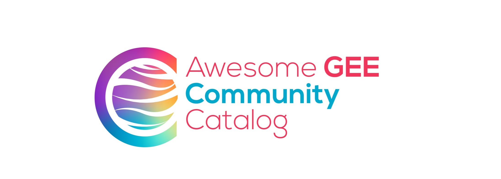

# awesome-gee-community-catalog

[](https://www.linkedin.com/in/samapriya/)
[](https://datacommons.substack.com/)
[](https://medium.com/@samapriyaroy)

[](https://jetstream-cloud.org/)
[](https://doi.org/10.5281/zenodo.21876800)
[](https://status.gee-community-catalog.org)

[](https://github.com/sponsors/samapriya)

The awesome-gee-community-catalog is an **unfunded, open-source, grassroots project** with a simple mission: to collect **community-sourced** and **community-generated** geospatial datasets and make them **accessible** — tied directly to an analysis platform, so that finding good data is never the bottleneck and the **digital divide** keeps narrowing. It lives and serves alongside the [Google Earth Engine data catalog](https://developers.google.com/earth-engine/datasets/catalog).

<div style="
    background-color: var(--md-code-bg-color, #f8fafc);
    border: 2px solid var(--md-accent-fg-color, #0ea5e9);
    border-radius: 8px;
    padding: 20px;
    margin: 20px 0;
    color: var(--md-default-fg-color);
">
    <h4 style="margin-top: 0; color: var(--md-accent-fg-color);">
        👋 On a Personal Note
    </h4>
    <p>
        Hi there! I'm <strong>Samapriya Roy</strong>, and I created and maintain the GEE Community Catalog.
        This has grown from a personal project into something much bigger thanks to this amazing community.
        If you find value in this work, star the
        <a href="https://github.com/samapriya/awesome-gee-community-datasets"
           target="_blank"
           style="color: var(--md-accent-fg-color); text-decoration: underline;">
            GitHub repo
        </a>
        as it helps others discover this catalog & keeps the effort visible.
        <a href="https://www.linkedin.com/in/samapriya/"
           target="_blank"
           style="color: var(--md-accent-fg-color); text-decoration: underline;">
            Connect with me
        </a>
        and start a chat; I love hearing how people are using this catalog & help me showcase your work!
    </p>
</div>

 **Stay in the loop — sign up for email updates to get the latest catalog news and more.**

<center>

<iframe src="https://datacommons.substack.com/embed" width="480" height="320" style="border:1px solid #EEE; background:white;" frameborder="0" scrolling="no"></iframe>

</center>


Curious how it all began? Read the story of how this project started in [this Medium article](https://medium.com/geospatial-processing-at-scale/community-datasets-data-commons-in-google-earth-engine-8585d8baef1f).



Community datasets, added by users and made available for everyone to use.

Like, share, and support the GitHub project — and now you can cite it, too.

#### Citation

```
Roy, S., Majumdar, S.& Swetnam, T. (2026). samapriya/awesome-gee-community-datasets: Community Catalog (Version 4.0.0) [Computer software].
Zenodo. https://doi.org/10.5281/zenodo.21876800
```
