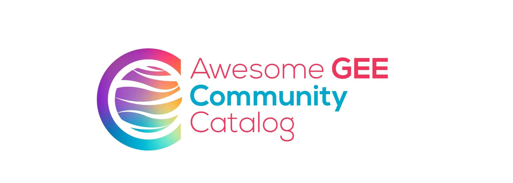

# awesome-gee-community-catalog

[](https://www.linkedin.com/in/samapriya/)
[](https://datacommons.substack.com/)
[](https://medium.com/@samapriyaroy)

[](https://jetstream-cloud.org/)
[](https://doi.org/10.5281/zenodo.15190103)
[](https://uptime.gee-community-catalog.org/status/all)

[](https://github.com/sponsors/samapriya)

The awesome-gee-community-catalog is an **unfunded open source grassroots project** with a mission to help collect **community sourced** and **community generated** geospatial datasets. Our goal is to make data **accessible** and tie it to an analysis platform **fostering accessibility** and **reducing digital divide**. This catalog lives and serves alongside the [Google Earth Engine data catalog](https://developers.google.com/earth-engine/datasets/catalog).

<div style="background-color: #f0f9ff; border: 2px solid #0ea5e9; border-radius: 8px; padding: 20px; margin: 20px 0;">
<h4 style="margin-top: 0; color: #0369a1;">👋 On a Personal Note</h4>
<p>Hi there! I'm <a href="https://www.linkedin.com/in/samapriya/" target="_blank">Samapriya Roy</a>, and I created and maintain the GEE Community Catalog. This has grown from a personal project into something much bigger thanks to this amazing community. If you find value in this work, star the <a href="https://github.com/samapriya/awesome-gee-community-datasets" target="_blank">GitHub repo</a> as it helps others discover this catalog & keeps the effort visible. <a href="https://www.linkedin.com/in/samapriya/" target="_blank">Connect with me</a> and start a chat; I love hearing how people are using this catalog & help me showcase your work!</p>
</div>

 **Stay updated by signing up for email updates and joining our community forum, ensuring you receive the latest catalog news, connect with other users, and more.**

<center>

<iframe src="https://datacommons.substack.com/embed" width="480" height="320" style="border:1px solid #EEE; background:white;" frameborder="0" scrolling="no"></iframe>

<div style="margin-top: 20px; margin-bottom: 20px;">
    <a href="https://forum.gee-community-catalog.org" target="_blank" style="display: inline-block; padding: 10px 20px; background-color: #4285F4; color: #fff; text-decoration: none; font-weight: bold; border-radius: 4px;">Join our Community Forum</a>
    <p style="margin-top: 10px; font-size: 0.9em;">Connect with other GEE users, ask questions, and share your insights!</p>
</div>
</center>


You can read about the history and how this project started in the [Medium Post article here](https://medium.com/geospatial-processing-at-scale/community-datasets-data-commons-in-google-earth-engine-8585d8baef1f)



Community Datasets added by users and made available for use at large

Like, share and support the Github project. And you can now cite it too

#### Citation

```
Samapriya Roy, Eric Jensen, Saah, A., & Swetnam, T. (2025). samapriya/awesome-gee-community-datasets: Community Catalog (3.5.0).
Zenodo. https://doi.org/10.5281/zenodo.15587604
```
