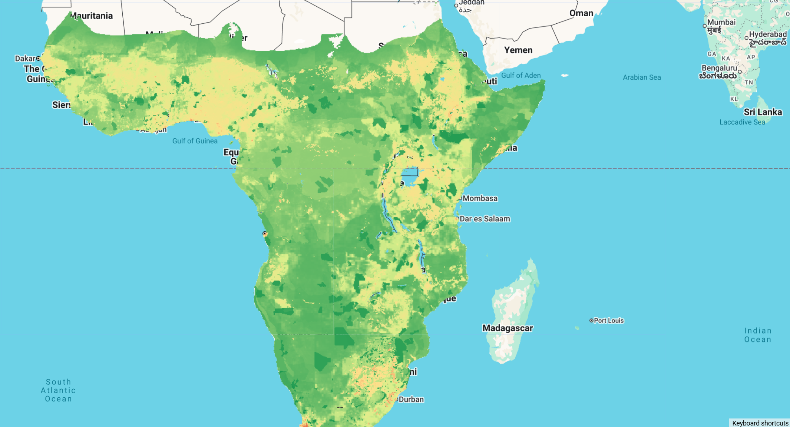

# Biodiversity Intactness Index (BII) for sub-Saharan Africa

!!! note
    The associated paper has been accepted and is awaiting publication in a few hours.

The Biodiversity Intactness Index (BII) is an indicator of ecosystem condition that assesses the impact of human land uses and activities on the abundance of a wide variety of species contributing diverse functions, capturing the multidimensional nature of biodiversity in a way that can be compared across multiple scales and time periods. It indicates the average remaining proportion of 'intact' populations of indigenous species in a particular area, relative to a pre-colonial/industrial reference state, on a scale from zero (nothing remains) to 1 (intact).

Previous assessments of ecosystem condition are criticised for being 'top-down': based on global, decontextualised pressure-impact relationships that extrapolate across data-poor taxa and regions, such as sub-Saharan Africa. This novel bottom-up approach overcomes critical data gaps and limitations of top-down biodiversity models by quantifying biodiversity intactness using the 'bii4africa' expert-elicited dataset that was previously published based on the knowledge of 200 experts in African fauna and flora. The bii4africa dataset contains experts' standardised estimates of the impact of sub-Saharan Africa's predominant land uses on diverse functional groupings of species that represent ~50,000 terrestrial vertebrates and vascular plants. Ten spatial datasets were integrated to map these land uses, which were combined with bioregional lists of indigenous taxa and the associated bii4africa data to map the BII across sub-Saharan Africa.

The data can be interactively explored and downloaded for individual countries using this [Earth Engine app](https://geethensingh.users.earthengine.app/view/bii) and the fighshare repo.

#### Citation

```
Clements, H et al. 2025. A place-based assessment of biodiversity intactness in sub-Saharan Africa.
Nature https://www.nature.com/articles/s41586-025-09781-7
```


#### Dataset citation

```
Clements, Hayley; Biggs, Reinette; De Vos, Alta; San, Emmanuel Do Linh; Hempson, Gareth; Linden, Birthe; et al. (2025). Data and R code for:
A place-based assessment of Sub-Saharan Africa's biodiversity intactness. figshare. Dataset. https://doi.org/10.6084/m9.figshare.29773169.v1
```



#### Earth Engine Snippet

```js
var bii8km = ee.ImageCollection("projects/earthengine-legacy/assets/projects/sat-io/open-datasets/BII/BII_8km");
var bii1km = ee.ImageCollection("projects/earthengine-legacy/assets/projects/sat-io/open-datasets/BII/BII_1km");
var mask = ee.Image("projects/earthengine-legacy/assets/projects/sat-io/open-datasets/BII/BII_Mask");

var bands1km = ee.List(['Land Use', 'Land Use Intensity', 'BII All',
'BII Amphibians', 'BII Birds', 'BII Forbs', 'BII Graminoids',
'BII Mammals', 'BII All Plants', 'BII Reptiles', 'BII Trees',
'BII All Vertebrates']);

var bands8km = ee.List(['BII All',
'BII Amphibians', 'BII Birds', 'BII Forbs', 'BII Graminoids',
'BII Mammals', 'BII All Plants', 'BII Reptiles', 'BII Trees',
'BII All Vertebrates', 'Land Use', 'Land Use Intensity']);

// Process 1km dataset
var bii1km = bii1km.toBands().rename(bands1km);
var biionekm = bii1km.select('^BII.*').selfMask();
var lcMask1km = bii1km.select('Land Use').neq(2).and(bii1km.select('Land Use').neq(5));
var LUI1km = bii1km.select('Land Use Intensity').updateMask(lcMask1km);
var bii1km_processed = biionekm.addBands([bii1km.select('Land Use'), LUI1km]).updateMask(mask);

// Process 8km dataset
var bii8km = bii8km.toBands().rename(bands8km);
var biieightkm = bii8km.select('^BII.*').selfMask();
var lcMask8km = bii8km.select('Land Use').neq(2).and(bii8km.select('Land Use').neq(5));
var LUI8km = bii8km.select('Land Use Intensity').updateMask(lcMask8km);
var bii8km_processed = biieightkm.addBands([bii8km.select('Land Use'), LUI8km]).updateMask(mask);

// Visualization parameters for BII
var biiVis = {
  min: 0,
  max: 1,
  palette: ['#d73027', '#fee08b', '#d9ef8b', '#1a9850']
};

// Add layers to map
Map.centerObject(bii8km_processed, 4);
Map.addLayer(bii8km_processed.select('BII All'), biiVis, 'BII All (8km)');
Map.addLayer(bii1km_processed.select('BII All'), biiVis, 'BII All (1km)', false);
Map.addLayer(bii1km_processed.select('BII Mammals'), biiVis, 'BII Mammals (1km)', false);
Map.addLayer(bii1km_processed.select('BII Birds'), biiVis, 'BII Birds (1km)', false);
Map.addLayer(bii1km_processed.select('Land Use'), {min: 1, max: 9, palette: ['#1f78b4','#33a02c','#e31a1c','#ff7f00','#6a3d9a','#b15928','#a6cee3','#b2df8a','#fb9a99']}, 'Land Use', false);

// Print band information
print('BII 1km bands:', bii1km_processed.bandNames());
print('BII 8km bands:', bii8km_processed.bandNames());
```

Sample code: https://code.earthengine.google.com/?scriptPath=users/sat-io/awesome-gee-catalog-examples:/biodiversity-ecosystems-habitat/BII-SUBSAHARAN-AFRICA

#### License

The datasets are made available under the [CC BY 4.0 license](https://creativecommons.org/licenses/by/4.0/)

Created by: Clements et al 2025

Curated in GEE by: Geethen Singh, Hayley Clements and Samapriya Roy

Keywords: Biodiversity, Ecology, Human Pressures, Gridded data, Africa, sub-Saharan Africa, expert knowledge, place-based

Last updated: 2025-12-03
