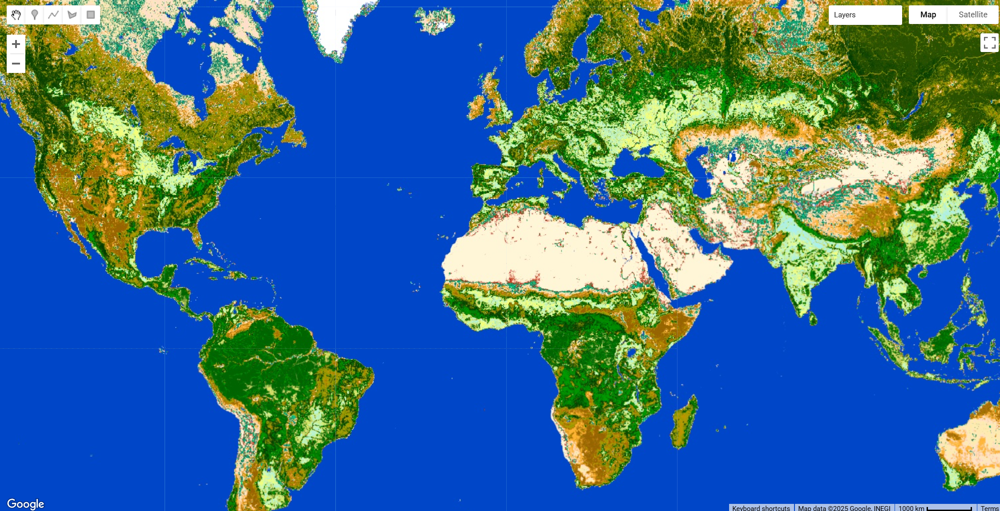

# Copernicus Climate Change Service (C3S) Land Cover Classification Gridded Maps (1992 -2022)

This dataset from the Copernicus Climate Change Service (C3S) provides global annual land cover (LC) maps from 1992 to the present. The maps describe the land surface using 22 classes defined by the UN Food and Agriculture Organization’s (UN FAO) Land Cover Classification System (LCCS). This dataset is designed for consistency with the European Space Agency (ESA) Climate Change Initiative (CCI) global annual LC maps from 1992-2015. The product is tailored for climate modelling communities but is also valuable for applications like forest monitoring, land accounting, and desertification studies due to its long-term consistency and yearly updates. You can download the [documentation here](https://dast.copernicus-climate.eu/documents/satellite-land-cover/WP2-FDDP-LC-2021-2022-SENTINEL3-300m-v2.1.1_PUGS_v1.1_final.pdf)

#### Dataset Description

The C3S LC maps are produced at a spatial resolution of approximately 300m (~0.00278°). The production methodology ensures temporal consistency across the entire series. A unique 10-year baseline LC map was first generated using the entire archive (2003-2012) of Medium Resolution Imaging Spectrometer (MERIS) data. This baseline is then annually updated (and was initially back-dated) by detecting land cover changes.

Change detection is performed using a variety of satellite time series:

* Advanced Very-High-Resolution Radiometer (AVHRR) for the period 1992-1999.
* SPOT-Vegetation (SPOT-VGT) for 1999-2013.
* PROBA-Vegetation (PROBA-V) for 2014-2019.
* Sentinel-3 OLCI and SLSTR for 2020 onwards.

In addition to the land cover class layer, the dataset includes four quality flag layers that provide information on the pixel state, processing status, number of observations, and the number of changes detected over the time series.

#### Available Layers

The dataset includes the main land cover classification layer and several quality flag layers.

| Variable Name | Description | Units |
|---------------|-------------|-------|
| `lccs_class` | Land cover class per pixel, defined using the UN LCCS legend of 22 primary classes. The full legend is available in the product user guide.| Dimensionless |
| `processed_flag` | A flag indicating whether a pixel was processed (1) or not (0). | Dimensionless |
| `current_pixel_state` | Identifies the pixel's status from observations, distinguishing between clear land, water, snow/ice, cloud, and cloud shadow. | Dimensionless |
| `observation_count` | The number of valid observations used to derive the baseline classification for each pixel. | Dimensionless |
| `change_count` | The number of LC changes observed per pixel during the period from 1992 to the latest map year. | Dimensionless |

#### Citation

```
Defourny, P., Lamarche, C., Bontemps, S., De Maet, T., Van Bogaert, E., Moreau, I., Brockmann, C., Boettcher, M., Kirches, G., Wevers, J., Santoro, M., Ramoino, F., & Arino, O. (2017). Land Cover Climate Change Initiative - Product User Guide v2. Issue 2.0.
```

#### Dataset Citation

```
Copernicus Climate Change Service, Climate Data Store, (2019): Land cover classification gridded maps from 1992 to present derived from satellite observation. Copernicus Climate Change Service (C3S) Climate Data Store (CDS). DOI: 10.24381/cds.006f2c9a (Accessed on DD-MMM-YYYY)
```



#### Earth Engine Snippet

```javascript
var collection = ee.ImageCollection("projects/sat-io/open-datasets/ESA/C3S-LC-L4-LCCS");

// Select the most recent image for visualization
var recentImage = collection.sort('system:time_start', false).first();

// Select the land cover classification band
var lccs = recentImage.select('b1').rename('lccs_class');

// Define the color palette based on the official C3S legend
var lccs_palette = [
  'ffff64', // 10: Cropland, rainfed
  'aaf0f0', // 20: Cropland, irrigated or post-flooding
  'dcf064', // 30: Mosaic cropland (>50%) / natural vegetation (<50%)
  'c8c864', // 40: Mosaic natural vegetation (>50%) / cropland (<50%)
  '006400', // 50: Tree cover, broadleaved, evergreen, closed to open (>15%)
  '00a000', // 60: Tree cover, broadleaved, deciduous, closed to open (>15%)
  '003c00', // 70: Tree cover, needleleaved, evergreen, closed to open (>15%)
  '285000', // 80: Tree cover, needleleaved, deciduous, closed to open (>15%)
  '788200', // 90: Tree cover, mixed leaf type
  '8ca000', // 100: Mosaic tree and shrub (>50%) / herbaceous cover (<50%)
  'be9600', // 110: Mosaic herbaceous cover (>50%) / tree and shrub (<50%)
  '966400', // 120: Shrubland
  'ffb432', // 130: Grassland
  'ffdcd2', // 140: Lichens and mosses
  'ffebaf', // 150: Sparse vegetation (<15%)
  '00785a', // 160: Tree cover, flooded, fresh or brackish water
  '009678', // 170: Tree cover, flooded, saline water
  '00dc82', // 180: Shrub or herbaceous cover, flooded
  'c31400', // 190: Urban areas
  'fff5d7', // 200: Bare areas
  '0046c8', // 210: Water bodies
  'ffffff'  // 220: Permanent snow and ice
];

// Define visualization parameters
var visParams = {
  min: 10,
  max: 220,
  palette: lccs_palette
};

// Add the layer to the map
Map.setCenter(0, 0, 2);
Map.addLayer(lccs, visParams, 'C3S Land Cover');
```

Sample Code: https://code.earthengine.google.com/?scriptPath=users/sat-io/awesome-gee-catalog-examples:global-landuse-landcover/C3S-LC

#### License

The products are made available to the public by ESA and the consortium. You may use one or several CCI-LC products land cover map for educational and/or scientific purposes, without any fee on the condition that you credit the ESA Climate Change Initiative and in particular its Land Cover project as the source of the CCI-LC database. Should you write any scientific publication on the results of research activities that use one or several CCI-LC products as input, you shall acknowledge the ESA CCI Land Cover project in the text of the publication and provide the project with an electronic copy of the publication (contact@esa-landcover-cci.org). If you wish to use one or several CCI-LC products in advertising or in any commercial promotion, you shall acknowledge the ESA CCI Land Cover project and you must submit the layout to the project for approval beforehand (contact@esa-landcover-cci.org).

Provided by: Copernicus Climate Change Service (C3S) / UCLouvain

Keywords: Land Cover, Climate Change, LCCS, Satellite, Copernicus, C3S, Global, ESA-CCI

Curated in GEE by: GEE Community

Last updated: 2025-04-19
