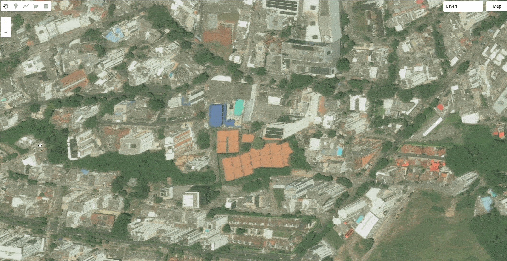

# 2026 Colombia Earthquake (Choco)

On 10 August 2026 at 07:34 local time (12:34 UTC), a Mw 7.4 earthquake struck western Colombia, with an epicenter about 5 to 20 km south of San Jose del Palmar in Choco department (USGS puts it at Mw 7.4 and roughly 110 km depth, while the Global CMT project and the Colombian Geological Survey both report Mw 7.5). The rupture was an intermediate depth strike slip event within the subducting Nazca plate, and strong shaking (MMI VI to VII) was felt across a wide swath of western and central Colombia, reaching Cali, Pereira, Manizales, Armenia and Quibdo, as well as parts of Ecuador and Panama. Two independent commercial disaster response programs, Vantor's (formerly Maxar) open data program and Planet Labs' disaster data program, tasked satellite collections over the affected departments, and both are catalogued here as separate Earth Engine collections.

#### Event Summary

| Field | Value |
|---|---|
| Date / time | 10 August 2026, 07:34 local (12:34 UTC) |
| Magnitude | Mw 7.4 (USGS), Mw 7.5 (Global CMT, Colombian Geological Survey) |
| Depth | approximately 110 km, strike slip, subducting Nazca plate |
| Epicenter | 5 to 20 km south of San Jose del Palmar, Choco, Colombia (approximately 4.844 N, 76.242 W) |
| Deaths | at least 294 (consolidated figures as of mid August 2026) |
| Injured / missing | 3,900+ injured, 300+ still missing |
| Affected departments | Choco, Valle del Cauca, Risaralda, Quindio, Caldas, Antioquia, plus damage reported as far as Cali |
| Economic damage | estimates diverge widely, from roughly USD 1 to 2 billion (Oxford Economics) up to about USD 10 billion in other reporting, so no single figure is authoritative here |

Casualty and damage figures for an event this recent continue to move as recovery operations proceed. Check the sources listed below before quoting a number.



#### Vantor (Maxar) Open Data

Vantor's open data program released a pre-event baseline collection over the earthquake affected region, 19 images across 2 ingestion runs, all captured before the event (earliest scene 16 July 2026, no post-event imagery in this collection as of ingestion). Sensors are WorldView-2, WorldView-3, WorldView Legion (three separate satellites in the constellation) and GeoEye-1, at native resolutions from 0.35 to 3.26 m. Assets are full-strip cloud optimized GeoTIFFs with a visual band and a thumbnail per acquisition.

```js
// Vantor (Maxar) open data, pre-event baseline imagery.
var vantorColombiaEq2026 = ee.ImageCollection("projects/sat-io/open-datasets/VANTOR-DISASTER-DATA/COLOMBIA_EQ_2026");
```

Sample code: https://code.earthengine.google.com/?scriptPath=users/sat-io/awesome-gee-catalog-examples:global-events-layers/VANTOR-OPEN-DATA

#### Planet Labs Disaster Data

Planet Labs' disaster data program released 157 images across 6 ingestion runs, combining a pre-event basemap with two distinct post-event collection phases. The pre-event baseline is drawn from Planet's Q2 2026 global quarterly basemap (1 April to 1 July 2026, roughly 4.8 m resolution). Post-event coverage was collected the same day and the following day as the earthquake: 57 PlanetScope scenes (approximately 3 m, collected the afternoon of 10 August 2026) spanning the cordillera from Risaralda south to Cauca, and skySat collects (approximately 0.66 m) over Quibdo, the Choco departmental capital, on 10 and 11 August 2026. Sensors are PlanetScope and SkySat, at resolutions from 0.66 to 4.78 m.

```js
// Planet Labs disaster data, pre-event basemap plus two post-event phases.
var planetColombiaEq2026 = ee.ImageCollection("projects/sat-io/open-datasets/PLANET-DISASTER-DATA/COLOMBIA_EQ_2026");
```

Sample code: https://code.earthengine.google.com/?scriptPath=users/sat-io/awesome-gee-catalog-examples:global-events-layers/PLANET-DISASTER-DATA

#### License

Both collections on this page are released under Creative Commons Attribution Non Commercial 4.0.

Data provided by: Vantor (Maxar) Open Data Program, Planet Labs PBC Disaster Data

Curated in GEE by: Samapriya Roy

Keywords: disaster, earthquake, Colombia, Choco, Vantor, Maxar, Planet Labs, PlanetScope, SkySat, WorldView, GeoEye

Last updated on GEE: 2026-08-17
