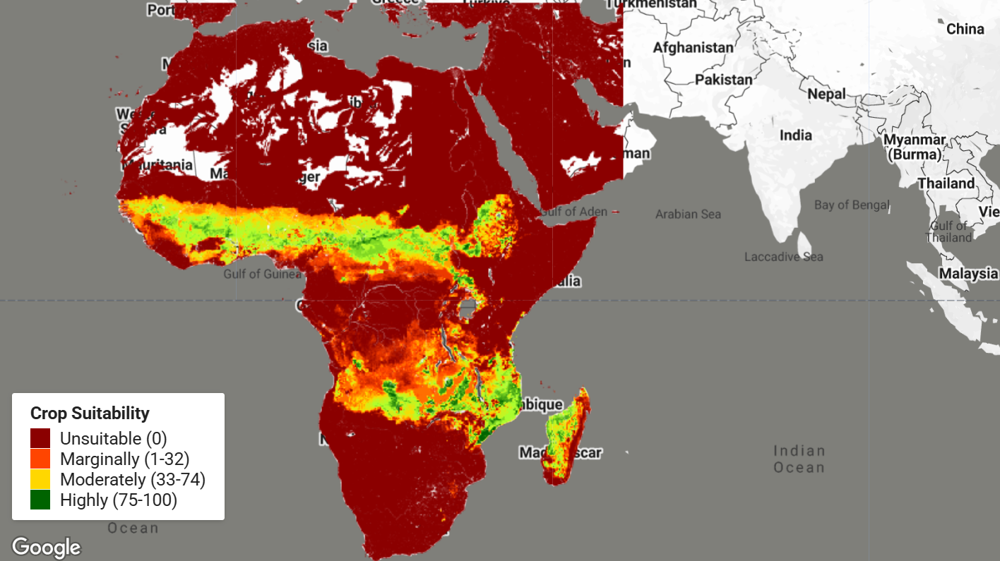

# CropSuite v1.0 Crop Suitability Assessment for Africa


CropSuite v1.0 is an open‑source tool that delivers high‑resolution crop‑suitability assessments for 48 species across the African continent, covering both rainfed and irrigated systems. The accompanying dataset, built for the historical window 1991‑2010, contains detailed suitability maps, climate suitability layers, identified limiting factors, estimates of multi‑cropping potential, and the optimal sowing windows for each crop. A central contribution of this work is the explicit incorporation of climate variability into the suitability calculations, offering a sharper picture for climate‑impact studies and agricultural decision‑making.

The modelling framework adopts a fuzzy‑logic formulation grounded in Liebig’s law of the minimum. By employing membership functions, it captures how each crop’s requirements intersect with a suite of climatic, edaphic, and topographic variables. With a spatial resolution of 30 arc‑seconds—roughly one kilometre—the model covers a broad portfolio of staples and cash crops, many of which have historically been overlooked in regional assessments, such as cassava, yam, millet, sorghum, cowpea, groundnuts, cocoa, coffee, oil palm, rubber, and banana.

Analyses of the resulting maps reveal that, across Africa, 5.7 million km² are highly suitable for cultivation, 10.6 million km² fall into a moderate suitability class, 3.3 million km² are marginal, and 10.4 million km² are deemed unsuitable. The zone between 10° N and 10° S offers a strong opportunity for multiple cropping, potentially supporting two or three harvests each year. In terms of sheer area, safflower leads with 16.82 million km² of suitable land, followed by sesame, guava, cowpea, and mango, which record 15.76, 14.15, 13.61, and 13.39 million km² respectively. When the model accounts for the dampening effect of climate variability, the overall area of suitable land shrinks by more than 2.2 million km², a reduction that is particularly pronounced in Somalia, Kenya, Ethiopia, South Africa, and the Maghreb countries of Morocco, Algeria, Tunisia, and Libya.

#### Dataset Description

The CropSuite v1.0 dataset provides comprehensive crop suitability information at 30 arcsec spatial resolution (approximately 1 km at the Equator) for Africa. The dataset uses:

* **Climate Data**: CHIRPS v2.0 daily precipitation and CHIRTS v1.0 daily temperature (1991-2010)
* **Soil Data**: ISRIC SoilGrids (250m-1000m), WISE database, and ISRIC Global Soil Salinity Map
* **Terrain Data**: SRTM elevation data
* **Irrigation**: Current irrigated areas based on Meier et al. (2018)

The model accounts for:
- Climate variability and recurrence rate of potential crop failure
- Irrigated and rainfed agricultural systems
- Vernalization requirements for winter crops
- Lethal temperature thresholds
- Photoperiodic sensitivity
- Multiple cropping potential
- Optimal sowing and harvest dates

The data is organized into 10 thematic collections, with each collection containing 6 scenarios representing different water conditions (rainfed, irrigated, combined) and climate variability considerations (with/without).

#### Crops Included (48 Total)

Alfalfa, Arabica Coffee, Avocado, Banana, Barley, Beans, Cabbage, Carrot, Cashew, Cassava, Castor Bean, Chickpea, Citrus, Cocoa, Coconut, Cotton, Cowpea, Green Pepper, Groundnut, Guava, Maize, Mango, Millet, Oil Palm, Olive, Onion, Papaya, Pea, Pineapple, Potato, Rapeseed, Rice, Robusta Coffee, Rubber tree, Rye, Safflower, Sesame, Sorghum, Soy, Sugar Cane, Sunflower, Sweet Potato, Tea, Tobacco, Tomato, Watermelon, Wheat, Yam

#### Available Collections and Layers

The dataset is organized into 10 thematic ImageCollections, each containing 6 scenario images:

**Collections:**

1. `climate_suitability` - Climate suitability index for each crop
2. `climate_suitability_mc` - Climate suitability for multiple cropping systems
3. `crop_limiting_factor` - Primary limiting factor for crop growth
4. `crop_suitability` - Overall crop suitability considering all factors
5. `multiple_cropping` - Potential number of harvests per year
6. `optimal_sowing_date` - Optimal day of year to plant crop
7. `optimal_sowing_date_mc_first` - Optimal sowing date for first harvest in multiple cropping
8. `optimal_sowing_date_mc_second` - Optimal sowing date for second harvest in multiple cropping
9. `optimal_sowing_date_mc_third` - Optimal sowing date for third harvest in multiple cropping
10. `suitable_sowing_days` - Number of suitable days per year for sowing

**Scenarios in each collection:**

- `historical_1991-2010_ir_novar` - Irrigated without climate variability
- `historical_1991-2010_ir_var` - Irrigated with climate variability
- `historical_1991-2010_rf_novar` - Rainfed without climate variability
- `historical_1991-2010_rf_var` - Rainfed with climate variability
- `historical_1991-2010_rfir_novar` - Combined rainfed/irrigated without climate variability
- `historical_1991-2010_rfir_var` - Combined rainfed/irrigated with climate variability

**Band Structure:**

Each scenario image contains up to 48 bands, one per crop. Band names correspond to crop names (e.g., `maize`, `wheat`, `cassava`).

<center>

| Collection                      | Value Range | Data Type   | Pyramiding Policy |
| ------------------------------- | ----------- | ----------- | ----------------- |
| `crop_suitability`              | 0-100       | Continuous  | MEAN              |
| `climate_suitability`           | 0-100       | Continuous  | MEAN              |
| `climate_suitability_mc`        | 0-100       | Continuous  | MEAN              |
| `suitable_sowing_days`          | 0-365       | Continuous  | MEAN              |
| `optimal_sowing_date`           | 1-365       | Discrete    | MODE              |
| `optimal_sowing_date_mc_first`  | 1-365       | Discrete    | MODE              |
| `optimal_sowing_date_mc_second` | 1-365       | Discrete    | MODE              |
| `optimal_sowing_date_mc_third`  | 1-365       | Discrete    | MODE              |
| `multiple_cropping`             | 1-3         | Discrete    | MODE              |
| `crop_limiting_factor`          | Categorical | Categorical | MODE              |

</center>

#### Citation

```
Zabel, F., Knüttel, M., & Poschlod, B. (2025). CropSuite v1.0 – a comprehensive open-source
crop suitability model considering climate variability for climate impact assessment.
Geosci. Model Dev., 18, 1067–1087. https://doi.org/10.5194/gmd-18-1067-2025
```

#### Dataset Citation

```
Zabel, F., Knüttel, M., & Poschlod, B. (2024). CropSuite – Crop suitability assessment
for 48 crops under rainfed and irrigated conditions for Africa (1.0) [Data set].
Zenodo. https://doi.org/10.5281/zenodo.14514729
```



#### Earth Engine Snippet

```javascript
// Load crop suitability collection
var cropSuitability = ee.ImageCollection('projects/sat-io/open-datasets/CROP_SUITE/crop_suitability');

// Select rainfed scenario with climate variability
var rainfedVar = cropSuitability
  .filter(ee.Filter.eq('scenario', 'historical_1991-2010_rf_var'))
  .first();

// Select maize suitability band
var maizeSuitability = rainfedVar.select('maize');

// Visualization parameters
var suitabilityVis = {
  min: 0,
  max: 100,
  palette: ['8B0000', 'FF4500', 'FFD700', 'ADFF2F', '006400']
};

// Center on Africa and display
Map.setCenter(20, 0, 4);
Map.addLayer(maizeSuitability, suitabilityVis, 'Maize Crop Suitability');

// Add legend
var legend = ui.Panel({
  style: {position: 'bottom-left', padding: '8px 15px'}
});
var legendTitle = ui.Label({
  value: 'Crop Suitability',
  style: {fontWeight: 'bold', fontSize: '14px', margin: '0 0 4px 0'}
});
legend.add(legendTitle);

var makeRow = function(color, name) {
  var colorBox = ui.Label({
    style: {
      backgroundColor: color,
      padding: '8px',
      margin: '0 8px 0 0'
    }
  });
  var description = ui.Label({value: name, style: {margin: '0'}});
  return ui.Panel({
    widgets: [colorBox, description],
    layout: ui.Panel.Layout.Flow('horizontal')
  });
};

legend.add(makeRow('8B0000', 'Unsuitable (0)'));
legend.add(makeRow('FF4500', 'Marginally (1-32)'));
legend.add(makeRow('FFD700', 'Moderately (33-74)'));
legend.add(makeRow('006400', 'Highly (75-100)'));

Map.add(legend);

// Example: Compare scenarios
print('Available scenarios:', cropSuitability.aggregate_array('scenario').distinct());

// Example: Analyze multiple crops
var crops = ['maize', 'wheat', 'cassava', 'sorghum'];
var multiCrop = rainfedVar.select(crops);

// Calculate average suitability across selected crops
var avgSuitability = multiCrop.reduce(ee.Reducer.mean());
Map.addLayer(avgSuitability, suitabilityVis, 'Average Suitability (4 crops)', false);
```

Sample Code: https://code.earthengine.google.com/?scriptPath=users/sat-io/awesome-gee-catalog-examples:agriculture-vegetation-forestry/CROPSUITE-AFRICA

App: [Check out a quick app for all crops](https://sat-io.earthengine.app/view/crop-suite)

#### License

This dataset is distributed under the Creative Commons Attribution 4.0 International (CC BY 4.0) license. Users are free to share and adapt the material for any purpose, provided appropriate credit is given to the source.

Provided by: Zabel et al 2025, University of Basel

Curated in GEE by: Samapriya Roy

Keywords: crop suitability, climate change, agriculture, Africa, food security, land use planning, climate variability, fuzzy logic, crop modeling, optimal sowing dates, multiple cropping, climate adaptation

Last updated: 2025-10-01
