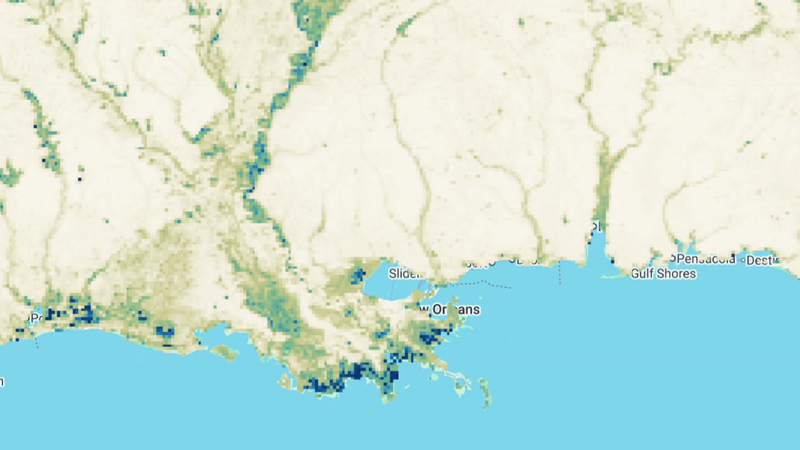

# CYGNSS Fractional Inundation

The UCAR/CU CYGNSS inundation maps provide fractional surface water extent derived from NASA's Cyclone Global Navigation Satellite System (CYGNSS), a constellation of eight microsatellites launched in December 2016. Each satellite carries a GNSS-Reflectometry (GNSS-R) receiver that records L-band GPS signals reflected from the Earth's surface. Because the transmitters are already on orbit, GNSS-R receivers are inexpensive to build and fly, which makes constellations — and therefore short revisit times — practical in a way that single-satellite radars are not. Surface reflectivity (Γ) at L-band is sensitive to the dielectric constant and micro-scale roughness of the reflecting surface, both of which change sharply when a landscape floods.

Inundation fraction is retrieved by treating the observed reflectivity of a 3 km grid cell as the weighted average of the reflectivity of its inundated and un-inundated fractions, with the weights equal to the respective cell fractions. Inverting this relationship requires ancillary estimates of soil moisture (SMAP L3 Enhanced), soil surface roughness, water surface roughness, and an empirical correction for the attenuating effect of above-ground biomass. Soil and water roughness are parameterized as spatially varying but temporally static fields calibrated against 2018 observations; soil moisture varies through time.

Because the eight satellites sample the surface pseudo-randomly and cannot completely cover it within a few days, observations are aggregated over 3-day windows and spatially interpolated using the Previously-Observed Behavior Interpolation (POBI) method, which derives historical relationships between reflectivity in neighboring grid cells and applies them to unobserved cells. POBI is an exact interpolator — observed values are unchanged — so users who prefer to avoid interpolated data can restrict their analysis to observed cells using the interpolation flag band.

Data span March 2017 to present at 3 km resolution, with daily files representing the mean inundation fraction for the current day and previous two days. Coverage is limited to ±38 degrees latitude by the CYGNSS orbital inclination.

#### Available Datasets

| Dataset Type | Description | Status | Earth Engine Collection |
| --- | --- | --- | --- |
| **CYGNSS Inundation** | Daily 5-band fractional inundation, anomalies, and interpolation flag (2017-present) | Ongoing | `projects/sat-io/open-datasets/CYGNSS/INUNDATION` |

#### Dataset Details

??? example "The CYGNSS inundation dataset details can be found here"

      | Characteristic | Description |
      | --- | --- |
      | Name | UCAR/CU CYGNSS Inundation Maps |
      | Provider | University Corporation for Atmospheric Research (UCAR) and University of Colorado Boulder |
      | Funding | NASA Terrestrial Hydrology Program (awards 80NSSC19K0046, 80NSSC18K1430) |
      | Data Type | Raster (5-band, UInt8) |
      | Coverage | Global, ±38 degrees latitude (CYGNSS orbital inclination) |
      | Temporal Range | March 2017 - present |
      | Temporal Resolution | Daily files; 3-day aggregation window |
      | Spatial Resolution | 3 km x 3 km |
      | Coordinate System | WGS 84 / NSIDC EASE-Grid 2.0 Global (EPSG:6933) |
      | Version | 3.2 |
      | Fill Value | 255 |

#### Band Descriptions

??? example "The CYGNSS inundation dataset includes the following bands"

      | Band | Description | Units |
      | --- | --- | --- |
      | inundation_1day | 1-day CYGNSS inundation fraction, observed cells only | %, divide by 100 for fraction |
      | inundation_3day | 3-day CYGNSS average inundation fraction, interpolated onto a regular grid | %, divide by 100 for fraction |
      | interpolation_flag | Whether a grid cell is interpolated (1) or observed (0) | None |
      | inundation_anomaly_1day | 1-day inundation anomaly, observed cells only | %, subtract 100 then divide by 100 |
      | inundation_anomaly_3day | 3-day average inundation anomaly, interpolated onto a regular grid | %, subtract 100 then divide by 100 |

      All bands use 255 as the fill value. Anomaly bands carry a +100 bias so that negative anomalies can be stored in an unsigned type — subtract 100 before converting to fractional inundation. Anomalies are computed relative to a long-term baseline climatology.

#### Image Properties

??? example "Each image carries the following properties"

      | Property | Description |
      | --- | --- |
      | year | Calendar year of the observation |
      | doy | Day of year (1-366) |
      | date | Observation date as YYYY-MM-DD |
      | month | Calendar month |
      | version | Product version (3.2) |
      | scale_factor | 0.01 — multiply band values to obtain fraction |
      | anomaly_offset | 100 — subtract from anomaly bands before scaling |
      | fill_value | 255 |
      | system:time_start | UTC midnight of the observation date |
      | system:time_end | UTC midnight of the following day (exclusive) |

#### Uncertainty and Known Limitations

??? example "Users should be aware of the following sources of uncertainty"

      | Source | Effect |
      | --- | --- |
      | Reflectivity calibration | Uncertainty in Γ is roughly ±1.74 dB, much of it attributable to GPS satellites switching to 'flex power mode' in February 2020. CYGNSS data are not calibrated for land remote sensing, which can bias entire tracks up or down. |
      | Water roughness | The largest known unknown. Water roughness is held temporally static, but varies with wind. Where surface water is rougher than the parameterized value, inundation is under-retrieved. |
      | Soil moisture | SMAP retrievals are themselves biased high by surface water, and high soil moisture values push the retrieval toward underestimating inundation during floods. |
      | High inundation fractions | Reflectivity becomes progressively less sensitive to inundation as fraction rises above ~0.5, so small errors in Γ can translate into inundation differences greater than 0.3. |
      | Dense vegetation | Retrievals underestimate inundation in flooded forest; the biomass correction does not account for seasonal canopy water content or structure. |
      | Complex terrain | Isolated cells with anomalously high inundation appear in mountainous regions, resembling speckle noise. |
      | Spatial interpolation | POBI performs best where inundation follows historical patterns and less well during floods with return intervals longer than the 2017-2018 training period. |

      Compared against PALSAR-2 over the Amazon, retrievals agree closely (RMSD 0.07, r² of 0.91) but underestimate at high water fractions. Against the Dartmouth Flood Observatory for Cyclone Idai, mean inundation was 0.06 low with an RMSD of 0.16. Incorporating several inundation sources is likely to be more informative than relying on any one alone.

#### Data Access

The source netCDF files are hosted on the [COSMIC data server](https://data.cosmic.ucar.edu/gnss-r/inundation/cygnss/level3/). The Earth Engine collection hosts the same retrievals converted to Cloud-Optimized GeoTIFF and updated to present day.

#### Citation

```
Chew, C., Small, E., Huelsing, H. 2023. Flooding and inundation maps using interpolated CYGNSS reflectivity observations. Remote Sensing of Environment 293: 113598. https://doi.org/10.1016/j.rse.2023.113598
```

**Related publications:**

* Chew, C.; Small, E. 2020. Estimating inundation extent using CYGNSS data: A conceptual modeling study. Remote Sensing of Environment 246: 111869. https://doi.org/10.1016/j.rse.2020.111869
* Chew, C. 2021. Spatial interpolation based on previously-observed behavior: a framework for interpolating spaceborne GNSS-R data from CYGNSS. Journal of Spatial Science. https://doi.org/10.1080/14498596.2021.1942253
* Chew, C.; Small, E. 2020. Description of the UCAR/CU Soil Moisture Product. Remote Sensing 12(10): 1558. https://doi.org/10.3390/rs12101558
* Chew, C.; Reager, J.T.; Small, E. 2018. CYGNSS data map flood inundation during the 2017 Atlantic hurricane season. Scientific Reports 8. https://doi.org/10.1038/s41598-018-27673-x
* Chew, C.; Small, E. 2018. Soil moisture sensing using spaceborne GNSS reflections: comparison of CYGNSS reflectivity to SMAP soil moisture. Geophysical Research Letters 45: 4049-4057. https://doi.org/10.1029/2018GL077905
* Baldysz, Z.; Baranowski, D. B.; Flatau, P. J.; Flatau, M. K.; Chew, C. 2025. Detecting localized floods in tropical regions with CYGNSS SmallSat constellation: A proof of concept from the Maritime Continent. Geophysical Research Letters 52: e2025GL118111. https://doi.org/10.1029/2025GL118111



#### Earth Engine Snippet

```javascript
var cygnss = ee.ImageCollection("projects/sat-io/open-datasets/CYGNSS/inundation");

// Scale to fractional inundation and mask fill values
var toFraction = function(image) {
  return image.select(['inundation_1day', 'inundation_3day'])
              .updateMask(image.select('inundation_3day').neq(255))
              .divide(100)
              .copyProperties(image, ['system:time_start', 'doy', 'year']);
};

// Anomalies carry a +100 bias
var toAnomaly = function(image) {
  return image.select('inundation_anomaly_3day')
              .updateMask(image.select('inundation_anomaly_3day').neq(255))
              .subtract(100).divide(100)
              .copyProperties(image, ['system:time_start']);
};

// Restrict to directly observed cells only
var observedOnly = function(image) {
  return image.updateMask(image.select('interpolation_flag').eq(0));
};

var palette = ['f7f4e9', 'c8c88c', '7ab88a', '2b8cbe', '08306b'];
Map.addLayer(cygnss.filterDate('2024-08-01', '2024-09-01').map(toFraction).mean(),
             {min: 0, max: 1, bands: ['inundation_3day'], palette: palette},
             'Mean fractional inundation, Aug 2024');
```

Sample Code: https://code.earthengine.google.com/?scriptPath=users/sat-io/awesome-gee-catalog-examples:hydrology/CYGNSS-INUNDATION

#### License

This work is licensed under a [Creative Commons Attribution-ShareAlike 4.0 International License](https://creativecommons.org/licenses/by-sa/4.0/) (CC BY-SA 4.0).

Created by: Clara Chew, Zofia Baldysz, Eric Small, and Hannah Huelsing — University Corporation for Atmospheric Research (UCAR) and University of Colorado Boulder, with funding from the NASA Terrestrial Hydrology Program

Curated in GEE by: Samapriya Roy

Keywords: inundation, flooding, surface water, CYGNSS, GNSS-R, reflectometry, wetlands, hydrology

Last updated: 2026-08-05
