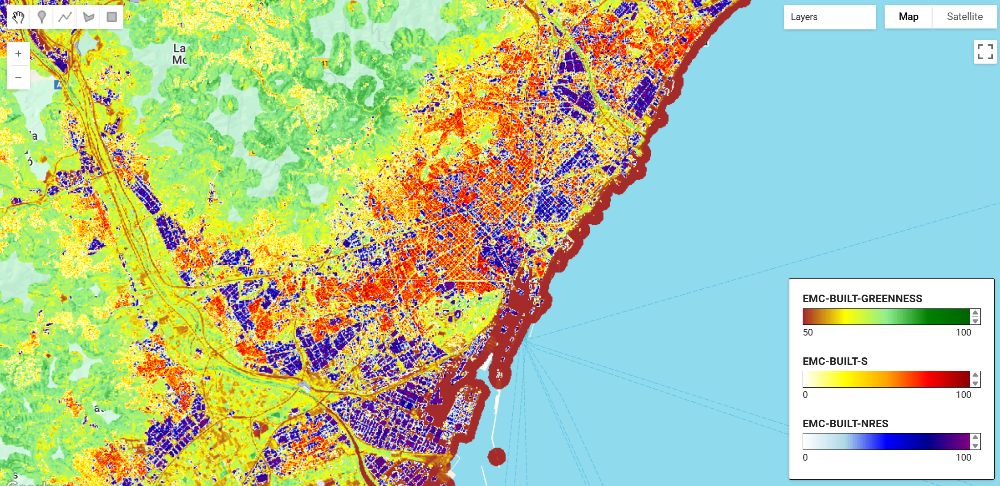

# Copernicus EMC-BUILT Global Built-up Surface R2025A

The Copernicus Exposure Mapping Component (EMC) Built-up product (EMC-BUILT R2025A) provides high-resolution global information on built-up surfaces, non-residential structures, and vegetation within built-up areas for the reference year 2022. This dataset represents the first operational Copernicus production of built-up information based on Sentinel-2 data and deep learning architecture, ensuring continuity with previous Global Human Settlement Layer (GHSL) products while introducing major methodological innovations. The dataset is produced by the European Commission's Joint Research Centre (JRC) as part of the Copernicus Emergency Management Service (CEMS) to support crisis management, disaster risk reduction, urban planning, and sustainable development monitoring.

The production employs a modified U-Net convolutional neural network (CNN) trained on Sentinel-2 imagery with comprehensive geospatial covariates including spectral metrics, temporal harmonics, and building footprints from multiple open sources (OpenStreetMap, Microsoft Building Footprints, Google Open Buildings). The dataset provides three core products at multiple resolutions (10m, 100m, 1000m in World Mollweide projection, and 3/30 arc-seconds in WGS84): total built-up surface, non-residential built-up surface, and greenness fraction within the built-up domain. All products follow an open and free data access policy aligned with the Copernicus programme principles.

#### Methodology Overview

The EMC-BUILT production workflow consists of six main steps:

1. **Pre-processing**: Computation of spectral and temporal metrics from all Sentinel-2 Level-1C scenes for 2022, including harmonic coefficients and percentile composites
2. **Reference Data Collection**: Compilation of global building footprint data from multiple open sources (OSM, Microsoft, Google)
3. **Model Training**: Development of a modified U-Net CNN to map Sentinel-2 metrics to built-up surfaces
4. **Prediction**: Application of trained models across all Sentinel-2 tiles with ensemble predictions
5. **Post-processing**: Ensemble averaging, commission error correction using auxiliary indices (NDWI), and value rescaling
6. **Mosaicking and Reprojection**: Assembly and reprojection to global grids in Mollweide and WGS84

The greenness layer is derived from median NDVI values with a 300m buffer around built-up areas to capture vegetation in and around settlements.

!!! info
    EMC-BUILT and GHSL R2023 are incompatible data streams. Direct temporal comparisons or change detection between these releases are not supported due to substantial methodological differences.

#### Dataset Characteristics

<center>

| Parameter | Value |
|-----------|-------|
| Spatial Resolution | 10m, 100m, 1000m (Mollweide); 3 arcsec, 30 arcsec (WGS84) |
| Temporal Coverage | 2022 (reference year) |
| Geographic Coverage | Global land areas (−60.9° to 89.1° latitude) |
| Coordinate Systems | World Mollweide (ESRI:54009), WGS84 (EPSG:4326) |
| Data Format | Cloud-optimised GeoTIFF (COG) |
| Source Data | Sentinel-2 Level-1C imagery |
| Methodology | U-Net CNN with Random Forest dasymetric approach |
| Update Frequency | Biennial (operational production every 2 years) |

</center>

#### Available Data Products

The **EMC-BUILT** collection provides three complementary datasets:

| Asset Name | Description | Value Range | Units |
|------------|-------------|-------------|-------|
| `EMC-BUILT-S` | Total built-up surface area per grid cell | 0-100 (10m), 0-10,000 (100m), 0-1,000,000 (1000m) | Square metres |
| `EMC-BUILT-NRES` | Non-residential built-up surface (industrial/commercial) | 0-100 (10m), 0-10,000 (100m), 0-1,000,000 (1000m) | Square metres |
| `EMC-BUILT-GREENNESS` | Vegetation fraction (NDVI) within and around built-up areas | 0-100 | NDVI percentage |

#### Citation

**Dataset**

```
Riffler, M., Leitner, A., Ralser, S., Poglitsch, E., Schleicher, C., Faucqueur, L., Pennec, A., Marconcini, M., Esch, T., Julea, A.M., Kemper, T., Politis, P., Melchiorri, M. (2025): EMC-BUILT R2025A – Exposure Mapping Component built-up surface grid, derived from Sentinel-2 year 2022. European Commission, Joint Research Centre (JRC) [Dataset]
doi: 10.2905/4cd8ccee-bfd1-48c5-9047-61c0343c41e9
```

**Concept & Methodology**:

```
Kemper, T., Politis, P., Mari Rivero, I., Riffler, M., Leitner, A. et al. (2025): Copernicus Exposure Mapping Component Built-up product 2022 - EMC-BUILT R2025,
Publications Office of the European Union, Luxembourg, JRC144315
```



#### Earth Engine Snippet

```javascript
// Load the three EMC-BUILT products
var builtUpSurface = ee.ImageCollection("projects/earthengine-legacy/assets/projects/sat-io/open-datasets/ESA/CEMS/EMC-BUILT-S");
var nonResidential = ee.ImageCollection("projects/earthengine-legacy/assets/projects/sat-io/open-datasets/ESA/CEMS/EMC-BUILT-NRES");
var greenness = ee.ImageCollection("projects/earthengine-legacy/assets/projects/sat-io/open-datasets/ESA/CEMS/EMC-BUILT-GREENNESS");
```

Sample Code: https://code.earthengine.google.com/?scriptPath=users/sat-io/awesome-gee-catalog-examples:global-utilities-assets-amenities/EMC-BUILT-2025A

#### License

This work is licensed under a Creative Commons Attribution 4.0 International License (CC BY 4.0). The reuse policy is implemented under European Commission Decision 2011/833/EU. All data and methods follow a fully open and free access policy aligned with the Copernicus programme and GHSL principles.

Provided by: European Commission Joint Research Centre (JRC), Copernicus Emergency Management Service

Keywords: Built-up surface, Urban mapping, Sentinel-2, Deep learning, U-Net, Settlement mapping, Non-residential buildings, Urban greenness, GHSL, Copernicus, Exposure mapping, Disaster risk reduction, Global Human Settlement Layer, Land cover

Curated in GEE by: Samapriya Roy

Last updated in GEE: 2025-11-11
