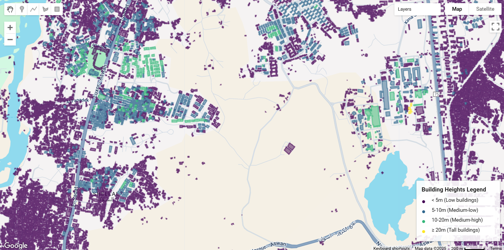

# Global Building Atlas Polygons

GlobalBuildingAtlas is a comprehensive dataset providing global coverage of building polygons (GBA.Polygon), heights (GBA.Height), and Level of Detail 1 (LoD1) 3D building models (GBA.LoD1). This represents the first open dataset to offer high quality, consistent, and complete building data in both 2D and 3D forms at the individual building level on a global scale. The dataset was developed using machine learning-based pipelines applied to global PlanetScope satellite imagery, offering unprecedented spatial resolution and coverage for building-level analysis.

The GlobalBuildingAtlas addresses critical gaps in existing global building datasets by providing comprehensive 3D information at individual building level, which enables applications in urban planning, energy modeling, disaster risk assessment, and climate change research. With more than 2.75 billion building polygons worldwide, this dataset surpasses existing global building databases by over 1 billion structures.

#### Dataset Details

<center>

| Characteristic | Description |
|----------------|-------------|
| Name | GlobalBuildingAtlas - Global Building Polygons, Heights and LoD1 3D Models |
| Provider | Technical University of Munich (TUM) |
| Coverage | Global (2.75 billion building polygons) |
| Temporal Range | 2019 (primary reference year) |
| Resolution | 3×3 meters (height maps), Individual building polygons |
| Data Format | GeoJSON (polygons/3D models), GeoTIFF (height maps) |
| Coordinate System | WGS84 (EPSG:4326) |
| Source Data | PlanetScope Surface Reflectance imagery + Multiple building footprint sources |

</center>

#### Citation

```
Zhu, Xiao Xiang, Sining Chen, Fahong Zhang, Yilei Shi, and Yuanyuan Wang. "GlobalBuildingAtlas: An Open Global and Complete Dataset of Building Polygons,
Heights and LoD1 3D Models." arXiv preprint arXiv:2506.04106 (2025).
```

#### Dataset Citation

```
Zhu, X.X., Chen, S., Zhang, F., Shi, Y., Wang, Y. (2025). GlobalBuildingAtlas: An Open Global and Complete Dataset of Building Polygons, Heights and LoD1 3D Models.
Technical University of Munich (TUM). [doi: 10.14459/2025mp1782307](https://doi.org/10.14459/2025mp1782307)
```

#### Coverage and Accuracy

**Global Statistics**:
- **Total Buildings**: 2.75 billion polygons
- **With Height Data**: 2.68 billion (97.4% completeness)
- **Total Building Area**: 506.64 billion m²
- **Total Building Volume**: 2.85 trillion m³

!!! note "Data Availability in Earth Engine"

    Only the **GBA.Polygon** component (building footprints with height attributes) is available in Google Earth Engine as Feature Collections. The **GBA.Height** raster maps and **GBA.LoD1** 3D models are available through the original data repository but not ingested into Earth Engine.



#### Earth Engine Snippet

```javascript
// Load sample building polygon data - replace 'TILE_ID' with specific tile identifier
var gba_polygons = ee.FeatureCollection("projects/sat-io/open-datasets/GLOBAL_BUILDING_ATLAS/e030_n25_e035_n20");

// Filter buildings with height information
var buildings_with_height = gba_polygons.filter(
  ee.Filter.and(
    ee.Filter.neq('height', null),
    ee.Filter.gt('height', 0)
  )
);

// Method 1: Color by height ranges using separate layers (more precise control)
var heightRanges = [
  {min: 0, max: 5, color: '440154', label: '< 5m (Low)'},
  {min: 5, max: 10, color: '31688e', label: '5-10m (Medium-low)'},
  {min: 10, max: 20, color: '35b779', label: '10-20m (Medium-high)'},
  {min: 20, max: 999, color: 'fde725', label: '≥ 20m (Tall)'}
];

// Add layers for each height range
heightRanges.forEach(function(range) {
  var rangeFilter = ee.Filter.and(
    ee.Filter.gte('height', range.min),
    ee.Filter.lt('height', range.max)
  );

  var rangeBuildings = buildings_with_height.filter(rangeFilter);

  Map.addLayer(
    rangeBuildings,
    {color: range.color, width: 1, fillColor: range.color},
    'Height ' + range.label,
    true,
    0.8
  );
});

// Calculate building statistics
print('Total building polygons in tile:', gba_polygons.size());
print('Buildings with height data:', buildings_with_height.size());

// Filter large buildings by area and use simple style
var large_buildings = gba_polygons.filter(ee.Filter.gt('area', 500));
Map.addLayer(large_buildings.style({color: 'red'}), {}, 'Large Buildings (>500m²)');

// Get height statistics
var height_stats = buildings_with_height.aggregate_stats('height');
print('Height statistics:', height_stats);

// Create height legend panel
function createLegendRow(color, text) {
  return ui.Panel({
    widgets: [
      ui.Label({
        value: '●',
        style: {
          color: color,
          fontSize: '16px',
          margin: '0px 8px 0px 0px',
          padding: '0px',
          width: '16px',
          textAlign: 'left'
        }
      }),
      ui.Label({
        value: text,
        style: {
          fontSize: '12px',
          margin: '0px',
          padding: '0px'
        }
      })
    ],
    layout: ui.Panel.Layout.flow('horizontal'),
    style: {
      margin: '2px 0px',
      padding: '0px'
    }
  });
}

var legendPanel = ui.Panel({
  widgets: [
    ui.Label({
      value: 'Building Heights Legend',
      style: {fontWeight: 'bold', fontSize: '14px', margin: '0 0 8px 0'}
    }),
    createLegendRow('#440154', '< 5m (Low buildings)'),
    createLegendRow('#31688e', '5-10m (Medium-low)'),
    createLegendRow('#35b779', '10-20m (Medium-high)'),
    createLegendRow('#fde725', '≥ 20m (Tall buildings)')
  ],
  style: {
    position: 'bottom-right',
    padding: '12px',
    backgroundColor: 'rgba(255, 255, 255, 0.9)',
    border: '1px solid #ccc',
    width: '200px'
  }
});

Map.add(legendPanel);

// Center map on the tile extent
Map.setCenter(32.90,24.06, 15);
```

Sample Code: https://code.earthengine.google.com/?scriptPath=users/sat-io/awesome-gee-catalog-examples:global-utilities-assets-amenities/GLOBAL-BUILDING-ATLAS(GBA)

Tile ID find and download App: https://sat-io.earthengine.app/view/gba

#### License

The dataseta are available under a [Creative Commons Attribution-NonCommercial 4.0 International (CC BY-NC 4.0) license.](https://creativecommons.org/licenses/by-nc/4.0/)


Keywords : Building Footprint, Building Height, 3D Building Models, Remote Sensing, Earth Observation, Deep Learning, Urban Morphology, Global Coverage, PlanetScope, Machine Learning, LoD1 Models

Created by: Xiao Xiang Zhu et al. 2025, Technical University of Munich

Curated in GEE by: Samapriya Roy

Last updated: 2025-09-22
