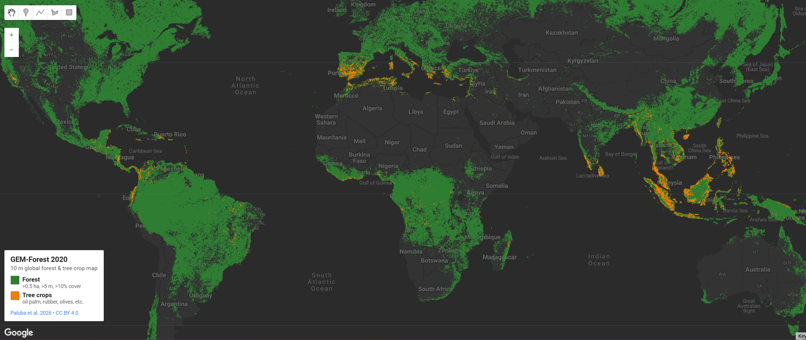

# Global Satellite Embedding-based Map of Forests and Tree Crops

!!! note "Preprint Notice"
    This dataset is associated with a **non-peer-reviewed preprint** submitted to EGUsphere (March 19, 2026). The methodology and results have not yet undergone formal peer review. Users are encouraged to review the [preprint](https://doi.org/10.5194/egusphere-2026-1401) directly and exercise appropriate caution when citing or applying this dataset in research.

A 10 m global map of forests and agricultural tree crops for 2020, built from Google DeepMind's Alpha Earth Foundation (AEF) satellite embeddings paired with a simple linear Support Vector Machine classifier. Unlike most global forest products, GEM-Forest explicitly separates forests from agricultural tree crops such as oil palm, rubber, coconut, olives, and fruit trees, addressing a known weakness of existing tree-cover datasets which tend to lump plantations in with natural forest.

The dataset comes in two variants. **GEM-FnF2020** is a binary forest / non-forest map following the FAO and EUDR forest definitions, achieving 91% overall accuracy and a macro F1-score of 0.90 against an independent ~21,000-point validation set. **GEM-TC2020** adds a tree-crop class as a sub-category of non-forest, with overall accuracy above 85% for most tree crop types. Because the AEF embeddings cover 2017–2025, the same trained model weights can be applied across that full period — meaning users can generate consistent annual maps for change detection without retraining or rebuilding ancillary datasets.

#### Key Features and Details

| Feature | Value |
|--|--|
| **Spatial Resolution** | 10 m |
| **Coordinate System** | WGS 84 (EPSG:4326) |
| **Temporal Scope** | 2020 (baseline; transferable to 2017–2025 via released model weights) |
| **Data Source** | Google DeepMind Alpha Earth Foundation (AEF) Satellite Embeddings |
| **Classifier** | Linear Support Vector Machine (selected from 8 ML models tested) |
| **Training Samples** | ~47,000 globally distributed points across 230 100×100 km areas |
| **Validation Samples** | ~21,000 (F/nF) + 8 tree-crop validation datasets |
| **Overall Accuracy (F/nF)** | 91% (macro F1 = 0.90) |
| **Tree Crop Accuracy** | >85% for most types |
| **Forest Definition** | FAO/EUDR: ≥0.5 ha, trees >5 m, canopy cover >10%, excluding agricultural and urban land use |
| **Coverage** | Global |

**GEM-FnF2020 Classes (binary):** Non-forest (0), Forest (1).

**GEM-TC2020 Classes (multi-class):** Non-forest other (0), Forest (1), Tree crops (2). Tree crops include oil palm, rubber, coconut, other palms, and European tree crops such as olives and fruit trees.

**Method Notes:** Training data were generated automatically by intersecting multiple global forest and land-cover datasets (ESA WorldCover, JRC GFC2020 v3, Hansen GFC) into a "strict" forest mask, with tree-crop training points sourced from the Forest Data Partnership palm/rubber layers, the global coconut palm map, the Copernicus FADSL European tree-crop layer, and the South America tree-crop map. A 0.5 ha majority filter is applied to the forest class to align with FAO/EUDR area thresholds, and urban areas are masked using GUB GAIA and FADSL urban layers. Cocoa and coffee plantations are not included due to data limitations and the difficulty of distinguishing shade-grown systems from natural forest with EO data alone.

**Known Limitations:** European tree crops show lower accuracy (45–66% depending on classifier) due to fragmented parcel structure and limited training samples. Performance is reduced in transitional vegetation (sparse woodlands, shrub-tree mosaics, forest edges) which account for the majority of misclassifications. The dataset cannot be generated for years outside the 2017–2025 AEF coverage window.

#### Data Sources

* **Journal Article (preprint):** [https://doi.org/10.5194/egusphere-2026-1401](https://doi.org/10.5194/egusphere-2026-1401)
* **Data Release (Zenodo):** [https://doi.org/10.5281/zenodo.18921586](https://doi.org/10.5281/zenodo.18921586)
* **Interactive Explorer (GEE App):** [https://danielp-cuni.projects.earthengine.app/view/gem-forest](https://danielp-cuni.projects.earthengine.app/view/gem-forest)
* **Code Repository:** [https://github.com/palubad/GEM-Forest](https://github.com/palubad/GEM-Forest)

#### Citations

```
Journal Article: Paluba, D., Marsocci, V., Onačillová, K., Puerta Quintana, Y. T., and Hastie, A. (2026). GEM-Forest: A Global satellite EMbedding–based map of forests and tree crops for 2020. EGUsphere [preprint]. https://doi.org/10.5194/egusphere-2026-1401

Data Release: Paluba, D., Marsocci, V., Onačillová, K., Puerta Quintana, Y. T., & Hastie, A. (2026). GEM-Forest: A Global satellite EMbedding–based map of forests and tree crops for 2020 (GEM-Forest products, training & validation data, and model weights) (1.0) [Data set]. Zenodo. https://doi.org/10.5281/zenodo.18921586
```



#### Earth Engine Snippet

```js
var GEM_Forest = ee.ImageCollection("projects/sat-io/open-datasets/GEM-Forest/GEM-Forest_2020");
```

Sample Code: https://code.earthengine.google.com/?scriptPath=users/sat-io/awesome-gee-catalog-examples:agriculture-vegetation-forestry/GEM-FOREST-10M


#### License

[Creative Commons Attribution 4.0 International (CC BY 4.0)](https://creativecommons.org/licenses/by/4.0/). Users are free to share and adapt the data with appropriate attribution. Although these data have been reviewed for accuracy and completeness, no warranty expressed or implied is made regarding the display or utility of the data on any other system or for general or scientific purposes.

Keywords: forest, non-forest, tree crop, embeddings, AlphaEarth Foundation, EUDR, oil palm, rubber, coconut, olives, fruit trees, deforestation, land cover

Provided by: Paluba et al 2026

Curated in GEE by: Daniel Paluba and Samapriya Roy

Last updated in GEE: 2026-05-04
