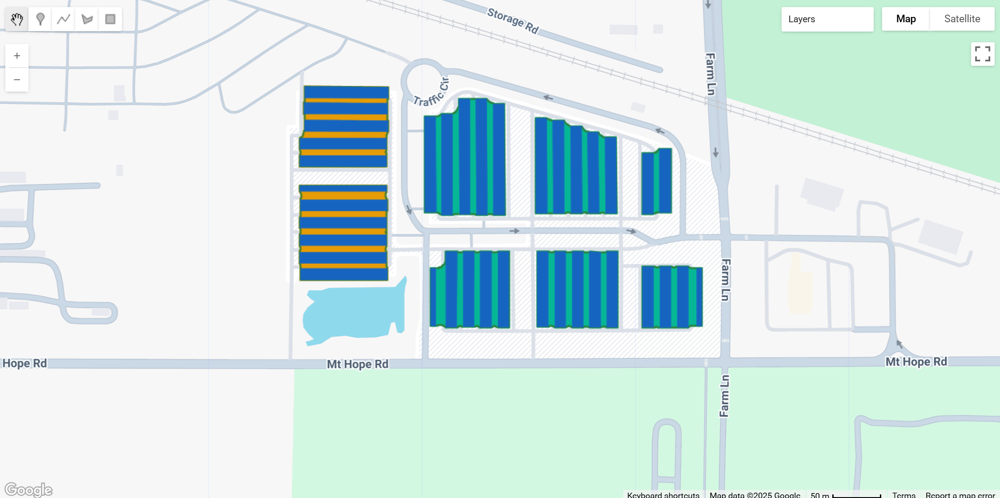

# Ground-Mounted Solar Energy in the US (GM-SEUS)

The Ground-Mounted Solar Energy in the United States (GM-SEUS) v1.0 dataset represents the most comprehensive harmonized geospatial repository of solar energy infrastructure in the United States. This open-access dataset combines the best available datasets with advanced image analysis on high-resolution aerial imagery to deliver unprecedented detail on both array-level and sub-array solar installations across the contiguous United States.

GM-SEUS includes over 15,000 commercial- and utility-scale ground-mounted solar photovoltaic and concentrating solar energy arrays representing 186 GW<sub>DC</sub> of installed capacity. A distinguishing feature is the inclusion of 2.92 million individual solar panel-rows covering 466 km², providing sub-array design metadata that enables detailed analysis of installation practices, land-use efficiency, and ecosystem impacts. The dataset harmonizes multiple existing sources while independently estimating critical attributes including installation year, mount technology, azimuth, tilt, ground cover ratio, and installed capacity.

By addressing gaps in existing databases—particularly the inclusion of commercial-scale installations and standardized panel-row geometries—GM-SEUS supports diverse applications in renewable energy modeling, grid planning, ecosystem service assessment, stormwater management, and infrastructure planning. The dataset follows FAIR principles and is updated annually to track the rapidly evolving solar energy landscape. You can read the [full paper in Nature Scientific Data](https://www.nature.com/articles/s41597-025-05862-4)

<center>

| Characteristic | Details |
|:---:|:---|
| **Spatial Extent** | Contiguous United States (CONUS) |
| **Spatial Resolution** | 30m (arrays), 0.3-0.6m (panel-rows) |
| **Temporal Coverage** | 1984-2024 |
| **Arrays** | 15,017 |
| **Panel-Rows** | 2.92 million |
| **Installed Capacity** | 186 GW<sub>DC</sub> |
| **Array Coverage** | 2,950 km² |
| **Panel-Row Coverage** | 466 km² |
| **Update Frequency** | Annual |

</center>

#### Dataset Description

GM-SEUS harmonizes polygon data from five major sources (USPVDB, TZ-SAM, OpenStreetMap, CCVPV, CWSD) with point-based metadata from six additional repositories (InSPIRE, USS, PVDAQ, SolarPACES, GSPT, GPPDB). The dataset employs National Agriculture Imagery Program (NAIP) high-resolution aerial imagery (0.3-0.6m) to delineate individual solar panel-rows within array boundaries using Random Forest classification combined with spectral indices, texture analysis, and object-based segmentation.

The methodology incorporates rigorous quality control to ensure geometric consistency and accuracy. Array boundaries follow a standardized definition that includes panel-rows and inter-row spacing while excluding project infrastructure like access roads and substations. Panel-row delineation achieves a median intersection-over-union (IoU) of 0.88 when validated against hand-digitized USPVDB boundaries, with installation year estimates within ±1 year for 66% of arrays and capacity estimates showing R² = 0.84 correlation with permit data.

Key innovations include multi-index temporal segmentation using LandTrendr to estimate installation years from Landsat imagery (1984-2024), geometric analysis to classify mount technologies from panel-row orientation, and pvlib-based modeling to estimate optimal tilt angles using local meteorological data. The dataset provides both harmonized attributes from source datasets and independently estimated values, offering transparency in data provenance and quality.

#### Available Data Products

The dataset includes five primary feature collections with comprehensive attribute information and two of these are included in GEE:

**Core Feature Collections:**

| Feature Collection | Description | Features | Coverage |
|---|---|---|---|
| `arrays_final` | Harmonized array boundaries with complete attributes | 15,017 | 2,950 km² |
| `panels_final` | Quality-controlled panel-rows with geometric attributes | 2.92M | 466 km² |

#### Array-Level Attributes

The arrays dataset provides comprehensive metadata organized into spatial, temporal, technical, and design categories:

**Spatial & Identification:**

??? example "The Spatial descriptors include array information on source, location and more. Expand to see spatial and identification descriptors/properties"

    | Attribute | Description | Units |
    |---|---|---|
    | `arrayID` | Unique array identifier | - |
    | `Source` | Original data source | - |
    | `latitude` | Centroid latitude (EPSG:4269) | decimal degrees |
    | `longitude` | Centroid longitude (EPSG:4269) | decimal degrees |
    | `STATEFP` | State FIPS code | - |
    | `COUNTYFP` | County FIPS code | - |
    | `totArea` | Total array footprint | m² |
    | `newBound` | Boundary source (0=existing, 1=derived) | binary |

**Temporal & Capacity:**

??? example "Expand to see temporal and capacity descriptors/properties"

    | Attribute | Description | Units |
    |---|---|---|
    | `instYr` | Installation year (harmonized) | year |
    | `instYrLT` | LandTrendr-derived installation year | year |
    | `capMW` | Installed capacity (harmonized) | MW<sub>DC</sub>/MW<sub>th</sub> |
    | `capMWest` | Estimated capacity | MW<sub>DC</sub>/MW<sub>th</sub> |
    | `modType` | Module technology (c-Si, thin-film, CSP) | - |
    | `efInit` | Initial panel efficiency | % |

**Design & Configuration:**

??? example "Expand to see design and configuration descriptors/properties"

    | Attribute | Description | Units |
    |---|---|---|
    | `mount` | Mount technology (fixed_axis, single_axis, dual_axis, mixed) | - |
    | `tilt` | Panel tilt angle (fixed-axis) | degrees |
    | `tiltEst` | Estimated optimal tilt | degrees |
    | `avgAzimuth` | Median panel-row orientation | degrees from N |
    | `GCR1` | Ground cover ratio (area-based) | 0-1 |
    | `GCR2` | Ground cover ratio (width-based) | 0-1 |

**Panel-Row Summary:**

??? example "Expand to see Panel row summaries"

    | Attribute | Description | Units |
    |---|---|---|
    | `numRow` | Number of panel-rows | count |
    | `totRowArea` | Total panel-row area | m² |
    | `avgLength` | Median panel-row length | meters |
    | `avgWidth` | Median panel-row width | meters |
    | `avgSpace` | Median inter-row spacing | meters |

#### Panel-Row Level Attributes

??? example "Expand to see Individual panel-rows include geometric and operational descriptors/properties"

    | Attribute | Description | Units |
    |---|---|---|
    | `panelID` | Unique panel-row identifier | - |
    | `arrayID` | Parent array identifier | - |
    | `Source` | Original data source | - |
    | `rowArea` | Panel-row area | m² |
    | `rowWidth` | Short-edge dimension | meters |
    | `rowLength` | Long-edge dimension | meters |
    | `rowAzimuth` | Panel-row orientation | degrees from N |
    | `rowMount` | Mount technology | - |
    | `rowSpace` | Distance to nearest panel-row | meters |
    | `version` | GM-SEUS version | - |

#### Citation

Stid, J.T., Kendall, A.D., Anctil, A., Rapp, J., Bingaman, J.C., & Hyndman, D.W. (2025). A harmonized dataset of ground-mounted solar energy in the US with enhanced metadata. Scientific Data, 12, 1586. https://doi.org/10.1038/s41597-025-05862-4

#### Dataset Citation

Stid, J., Kendall, A., Rapp, J., Bingaman, J., Anctil, A., & Hyndman, D. (2025). GM-SEUS: A harmonized dataset of ground-mounted solar energy in the US with enhanced metadata (v1.0) [Data set]. Zenodo. https://doi.org/10.5281/zenodo.14827819



#### Earth Engine Snippet

```js
// Import GM-SEUS feature collections
var arrays = ee.FeatureCollection('projects/sat-io/open-datasets/GMSEUS/arrays_final');
var panels = ee.FeatureCollection('projects/sat-io/open-datasets/GMSEUS/panels_final');

// Print collection sizes
print('Total Arrays:', arrays.size());
print('Total Panel-Rows:', panels.size());

// Example location: Burcham Solar Park, East Lansing, MI
Map.setCenter(-84.4512, 42.7398, 16);

// Visualize arrays and panel-rows
var arrayStyle = {color: '#2E7D32', width: 2, fillColor: '2E7D3220'};
var panelStyle = {color: '#1565C0', width: 0.5};

Map.addLayer(arrays.style(arrayStyle), {}, 'Solar Arrays');
Map.addLayer(panels.style(panelStyle), {}, 'Panel-Rows', false);

// Query specific array
var exampleID = 1404; // Burcham Solar Park
var exampleArray = arrays.filter(ee.Filter.eq('arrayID', exampleID));
var examplePanels = panels.filter(ee.Filter.eq('arrayID', exampleID));

print('Example Array Metadata:', exampleArray.first());
print('Number of Panel-Rows:', examplePanels.size());

// Filter examples
var californiaArrays = arrays.filter(ee.Filter.eq('STATEFP', '06'));
var fixedAxis = arrays.filter(ee.Filter.eq('mount', 'fixed_axis'));
var recent = arrays.filter(ee.Filter.gte('instYr', 2020));
var utility = arrays.filter(ee.Filter.gte('capMW', 1));

print('California Arrays:', californiaArrays.size());
print('Fixed-Axis Mount:', fixedAxis.size());
print('Installed Since 2020:', recent.size());
print('Utility-Scale (≥1 MW):', utility.size());

// Visualize by mount technology
var mountColors = ee.Dictionary({
  'fixed_axis': '#FFA000',
  'single_axis': '#00BFA5',
  'dual_axis': '#D81B60',
  'mixed_fs': '#7E57C2'
});

var styledArrays = arrays.map(function(f) {
  var mount = f.get('mount');
  var color = mountColors.get(mount, '#757575');
  return f.set('style', {color: color, width: 2});
});

Map.addLayer(
  styledArrays.style({styleProperty: 'style'}),
  {},
  'Mount Technology',
  false
);

// Calculate statistics
var totalCapacity = arrays.aggregate_sum('capMW');
var totalArea = arrays.aggregate_sum('totArea');
var meanGCR = arrays.aggregate_mean('GCR1');

print('Total Capacity (GW):', ee.Number(totalCapacity).divide(1000));
print('Total Area (km²):', ee.Number(totalArea).divide(1e6));
print('Mean Ground Cover Ratio:', meanGCR);

// Create histogram of installation years
var yearHistogram = arrays.aggregate_histogram('instYr');
print('Arrays by Installation Year:', yearHistogram);
```

Sample Code: https://code.earthengine.google.com/?scriptPath=users/sat-io/awesome-gee-catalog-examples:global-utilities-assets-amenities/GM-SEUS-SOLAR-ARRAYS

#### License

This work is licensed under a Creative Commons Attribution-NonCommercial-NoDerivatives 4.0 International License (CC BY-NC-ND 4.0). The dataset is open access and follows FAIR principles (Findable, Accessible, Interoperable, and Reusable).

**Created by:** Stid et al. 2025, Michigan State University

**Curated in GEE by:** Samapriya Roy

**Keywords:** solar energy, photovoltaic, renewable energy, infrastructure, land use, remote sensing, NAIP, Landsat, panel-rows, mount technology, ground cover ratio, installation year, capacity estimation, United States, open data, agrivoltaics

**Last updated:** 2025-10-13