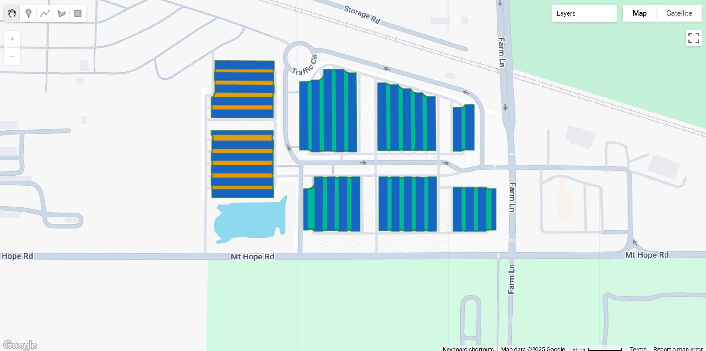

# Ground-Mounted Solar Energy in the US (GM-SEUS)

The Ground-Mounted Solar Energy in the United States (GM-SEUS) v2.0 dataset is the first major update to the comprehensive, harmonized geospatial repository of non-residential solar energy infrastructure across the contiguous United States. This open-access dataset combines the best available public datasets with advanced image analysis on high-resolution aerial imagery to deliver unprecedented detail on both array-level and sub-array solar installations.

GM-SEUS v2.0 includes 18,980 commercial- and utility-scale ground-mounted solar photovoltaic and concentrating solar energy arrays representing 292 GW<sub>DC</sub> of installed capacity, spanning 3,817 km². Of these, 12,739 arrays (112 GW) include detailed panel-row geometries, comprising 3.43 million individual panel-rows across 527 km². When restricted to arrays verifiable through high-resolution aerial or satellite imagery (i.e., hand-delineated geometries and/or arrays with panel-row data, representing low commission error), the dataset contains 15,744 arrays, representing 204 GW and 2,586 km². These sub-array data enable detailed analysis of installation design, land-use efficiency, and ecosystem impacts. The dataset harmonizes multiple existing sources while independently estimating critical attributes including installation year, mount technology, azimuth, tilt, ground cover ratio, ground cover management practice, and installed AC and DC capacity.

The 2025 v2.0 update introduces two new input polygon datasets (California Energy Commission Solar Footprints (CECSFC) and Global Renewables Watch (GRW)), expanded hand-delineated arrays and panel-row geometries, new georeferenced metadata, new attributes including installed AC capacity and ground cover management practices, and improved documentation and metadata standardization.

By addressing gaps in existing databases—particularly the inclusion of commercial-scale installations and standardized panel-row geometries—GM-SEUS supports diverse applications in renewable energy modeling, grid planning, ecosystem service assessment, stormwater management, and infrastructure planning. The dataset follows FAIR principles and is updated annually to track the rapidly evolving solar energy landscape. You can read the [full paper in Nature Scientific Data](https://www.nature.com/articles/s41597-025-05862-4)

<center>

| Characteristic | Details |
|:---:|:---|
| **Spatial Extent** | Contiguous United States (CONUS) |
| **Spatial Resolution** | 30m (arrays), 0.3-0.6m (panel-rows) |
| **Temporal Coverage** | 1984-2024 |
| **Arrays** | 18,980 (15,744 verifiable) |
| **Panel-Rows** | 3.43 million |
| **Installed Capacity** | 292 GW<sub>DC</sub> (204 GW verifiable) |
| **Array Coverage** | 3,817 km² |
| **Panel-Row Coverage** | 527 km² |
| **Update Frequency** | Annual |
| **Version** | v2.0 (2025 release) |

</center>

#### Dataset Description

GM-SEUS v2.0 harmonizes polygon data from nine existing and new sources (GM-SEUS v1.0, GM-SEUS v2.0 georeferenced and digitized updates, USPVDB, CECSFC, CCVPV, CWSD, OSM, TZ-SAM, and GRW) with point-based metadata from six additional repositories (InSPIRE, USS, PVDAQ, SolarPACES, GSPT, GPPDB). The dataset employs National Agriculture Imagery Program (NAIP) high-resolution aerial imagery (0.3-0.6m) to delineate individual solar panel-rows within array boundaries using Random Forest classification combined with spectral indices, texture analysis, and object-based segmentation.

The methodology incorporates rigorous quality control to ensure geometric consistency and accuracy. Array boundaries follow a standardized definition that includes panel-rows and inter-row spacing while excluding project infrastructure like access roads and substations. Panel-row delineation achieves a median intersection-over-union (IoU) of 0.88 when validated against hand-digitized USPVDB boundaries, with installation year estimates within ±1 year for 66% of arrays and capacity estimates showing R² = 0.84 correlation with permit data.

Key innovations include multi-index temporal segmentation using LandTrendr to estimate installation years from Landsat imagery (1984-2024), geometric analysis to classify mount technologies from panel-row orientation, and pvlib-based modeling to estimate optimal tilt angles using local meteorological data. Key value-added attributes include installation year, azimuth, mount technology, panel-row area and dimensions, inter-row spacing, ground cover ratio, optimal tilt, and installed peak capacity (DC), and now (v2.0) installed AC capacity, and ground cover management practice (where available from the [NLR Agrivoltaics Map](https://openei.org/wiki/InSPIRE/Agrivoltaics_Map) and CECSFC parking lot metadata). These enhancements enable multi-scale analysis of solar energy development, bridging infrastructure, land systems, and environmental outcomes.

#### Available Data Products

The dataset includes five primary feature collections with comprehensive attribute information and two of these are included in GEE:

**Core Feature Collections:**

| Feature Collection | Description | Features | Coverage |
|---|---|---|---|
| `arrays_final_2025_v2` | Harmonized array boundaries with complete attributes | 18,980 | 3,817 km² |
| `panels_final_2025_v2` | Quality-controlled panel-rows with geometric attributes | 3.43M | 527 km² |

#### Array-Level Attributes

The arrays dataset provides comprehensive metadata organized into spatial, temporal, technical, and design categories:

**Spatial & Identification:**

??? example "The Spatial descriptors include array information on source, location and more. Expand to see spatial and identification descriptors/properties"

    | Attribute | Description | Units |
    |---|---|---|
    | `arrayID` | Unique array identifier | - |
    | `Source` | Original data source | - |
    | `latitude` | Centroid latitude (EPSG:4269) | decimal degrees |
    | `longitude` | Centroid longitude (EPSG:4269) | decimal degrees |
    | `STATEFP` | State FIPS code | - |
    | `COUNTYFP` | County FIPS code | - |
    | `totArea` | Total array footprint | m² |
    | `newBound` | Boundary source (0=existing, 1=derived) | binary |

**Temporal & Capacity:**

??? example "Expand to see temporal and capacity descriptors/properties"

    | Attribute | Description | Units |
    |---|---|---|
    | `instYr` | Installation year (harmonized) | year |
    | `instYrLT` | LandTrendr-derived installation year | year |
    | `capMWDC` | Installed peak DC capacity (harmonized) | MW<sub>DC</sub>/MW<sub>th</sub> |
    | `capMWAC` | Installed AC capacity (harmonized, new in v2.0) | MW<sub>AC</sub> |
    | `capMWest` | Estimated capacity | MW<sub>DC</sub>/MW<sub>th</sub> |
    | `modType` | Module technology (c-Si, thin-film, CSP) | - |
    | `efInit` | Initial panel efficiency | % |

**Design & Configuration:**

??? example "Expand to see design and configuration descriptors/properties"

    | Attribute | Description | Units |
    |---|---|---|
    | `mount` | Mount technology (fixed_axis, single_axis, dual_axis, mixed) | - |
    | `tilt` | Panel tilt angle (fixed-axis) | degrees |
    | `tiltEst` | Estimated optimal tilt | degrees |
    | `avgAzimuth` | Median panel-row orientation | degrees from N |
    | `GCR1` | Ground cover ratio (area-based) | 0-1 |
    | `GCR2` | Ground cover ratio (width-based) | 0-1 |
    | `gcMgmt` | Ground cover management practice (new in v2.0; from NLR Agrivoltaics Map / CECSFC) | - |

**Panel-Row Summary:**

??? example "Expand to see Panel row summaries"

    | Attribute | Description | Units |
    |---|---|---|
    | `numRow` | Number of panel-rows | count |
    | `totRowArea` | Total panel-row area | m² |
    | `avgLength` | Median panel-row length | meters |
    | `avgWidth` | Median panel-row width | meters |
    | `avgSpace` | Median inter-row spacing | meters |

#### Panel-Row Level Attributes

??? example "Expand to see Individual panel-rows include geometric and operational descriptors/properties"

    | Attribute | Description | Units |
    |---|---|---|
    | `panelID` | Unique panel-row identifier | - |
    | `arrayID` | Parent array identifier | - |
    | `Source` | Original data source | - |
    | `rowArea` | Panel-row area | m² |
    | `rowWidth` | Short-edge dimension | meters |
    | `rowLength` | Long-edge dimension | meters |
    | `rowAzimuth` | Panel-row orientation | degrees from N |
    | `rowMount` | Mount technology | - |
    | `rowSpace` | Distance to nearest panel-row | meters |
    | `version` | GM-SEUS version | - |

#### Citation

```
Stid, J.T., Kendall, A.D., Anctil, A., Rapp, J., Bingaman, J.C., & Hyndman, D.W. (2025). A harmonized dataset of ground-mounted solar energy in the US with enhanced metadata. Scientific Data, 12, 1586. https://doi.org/10.1038/s41597-025-05862-4
```

#### Dataset Citation

```
Stid, J., Kendall, A., Rapp, J., Bingaman, J., Anctil, A., & Hyndman, D. (2025). GM-SEUS: A harmonized dataset of ground-mounted solar energy in the US with enhanced metadata (v2.0) [Data set]. Zenodo. https://doi.org/10.5281/zenodo.19581821
```



#### Earth Engine Snippet

```js
// Load GM-SEUS v2.0 feature collections
var arrays = ee.FeatureCollection('projects/sat-io/open-datasets/GMSEUS/arrays_final_2025_v2');
var panels = ee.FeatureCollection('projects/sat-io/open-datasets/GMSEUS/panels_final_2025_v2');

print('Total Arrays:', arrays.size(), 'Panel-Rows:', panels.size());

// Example site: Burcham Solar Park, East Lansing, MI
var exampleID = 7604;
var exampleArray = arrays.filter(ee.Filter.eq('arrayID', exampleID));
var examplePanels = panels.filter(ee.Filter.eq('arrayID', exampleID));
Map.centerObject(exampleArray);

// Visualize arrays (MSU green) and panel-rows (blue), with example highlighted
Map.addLayer(arrays.style({color: '#18453B', width: 2, fillColor: '#18453B20'}), {}, 'Solar Arrays');
Map.addLayer(panels.style({color: '#0D47A1', width: 0.5}), {}, 'Panel-Rows', false);
Map.addLayer(exampleArray.style({color: '#6FAF9F', width: 3, fillColor: '#6FAF9F60'}), {}, 'Example Array');
Map.addLayer(examplePanels.style({color: '#7FA6FF', width: 1}), {}, 'Example Panel-Rows');

print('Example Array:', exampleArray.first(), 'Panel-Rows:', examplePanels.size());

// Filter examples: by state, mount, year, capacity
print('California:', arrays.filter(ee.Filter.eq('STATEFP', '06')).size());
print('Fixed-Axis:', arrays.filter(ee.Filter.eq('mount', 'fixed_axis')).size());
print('Since 2020:', arrays.filter(ee.Filter.gte('instYr', 2020)).size());
print('Utility-Scale (≥1 MW DC):', arrays.filter(ee.Filter.gte('capMWDC', 1)).size());

// Color arrays by mount technology
var mountColors = ee.Dictionary({fixed_axis: '#FFA000', single_axis: '#00BFA5', dual_axis: '#D81B60', mixed_fs: '#7E57C2'});
var styled = arrays.map(function(f) {
  return f.set('style', {color: mountColors.get(f.get('mount'), '#757575'), width: 2});
});
Map.addLayer(styled.style({styleProperty: 'style'}), {}, 'Mount Technology', false);

// Aggregate statistics
print('Total Capacity (GWDC):', ee.Number(arrays.aggregate_sum('capMWDC')).divide(1000));
print('Total Capacity (GWAC):', ee.Number(arrays.aggregate_sum('capMWAC')).divide(1000));
print('Total Area (km²):', ee.Number(arrays.aggregate_sum('totArea')).divide(1e6));
print('Mean GCR:', arrays.aggregate_mean('GCR1'));
print('Arrays by Installation Year:', arrays.aggregate_histogram('instYr'));
```

Sample Code: https://code.earthengine.google.com/?scriptPath=users/sat-io/awesome-gee-catalog-examples:global-utilities-assets-amenities/GM-SEUS-SOLAR-ARRAYS

#### License

This work is licensed under a Creative Commons Attribution 4.0 International License (CC-BY-4.0). The dataset is open access and follows FAIR principles (Findable, Accessible, Interoperable, and Reusable).

Created by: Stid et al. 2025, Michigan State University

Curated in GEE by: Samapriya Roy

Keywords: solar energy, photovoltaic, renewable energy, infrastructure, land use, remote sensing, NAIP, Landsat, panel-rows, mount technology, ground cover ratio, installation year, capacity estimation, United States, open data, agrivoltaics

Last updated: 2026-05-04 (v2.0 release)
