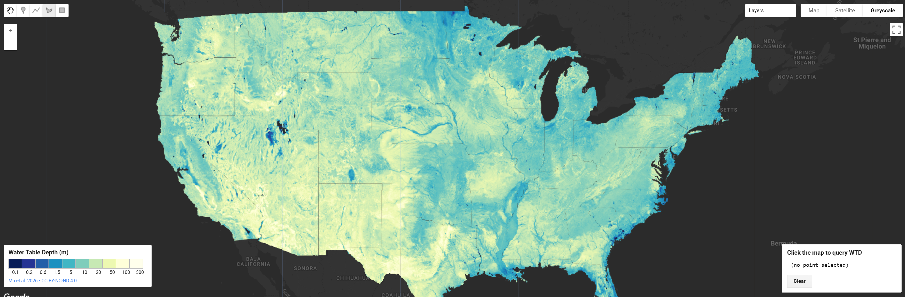

# High Resolution 30 m Water Table Depth for CONUS

A wall-to-wall map of water table depth across the contiguous United States at roughly 30 m resolution. The dataset was built using machine learning trained on more than one million well observations spanning 1914–2023, drawing on climate, soil, geology, and terrain inputs. The result is the highest resolution, most accurate water table depth estimate available for CONUS to date, fine enough to capture features as small as an individual farm field while still covering the entire country.

Alongside the main depth map, the product includes uncertainty bounds (25th and 75th percentile layers), letting users see where the estimate is well constrained and where well coverage is sparse. Combined with porosity data down to a depth of 392 m, the authors estimate roughly 306,500 km³ of groundwater stored beneath CONUS, with about 40% of the country underlain by water shallower than 10 m. Comparing the 30 m product against coarsened versions shows that lower-resolution datasets underestimate total storage by up to 18% and miss most of the shallow groundwater that supports streams, vegetation, and irrigated farmland.

#### Key Features and Details

| Feature | Value |
|--|--|
| **Variable** | Long-term mean water table depth (m below land surface) |
| **Spatial Resolution** | 1 arc-second (~30 m) |
| **Coverage** | Conterminous United States (~7.3 M km²) |
| **Observation Period** | 1914–2023 (long-term mean) |
| **Method** | Random forest, 300 decision trees |
| **Training Observations** | 726,828 grid cells from >1 M well measurements |
| **Test Performance** | r = 0.79, RMSE = 14.94 m, NSE = 0.62 |
| **Uncertainty Quantification** | 300-member ensemble; 25th / 50th / 75th percentile layers |
| **Subsurface Depth (Storage)** | 392 m |
| **Estimated CONUS Groundwater Storage** | 306,500 km³ (range: 291,850–316,720 km³) |
| **Validation** | National test split + 18 HUC2 basins + independent Arizona hold-out |

**Predictor Variables (10):** Precipitation, temperature, precipitation minus evapotranspiration (PME), hydraulic conductivity, soil texture, elevation, slope, and distances to stream networks (multiple stream-order classes).

**Output Layers:** Median water table depth, 25th percentile WTD, 75th percentile WTD (interquartile range available as an uncertainty layer), and derived groundwater storage when combined with ParFlow CONUS 2.0 porosity.

**Interpretation Notes:** Because training observations span more than a century and reflect the modern pumping signal, the product represents present-day, anthropogenically influenced water table conditions rather than a natural equilibrium. The data-driven approach is limited by observation sparsity in some regions; uncertainty layers should be consulted alongside the median estimate, especially in the western US where the interquartile range can be large.

#### Citation

```
Ma, Y., Condon, L.E., Koch, J. et al. High resolution US water table depth estimates reveal quantity of accessible groundwater.
Commun Earth Environ 7, 45 (2026). https://doi.org/10.1038/s43247-025-03094-3
```



#### Earth Engine Snippet

```js
var hres_wtd = ee.ImageCollection("projects/sat-io/open-datasets/HRES-WTD");
```

Sample Code: https://code.earthengine.google.com/?scriptPath=users/sat-io/awesome-gee-catalog-examples:hydrology/HRES-WTD-CONUS

- CONUS WTD Explorer from HydroFrame: https://30m-wtd-viewer.hydroframe.org/

#### Additional Links

* [CONUS WTD Explorer GEE Script](https://code.earthengine.google.com/87c965aae54facde740850b0949fc3b4)
* [HydroFrame-ML GitHub Repository](https://github.com/HydroFrame-ML/high-res-WTD-static)
* [HydroData Access Portal](https://hydroframe.org/hydrodata)
* [30m Water Table Depth Viewer](https://30m-wtd-viewer.hydroframe.org/)

#### License

[CC BY-NC-ND 4.0](https://creativecommons.org/licenses/by-nc-nd/4.0/) as provided by [dataset viewer](https://30m-wtd-viewer.hydroframe.org/) which states **The water table depth dataset is provided under the terms specified in the original publication (Ma et al., 2026).** 

Keywords: hydrology, groundwater, water table depth, machine learning, random forest, ParFlow, CONUS, HydroFrame, uncertainty, aquifer

Curated in GEE by: Sayantan Majumdar & Samapriya Roy

Last updated in GEE: 2026-05-04
