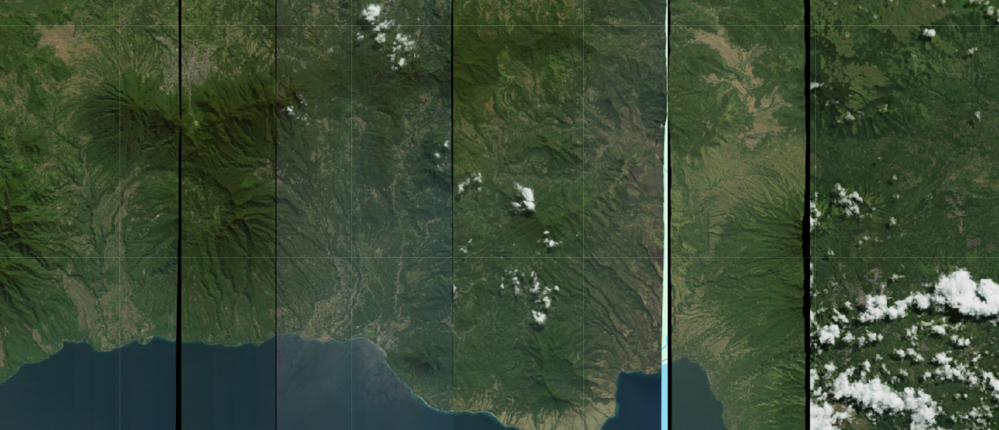

# Indonesia Earthquake (Flores) 2026

On 15 August 2026 at 05:58 local time (14 August, 21:58 UTC), a Mw 7.7 earthquake ruptured the seafloor north of Flores in East Nusa Tenggara, Indonesia. USGS placed the hypocentre at 10 km depth with an epicentre 68 km north-northwest of Ende; BMKG put the depth at 15 km and Geoscience Australia measured the event at Mw 7.8. The source was the Flores Back-Arc Thrust, a south-dipping structure running roughly 800 km along the northern side of the Lesser Sunda Islands, on the opposite vergence to the Sunda megathrust. USGS modelled a rupture of about 150 by 40 km lasting some 51 seconds, initiating near the eastern end north of Mbay in Nagekeo and propagating westward across roughly 160 km. Because back-arc thrusts break close to shore rather than far offshore, shaking reached the coast almost undiminished — BMKG recorded a maximum intensity of MMI VIII in Manggarai Regency — and the vertical seafloor displacement generated a tsunami despite the modest rupture area. A tsunami warning covering 22 areas across four provinces was raised and later lifted; the largest wave came ashore at 1.61 m. The same fault segment system produced the 1992 Flores earthquake, which killed approximately 2,500 people and generated runups reaching 26 m, and the comparison shaped both the public response and the emergency declaration. Vantor's (formerly Maxar) Open Data Program tasked collections over the affected regencies, and the resulting imagery is catalogued here as an Earth Engine collection.

#### Event Summary

??? example "This is being update constantly so please check online resources for latest"

    | Field | Value |
    |---|---|
    | Date / time | 15 August 2026, 05:58 WITA (14 August 2026, 21:58 UTC) |
    | Magnitude | Mw 7.7 (USGS, BMKG, EMSC); Mw 7.8 (Geoscience Australia) |
    | Depth | 10 km (USGS), 15 km (BMKG), 35 km (EMSC) |
    | Epicentre | 8.310 S, 121.352 E, approximately 68 km north-northwest of Ende, East Nusa Tenggara |
    | Source fault | Flores Back-Arc Thrust, south-dipping at approximately 32 degrees, oriented east-northeast |
    | Rupture | Primary slip patch approximately 150 by 40 km, duration approximately 51 seconds, initiating north of Mbay (Nagekeo) and propagating westward across roughly 160 km. Preliminary USGS slip estimate 2.6 m, revised upward to approximately 3.87 m in the finite fault model |
    | Shaking | Maximum MMI VIII (Severe) in Manggarai Regency; MMI VII in West Manggarai and Bima. USGS estimated 56,000 people exposed to severe shaking and 420,000 to very strong shaking |
    | Tsunami | Warning issued for 22 areas across East Nusa Tenggara, West Nusa Tenggara, South Sulawesi and Southeast Sulawesi, later lifted. Maximum recorded wave 1.61 m at Reok, Manggarai; BMKG gauges recorded 0.94 m at Maurole-Ende, 0.54 m at Bulukumba, 0.38 m at Kewapante-Sikka and 0.36 m at Labuan Bajo |
    | PAGER alert | Yellow |
    | Deaths | Provisional and rising through the reporting period. BNPB figures moved from 14 (15 Aug, morning) to 47 (15 Aug, evening) to 51 (16 Aug) to 68 (17 Aug) to 75 (20 Aug) to 83 (21 Aug, the later additions attributed to indirect impacts). Two further deaths followed a 17 August aftershock and one a M6.0 aftershock near Ruteng on 20 August |
    | Injured | Reported as 101 (16 Aug), 213 (17 Aug), 986 (21 Aug) and 1,182 in later consolidated figures |
    | Displaced | Escalated sharply as assessments proceeded: approximately 5,000 (16 Aug), 9,290 (16 Aug, BNPB), 34,689 (18 Aug), 59,600 (20 Aug), 110,785 (21 Aug). Higher totals above 188,000 appear in some later reporting |
    | Homes damaged | 1,357 (16 Aug) to 19,297 including 6,463 severely (20 Aug) to 44,946 including 17,176 heavily, 9,758 moderately and 18,013 lightly (21 Aug). Worst affected: East Manggarai (5,962), Manggarai (3,146), West Manggarai (3,050) |
    | Other damage | Hundreds of schools, clinics, places of worship and government offices. Five of the 15 airports in East Nusa Tenggara sustained terminal damage, though runways stayed usable |
    | Worst-affected regencies | Manggarai (26 deaths) and East Manggarai (25), ahead of Nagekeo (8). Reo/Reok district in Manggarai was the hardest hit locality |
    | Aftershocks | More than 3,400 recorded by 20 August and 4,258 by 21 August, 24 of them above M 5.0. Strongest early aftershocks M 6.1, M 5.9 and M 5.6 within 30 minutes of the mainshock; M 5.8 and M 5.7 near Ruteng on 19 to 20 August |
    | Response | 14-day state of emergency declared for East Nusa Tenggara from 15 August. Nearly 1,500 military and police personnel and 10 aircraft deployed, moving 275 tonnes of aid. Landslides closed roads and cut communications into Nagekeo, delaying rescue teams |
    | Economic damage | No estimate published |
    | Activations | International Charter Space and Major Disasters, call 1050; GLIDE EQ-2026-000150-IDN |

Casualty, displacement and damage figures moved substantially over the week following the event, and displacement in particular rose by more than an order of magnitude as assessments reached outlying areas. Any number quoted here is provisional. Check current sources before citing one.



#### Vantor (Maxar) Open Data

Vantor's Open Data Program released 35 acquisitions over northern Flores and its offshore shelf under CC BY-NC 4.0, at native resolutions of 0.37 to 0.63 m. Coverage spans the regencies west of the epicentre where losses were heaviest, through Manggarai and East Manggarai, and extends east through Ende and Sikka where damage was lighter. The collection is drawn from nine platforms across the WorldView constellation, with the full WorldView Legion fleet contributing: WorldView-2 (9 acquisitions), WorldView Legion 3 (6), WorldView Legion 1 (4), WorldView Legion 2 (4), WorldView-3 (4), WorldView Legion 4 (3), WorldView Legion 5 (2), WorldView Legion 6 (2) and GeoEye-1 (1). Assets are full-strip cloud optimized GeoTIFFs with a visual band and a thumbnail per acquisition.

Vantor's own description of the event: a M7.7 earthquake centred north of Flores on 15 August, followed by several powerful aftershocks, with the resulting tsunami causing minor flooding and thousands displaced by structural collapse of homes and buildings.

| Field | Value |
|---|---|
| Acquisitions | 35 |
| Sensors | WorldView-2, WorldView-3, WorldView Legion 1 to 6, GeoEye-1 |
| Resolution | 0.37 to 0.63 m |
| Product | Vantor full-strip COGs |
| Assets | `visual`, `thumbnail` |
| Extent | 119.80, -9.10, 122.50, -7.70 |
| Regions | East Nusa Tenggara; Flores; Manggarai; East Manggarai; West Manggarai; Ngada; Nagekeo; Ende; Sikka |
| Licence | CC-BY-NC-4.0 |

```js
// Vantor (Maxar) open data, northern Flores earthquake imagery.
var vantorFloresEq2026 = ee.ImageCollection("projects/sat-io/open-datasets/VANTOR-DISASTER-DATA/INDONESIA_FLORES_EQ_2026");
```

#### Preprocessing

Vantor's open data strips ship without a cloud mask of any kind — no UDM, no QA band, no per-pixel cloud flag. Since 2026, every scene entering a Vantor disaster collection is therefore passed through OmniCloudMask during ingestion, and two derived bands are appended to the imagery bands automatically:

| Band | Type | Values |
|---|---|---|
| `cloud_mask` | Binary | 0 = clear, 1 = cloud or cloud shadow |
| `cloud_probability` | Continuous | 0 to 100 |

OmniCloudMask is a sensor-agnostic deep learning model for cloud and cloud shadow segmentation, validated on Maxar imagery alongside Sentinel-2, Landsat 8 and PlanetScope, which is why it transfers to WorldView without a sensor-specific retrain. It takes Red, Green and NIR and returns per-pixel labels for clear, thin cloud, thick cloud and cloud shadow. The binary band collapses those four classes; the probability band preserves the model's confidence, so borderline pixels can be thresholded rather than accepted or discarded outright. Because the model is trained for 10 to 50 m and WorldView is sub-metre, scenes are resampled to 10 m for inference and the mask is resampled back onto the native grid.

```
Wright, N., Duncan, J.M.A., Callow, J.N., Thompson, S.E., & George, R.J. (2025). Training sensor-agnostic deep learning models for remote sensing: Achieving state-of-the-art cloud and cloud shadow identification with OmniCloudMask. Remote Sensing of Environment, 322, 114694. https://doi.org/10.1016/j.rse.2025.114694
```

Masking, with the cloud threshold passed in as a percentage and 0 treated as no data:

```js
// Drop the derived bands from the stack, then mask 0 = no data.
// cloud_mask has to come out too: 0 there means CLEAR, so leaving it in
// would make gt(0) discard exactly the pixels worth keeping.
function maskNoData(image) {
  image = ee.Image(image);
  var bands = image.select(
    image.bandNames().remove('cloud_probability').remove('cloud_mask'));
  return ee.Image(
    bands
      .updateMask(bands.gt(0))
      .copyProperties(image, image.propertyNames()));
}

// Binary mask — the quick path.
function maskCloudsBinary(image) {
  image = ee.Image(image);
  return maskNoData(image).updateMask(image.select('cloud_mask').eq(0));
}

// Probability mask, threshold passed in as a percentage.
function maskClouds(maxCloudPct) {
  return function (image) {
    image = ee.Image(image);
    var clear = image.select('cloud_probability').lte(maxCloudPct);
    return maskNoData(image).updateMask(clear);
  };
}

var noData  = vantorFloresEq2026.map(maskNoData);
var binary  = vantorFloresEq2026.map(maskCloudsBinary);
var masked  = vantorFloresEq2026.map(maskClouds(1));

Map.centerObject(vantorFloresEq2026.geometry().bounds(), 9);
Map.addLayer(noData.median(), {}, 'No-data masked only');
Map.addLayer(binary.median(), {}, 'No-data + binary cloud mask');
Map.addLayer(masked.median(), {}, 'No-data + cloud probability <= 1%');;
```

August is the dry season across the Lesser Sunda Islands, so cloud is far less of a constraint here than on monsoon-season collections and a tighter threshold is usually workable. Compare against the no-data-only layer before concluding that a gap is cloud rather than absent coverage — with 35 strips across nine platforms, footprint gaps are the more likely explanation.

Sample code: https://code.earthengine.google.com/?scriptPath=users/sat-io/awesome-gee-catalog-examples:disaster-response/VANTOR-OPEN-DATA-INDONESIA-FLORES-EQ-2026

#### License

This collection is released under Creative Commons Attribution Non Commercial 4.0.

Data provided by: Vantor (Maxar) Open Data Program

Curated in GEE by: Samapriya Roy

Keywords: disaster, earthquake, tsunami, Indonesia, Flores, East Nusa Tenggara, Manggarai, Nagekeo, Ende, Sikka, Flores Back-Arc Thrust, Vantor, Maxar, WorldView, WorldView Legion, GeoEye, OmniCloudMask, cloud masking

Last updated on GEE: 2026-08-31
