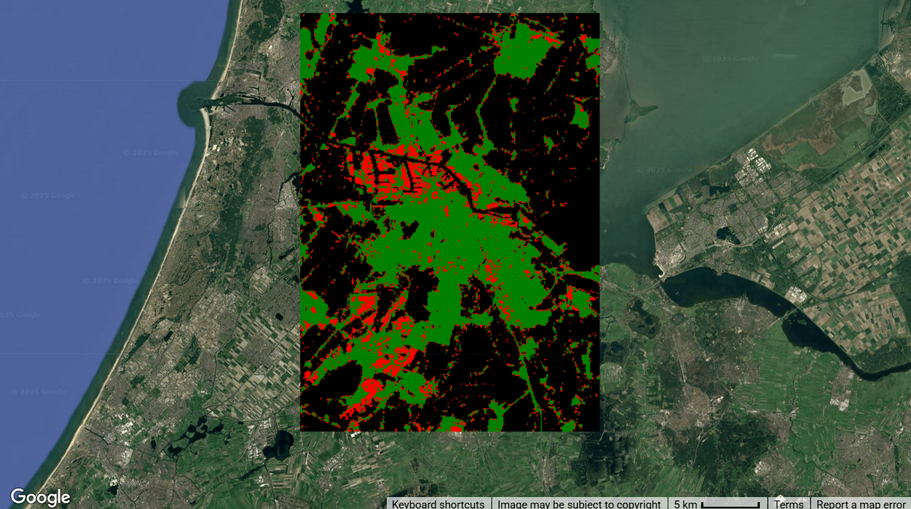

# Industrial Land Maps across Global Cities

This dataset provides high-resolution (10-meter) industrial land use maps for 1,093 large cities (area 100km² or more) across the globe, covering a seven-year period from 2017 to 2023. Developed by researchers from the JC STEM Lab of Earth Observations at the Hong Kong Polytechnic University, these maps were created by integrating multisource geospatial data, including Sentinel-2 reflectance data, nighttime light data, and OpenStreetMap information, processed through machine learning algorithms. The dataset achieves high overall accuracy (91.87% to 92.21%) across all years, making it a valuable resource for tracking industrial land use changes and assessing their environmental impacts.

#### Dataset Details

| Characteristic  | Description                                                        |
|-----------------|-------------------------------------------------------------------|
| Name            | Global 10-m Industrial Land Maps                                   |
| Provider        | Hong Kong Polytechnic University                                   |
| Resolution      | 10 meters                                                          |
| Coverage        | 1,093 global cities (≥100 km²)                                     |
| Temporal Range  | 2017-2023 (annual)                                                 |
| Classes         | Industrial land, Non-industrial land, Non-built-up areas           |
| Format          | GeoTIFF                                                            |
| Accuracy        | Overall accuracy: 91.87-92.21%                                     |
| License         | Creative Commons Attribution-NonCommercial-NoDerivatives 4.0       |

#### Notes

!!! info

    - Maps provide detailed industrial land information for 1,093 large cities globally, with 531 in Asia, 174 in Europe, 165 in North America, 113 in South America, 99 in Africa, and 11 in Oceania
    - The dataset correlates strongly (r=0.72) with per capita CO₂ emissions, demonstrating its value for environmental and sustainability studies
    - Classification distinguishes between three classes: industrial land in built-up areas, non-industrial land in built-up areas, and non-built-up areas
    - Each city map includes a 1.5 km buffer around standardized rectangular boundaries to provide flexibility for users

#### Citation

```
Yoo, C., Zhou, Y., & Weng, Q. (2025). Mapping 10-m Industrial Lands across 1000+ Global Large Cities, 2017–2023.
Scientific Data, 12(278). https://doi.org/10.1038/s41597-025-04604-w

Yoo, C., Zhou, Y., & Weng, Q. (2025). Dataset of 'Mapping 10-m Industrial Lands across 1000+ Global Large Cities,
2017-2023'. Zenodo. https://doi.org/10.5281/zenodo.14832219
```



#### Earth Engine Snippet

```javascript
// Import the industrial land collection
var industrialLand = ee.ImageCollection("projects/sat-io/open-datasets/INDUSTRIAL_LAND");
```

Sample Code: https://code.earthengine.google.com/?scriptPath=users/sat-io/awesome-gee-catalog-examples:global-utilities-assets-amenities/GLOBAL-INDUSTRIAL-LAND

#### Keywords
Industrial Land, Land Use, Urban, Global Cities, Environmental Sustainability, Carbon Emissions, Urbanization, Urban Planning, Earth Observation, Remote Sensing

#### License
The dataset is distributed under a Creative Commons Attribution-NonCommercial-NoDerivatives 4.0 International License.

Produced by: Yoo et al 2025, JC STEM Lab of Earth Observations, Department of Land Surveying and Geo-Informatics, The Hong Kong Polytechnic University

Curated in GEE by: Samapriya Roy

Last updated on GEE: 2025-05-01
