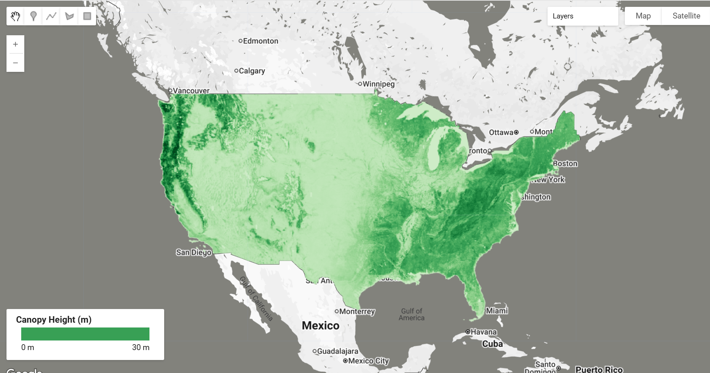

# ICESat-2 Derived Canopy Height Model (IS2CHM)

The ICESat-2 Derived Canopy Height Model provides a regression-based canopy height map of the contiguous United States (CONUS) at 30-meter spatial resolution. This dataset integrates data from ATLAS/ICESat-2 L3A Land and Vegetation Height (ATL08) with Landsat, LANDFIRE, and NASADEM to produce a comprehensive vegetation height model spanning 2019-2021.

The 30-meter resolution represents a significant improvement over the 100-meter resolution of the source ATL08 data, making it valuable for studies of vegetation structure, biomass and carbon estimation, ecological modeling, wildfire management, and disturbance monitoring. The model was developed using non-parametric gradient-boosted regression trees (XGBoost) and achieved an R² of 0.76 with a mean absolute error of 2.5 meters on validation data.The dataset is provided as six Cloud Optimized GeoTIFFs covering different regions of CONUS, with canopy heights ranging from 0 to 54 meters. Model performance is highest in relatively homogeneous environments and dense forests such as mangroves, flooded areas, coniferous forests, and broadleaf mixed forests, while performance is lower in sparse environments like deserts and chaparral.

#### Citation

```
Malambo, L., & Popescu, S.C. (2025). ICESat-2 Derived Canopy Height Model. (IS2CHM, Version 1).
[Data set]. Boulder, Colorado USA. NASA National Snow and Ice Data Center Distributed Active
Archive Center. https://doi.org/10.5067/J8DMNXTBZ22J [Date Accessed].
```

#### Related Publication

```
Malambo, L. & Popescu, S. (2024). Mapping vegetation canopy height across the contiguous
United States using ICESat-2 and ancillary datasets. Remote Sensing of Environment, 309,
114226. https://doi.org/10.1016/j.rse.2024.114226
```

| Category | Detail | Value |
|----------|--------|-------|
| **Temporal Coverage** | Period | January 1, 2019 to December 31, 2021 |
| **Resolution** | Spatial | 30 meters |
| **Scale**      | Scale   | 0.1       |
| **Offset**     | Offset  | 0         |
| **Resolution** | Temporal | ~3 years (future versions may be yearly with 1-2 updates per year) |
| **Tile Coverage** | Tile 0 | Southwest United States |
| **Tile Coverage** | Tile 1 | South-central United States |
| **Tile Coverage** | Tile 2 | Southeast United States |
| **Tile Coverage** | Tile 3 | Northwest United States |
| **Tile Coverage** | Tile 4 | North-central United States |
| **Tile Coverage** | Tile 5 | Northeast United States |

**Naming Convention:**
```
IS2CHM_region_tile#_YYYYMMDD-yyyymmdd_Vvv.tif
Example: IS2CHM_CONUS_tile0_20190101-20211231_V10.tif
```
*Note: Version naming modified for Earth Engine compatibility (periods removed from version numbers)*



#### Earth Engine Snippet

```js
// Load ICESAT CHM (Canopy Height Model) dataset
var imageCollection = ee.ImageCollection("projects/sat-io/open-datasets/ICESAT/CHM_CONUS");

// Get the first image to inspect properties
var firstImage = imageCollection.first();

// Print native resolution information
print('Dataset Information:', {
  'Band Names': firstImage.bandNames(),
  'Projection': firstImage.projection(),
  'Native Resolution (meters)': firstImage.projection().nominalScale(),
  'Image Count': imageCollection.size()
});
```

Sample Code: https://code.earthengine.google.com/?scriptPath=users/sat-io/awesome-gee-catalog-examples:agriculture-vegetation-forestry/ICESAT2-CANOPY-HEIGHT-CONUS

#### License

Most NSIDC data are government-funded and in the public domain. No explicit copyright or distribution restrictions are stated for this dataset in the official NSIDC documentation. Citation is requested as a condition of use.

Created by: Malambo, L., & Popescu, S.C. (2025)

Provided by: Malambo, L., & Popescu, S.C. (2025), NASA National Snow and Ice Data Center DAAC

Keywords: ICESat-2, canopy height, vegetation structure, biomass, CONUS, lidar, remote sensing, forest, regression modeling

Last updated in GEE: 2025-12-14
