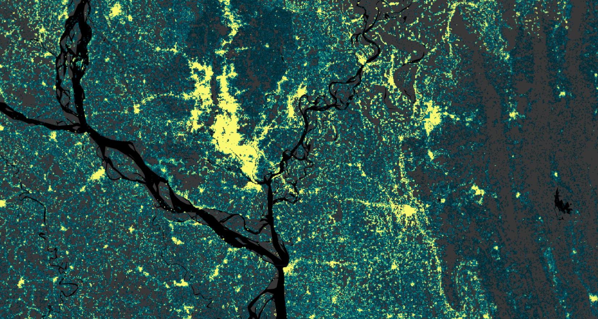

# LandScan Mosaic Annual Global Ambient Population Time Series

The LandScan Mosaic Annual Global Ambient Population Time Series, Version 1.0, provides annual high-resolution global ambient population estimates from 1975 to 2024. The dataset is distributed as one Cloud-Optimized GeoTIFF per year on a globally aligned 3 arc-second WGS 84 grid. The 2024 layer is the LandScan Mosaic benchmark reference year, while the 1975-2023 layers are historical estimates generated using the LandScan Mosaic Timeseries Methodology.

Previous LandScan products, although widely used, were typically not suitable for change detection or temporal analysis because their methodology evolved over time, preventing consistent year-to-year comparisons. This time series addresses that limitation by anchoring every year to a single standardized building-level benchmark and backcasting to earlier years using historical changes in built-surface area from the Global Human Settlement Layer (GHSL) together with authoritative population counts. Because the LandScan Mosaic benchmark is derived from a building-level model rather than a traditional dasymetric or random-forest approach, it is well situated to adjust population estimates based on observed changes in built-surface area, allowing populations to be scaled backward in time while maintaining spatial realism.

Ambient population represents the average population distribution over a 24-hour period, combining daytime and nighttime dynamics into a single surface. The dataset is available for download at [landscan.ornl.gov](https://landscan.ornl.gov/).

!!! note "A note on LandScan and LandCast"

    This dataset is released as a **LandScan** product: the LandScan Mosaic Annual Global Ambient Population Time Series, Version 1.0. The backcasting methodology behind it is documented separately under the name **LandCast Mosaic**, in the ORNL technical report *LandCast Mosaic: Reconstructing Global Population Distributions, 1975-2025* ([DOI:10.2172/3015559](https://doi.org/10.2172/3015559)).

    In short, LandCast Mosaic is the method and LandScan Mosaic Time Series is the data product it generates. Users searching for either name should find this collection, and anyone wanting the full derivation, equations, worked examples, and limitations should read the LandCast report.

#### Backcasting Workflow

The LandCast Mosaic methodology proceeds through five stages, all performed on a common 3 arc-second grid with an origin at -180° longitude and 90° latitude:

**Interpolation**: GHSL-BUILT-S provides built-surface area at 5-year intervals from 1975 onward. Pixel-wise linear interpolation between consecutive reference years produces an annual, globally consistent built-surface time series. Negative interpolated values arising from data artifacts are truncated to zero.

**Aggregation**: The GHSL and LandScan Mosaic rasters share the same nominal resolution but differ in grid origin, so each LandScan Mosaic pixel overlaps four GHSL pixels (NW, NE, SE, SW). Temporal interpolation is performed independently per quadrant, and the annual built-surface value for each pixel is the arithmetic mean of the four overlapping quadrants.

**Scaling**: For each pixel and year, a scaling factor is computed as the ratio of built-surface area in year *t* to that in the benchmark reference year. Pixels with zero built-surface area in the benchmark year are assigned a constant scaling factor of 1 for all years, avoiding undefined ratios and preventing artificial growth or decline where no built infrastructure exists in the baseline.

**Adjustment**: The scaling factor is applied to the benchmark population baseline independently for each pixel. Pixels with zero population in the benchmark year remain zero for all years regardless of built-surface change. This preserves the spatial distribution of the baseline while modulating magnitudes through time.

**Normalization**: Preliminary estimates are aggregated to a fixed set of ORNL first sub-national level (ADM1) administrative boundaries, held constant across all years, and scaled so that each unit sums to an externally defined target population. This preserves relative spatial distribution while ensuring consistency with authoritative national and sub-national totals.

#### Input Datasets

| Dataset | Spatial Resolution | Temporal Coverage | Role in Workflow |
|---------|-------------------|-------------------|------------------|
| LandScan Mosaic | 3 arc-sec | Benchmark year | Building-level population baseline |
| GHSL-BUILT-S (2023 release) | 3 arc-sec | 1975-2030, 5-year intervals | Temporal scaling of built surface |
| US Census Bureau IDB | National-level | Annual | National population targets |
| LandScan Global | 30 arc-sec (1 km) | Annual | Sub-national relative distributions |
| CIA World Factbook | National-level | Benchmark year | National totals for the benchmark baseline |

Sub-national distributions are derived from historical LandScan Global versions; for years prior to 2000, they are linearly extrapolated backward to 1975 at annual time steps.

#### Dataset Characteristics


| Parameter | Value |
|-----------|-------|
| Spatial Resolution | 3 arc-seconds (~90m at the equator) |
| Temporal Coverage | 1975-2024 (annual) |
| Geographic Coverage | Global |
| Coordinate System | Geographic (WGS84) |
| Data Format | Cloud-Optimized GeoTIFF (one per year) |
| Population Type | Ambient (24-hour average) |
| Benchmark Reference Year | 2024 |
| Normalization Level | ADM1 (first sub-national level) and national |
| Methodology | Built-surface backcasting from a building-level benchmark |
| Version | 1.0 |


#### Available Data

The **LandScan Mosaic Time Series** collection provides annual ambient population estimates, with one image per year from 1975 to 2024:

| Asset Name | Description | Band | Units |
|------------|-------------|------|--------|
| `LANDSCAN_MOSAIC_TIMESERIES` | Annual ambient population estimates (1975-2024) | `ambient` | Number of people per grid cell |

Each image maintains strict alignment with the LandScan Mosaic benchmark grid and its row and column indices, ensuring consistent pixel-level referencing across the entire temporal series.

#### Applications

- **Temporal Population Analysis**: Examine historical trends in population distribution, urban growth, and rural-urban migration across five decades.
- **Disaster Risk Assessment**: Model exposure to natural hazards, estimate potential impacts, and support emergency response planning.
- **Urban and Infrastructure Planning**: Assess population change at fine spatial scales to inform infrastructure development and service allocation.
- **Public Health and Epidemiology**: Supply population denominators at high spatial and temporal resolution for disease modeling and vaccination coverage planning.
- **Integration with Environmental and Socioeconomic Data**: Pixel-level alignment supports joint analysis with land use, mobility, economic activity, and environmental exposure datasets.

#### Assumptions and Limitations

This dataset should be interpreted as a set of internally consistent, scenario-based reconstructions anchored to the benchmark baseline, rather than as a causal model of historical population processes. Each year represents a retrospective application of present-day building-population relationships, constrained by observed built-surface change and authoritative population totals.

??? warning "Expand to review the key assumptions and limitations documented in the LandCast Mosaic technical report"

        **Model structural assumptions.** Population is assumed to scale proportionally with changes in built-surface extent, implying constant average occupancy rates, stable building use composition, and unchanged structural density through time. The workflow does not account for temporal variation in household size, vacancy rates, building function transitions, or vertical densification, since GHSL-BUILT-S captures horizontal built-surface change only.

        **Proxy-based scaling and interpolation.** Built-surface change is a proxy for population redistribution and assumes a stable relationship between infrastructure and population over time. Linear interpolation between 5-year GHSL epochs assumes gradual change and does not capture abrupt shifts due to conflict, disasters, or rapid development. Pixels with zero built surface in the benchmark year receive constant scaling factors, which may underestimate historical population where built infrastructure existed previously but is absent in the benchmark year.

        **Input data reliability.** All input datasets are assumed to be internally consistent and free of systematic bias; errors in any source may propagate through the workflow.

        **Spatial aggregation.** Aggregating GHSL built-surface data to the LandScan Mosaic grid preserves broad spatial patterns but may smooth fine-scale heterogeneity in fragmented or highly localized settlement structures.

        **Normalization.** Normalizing to authoritative totals ensures external consistency but may not fully correct localized spatial inaccuracies, particularly where administrative boundaries do not align with settlement patterns or where census estimates are themselves uncertain.

#### Citation

**Dataset Citation:**

```
Zimmer, A., Adams, D., Buck, W., Martin, A. and Urban, M., 2026. LandScan Mosaic Time
Series Version 1.0: 1975-2024. Oak Ridge National Laboratory (ORNL), Oak Ridge, TN
(United States). DOI:10.48690/lsm/zew2-1n91
```

**Methodology Technical Report:**

```
Zimmer, A., Adams, D. and Urban, M., 2026. LandCast Mosaic: Reconstructing Global
Population Distributions, 1975-2025 (No. ORNL/TM--2026/4405). Oak Ridge National
Laboratory (ORNL), Oak Ridge, TN (United States). DOI:10.2172/3015559
```

**Methodology Paper / Preprint:** Forthcoming



#### Earth Engine Snippet

```javascript
var landscanTS = ee.ImageCollection("projects/sat-io/open-datasets/ORNL/LANDSCAN_MOSAIC_TIMESERIES");
```

Sample Code: https://code.earthengine.google.com/?scriptPath=users/sat-io/awesome-gee-catalog-examples:population-socioeconomics/ORNL-LANDSCAN-MOSAIC-TIMESERIES

Earth Engine App: https://sat-io.earthengine.app/view/landscan-mosaic-ts

#### License

These datasets are offered under the Creative Commons Attribution 4.0 International License. Users are free to use, copy, distribute, transmit, and adapt the data for commercial and non-commercial purposes, without restriction, as long as clear attribution of the source is provided. For more information, please refer to the [CC BY 4.0](https://creativecommons.org/licenses/by/4.0/) documentation.

#### Changelog

**2026-07-30** Added LandScan Mosaic Annual Global Ambient Population Time Series (1975-2024)

Provided by: Oak Ridge National Laboratory (ORNL)

Contact: zimmera@ornl.gov

Keywords: population, human dynamics, population distribution, timeseries, LandScan, LandScan Mosaic, LandCast, LandCast Mosaic, ambient population, backcasting

Curated in GEE by: Samapriya Roy

Last updated: 2026-07-30
