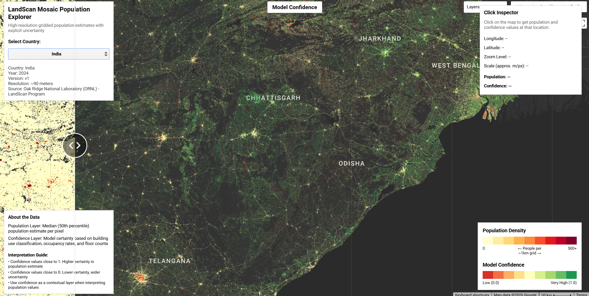

# LandScan Mosaic Population Data (90m)

LandScan Mosaic represents the next generation of high-resolution population modeling from Oak Ridge National Laboratory (ORNL). Building upon the established LandScan HD methodology, LandScan Mosaic enhances population distribution estimates by integrating advanced machine learning techniques with probabilistic modeling to explicitly quantify and propagate uncertainty throughout the population estimation process.

Unlike traditional deterministic population models, LandScan Mosaic employs a Monte Carlo simulation framework that samples from probability distributions of key building attributes (use type, floor count, and occupancy rates) to generate an ensemble of plausible population estimates. This approach produces gridded population data at approximately 90-meter (3-arcsecond) resolution with accompanying confidence metrics, enabling more informed decision-making across applications including disaster preparedness, resource allocation, and risk assessment. You can find additional information including the methods and other details [in the paper here](https://www.nature.com/articles/s41598-025-28125-z.pdf)

**Current Status**: LandScan Mosaic is being released in batches, with approximately 143 countries currently available in the Earth Engine collection.

#### Citation

```
Adams, D.S., Zimmer, A., Tuccillo, J., Moehl, J., Stewart, R., Walters, S., Bhaduri, B., Li, P., & Urban, M. (2025). LandScan Mosaic enables high-resolution gridded population estimates with explicit uncertainty. *Scientific Reports*, 15, 44493. https://doi.org/10.1038/s41598-025-28125-z
```


#### Using the Population Layer

The population band represents the median (50th percentile) estimate from thousands of simulated outcomes. This value:
- Is normalized to match authoritative census totals at the national scale
- Represents ambient population (average of day and night estimates)
- Should be interpreted as the most likely population count per pixel
- Aggregates to administrative units for regional analysis

#### Using the Confidence Layer

The confidence band should be used as a contextual layer when interpreting population estimates:

- **High Confidence (0.7 - 1.0)**: Narrow uncertainty range, typically in areas with:
  - Homogeneous building characteristics
  - Predominantly residential land use
  - Complete building attribution data

- **Moderate Confidence (0.4 - 0.7)**: Moderate uncertainty, common in:
  - Mixed-use neighborhoods
  - Peri-urban areas
  - Regions with partial building data

- **Low Confidence (0.0 - 0.4)**: Wide uncertainty range, often found in:
  - Dense urban cores with diverse building types
  - Areas lacking detailed building attribution
  - Locations where pseudo-buildings from GHSL are used

**Important Notes**:
- The confidence layer reflects uncertainty in building use classification, occupancy rates, and floor counts
- It does NOT currently account for uncertainty in building footprint accuracy or false positives
- When reporting aggregated statistics, include both population estimate and average confidence:
  - Example: "Estimated population: 124,237 people (average confidence: 0.76)"

#### Dataset Preprocessing
A automated tool was create to speed up the download  from ORNL site rather than using the drop down selector for 143 countries. The population layer and confidence layer were added as bands to a single image and country names were corrected to confirm to Earth Engine naming guidelines and to remove names with "," for example. These were then added to the metadata.



#### Earth Engine Snippet

```javascript
var landscan_mosaic = ee.ImageCollection('projects/sat-io/open-datasets/ORNL/LANDSCAN_MOSAIC');

// Filter to a specific country (example: Uganda)
var uganda = landscan_mosaic.filter(ee.Filter.eq('country_name', 'Uganda')).first();

// Extract the two bands
var population = uganda.select('population');
var confidence = uganda.select('confidence_interval');

// Mask out zero and negative population values
var popMask = population.gt(0);
var maskedPopulation = population.updateMask(popMask);

// Visualization parameters
var populationVis = {
  min: 1,
  max: 500,
  palette: ['#ffffcc', '#ffeda0', '#fed976', '#feb24c', '#fd8d3c',
            '#fc4e2a', '#e31a1c', '#bd0026', '#800026']
};

var confidenceVis = {
  min: 0,
  max: 1,
  palette: ['#d73027', '#f46d43', '#fdae61', '#fee08b', '#ffffbf',
            '#d9ef8b', '#a6d96a', '#66bd63', '#1a9850']
};

// Add layers to map
Map.addLayer(maskedPopulation, populationVis, 'Population Density');
Map.addLayer(confidence, confidenceVis, 'Model Confidence');

// Center on Uganda
Map.centerObject(uganda.geometry(), 7);

// Add legend
var legend = ui.Panel({
  style: {
    position: 'bottom-right',
    padding: '8px 15px'
  }
});

var legendTitle = ui.Label({
  value: 'LandScan Mosaic',
  style: {
    fontWeight: 'bold',
    fontSize: '14px',
    margin: '0 0 4px 0',
    padding: '0'
  }
});
legend.add(legendTitle);

legend.add(ui.Label('Population: Light to Dark (0-500+ people)'));
legend.add(ui.Label('Confidence: Red to Green (Low to High)'));

Map.add(legend);
```

Sample Code: https://code.earthengine.google.com/?scriptPath=users/sat-io/awesome-gee-catalog-examples:population-socioeconomics/LANDSCAN-MOSAIC

Earth Engine App: https://sat-io.earthengine.app/view/landscan-mosaic


#### License

This dataset is offered under the **Creative Commons Attribution 4.0 International License (CC BY 4.0)**. Users are free to use, copy, distribute, transmit, and adapt the data for commercial and non-commercial purposes, without restriction, as long as clear attribution of the source is provided.

Created by: Oakridge National Laboratory

Curated in GEE by : Samapriya Roy

keywords: Population modeling, uncertainty quantification, machine learning, gridded population, probabilistic modeling, ambient population, disaster preparedness, risk assessment

Last updated on GEE: 2026-01-13
