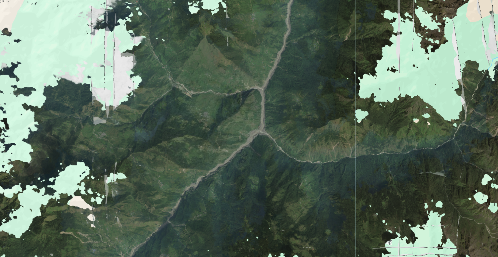

# Nepal Floods (Bhote Koshi / Trishuli) 2026

On 26 August 2026 at about 08:37 local time (02:52 UTC), a mass of ice and rock broke away from the north flank of the Langtang Himal at roughly 5,600 m elevation, inside Langtang National Park in Rasuwa district. The failure dropped approximately 1,200 m into the headwaters of the Lhende (Lende) Khola and mobilised into a debris flow that entered the Bhote Koshi at the Rasuwagadhi border crossing and continued down the Trishuli. USGS catalogued the collapse as a landslide rather than an earthquake, recording a seismic signal equivalent to Mw 5.2 (event us7000tbwb), with a second signal equivalent to Mw 4.2 about three hours later (us7000tc90). USGS puts the total runout at close to 100 km. Whether the initiating failure was a glacier collapse or a landslide that entrained part of a glacier is still unresolved. The Trishuli reportedly rose by as much as 9 m in 30 minutes, and independent analysis of the seismic record put the average speed of the front over the first 22 km at roughly 193 km/h. Two commercial disaster response programs, Vantor's (formerly Maxar) Open Data Program and Planet Labs' Disaster Data program, tasked collections over the corridor, and both are catalogued here as separate Earth Engine collections.

#### Event Summary

| Field | Value |
|---|---|
| Date / time | 26 August 2026, approximately 08:37 to 08:40 NPT (02:52 to 02:55 UTC) |
| Event type | Ice and rock avalanche or glacier collapse, mobilised into a debris flow and outburst flood |
| Source area | North flank of the Langtang Himal near Langtang Lirung, approximately 5,600 m, Langtang National Park, Rasuwa |
| Seismic signature | Mw 5.2 equivalent, catalogued by USGS as a landslide (us7000tbwb); secondary Mw 4.2 equivalent about 3 hours later (us7000tc90) |
| Flow path | Lhende (Lende) Khola to Bhote Koshi to Trishuli, runout approximately 100 km, with settlements struck along a 72 km reach of the Trishuli |
| Peak stage | Trishuli rose by up to 9 m in 30 minutes |
| Front velocity | Approximately 193 km/h averaged over the first 22 km (Planetary Science Institute analysis of the seismic record) |
| Affected districts (Nepal) | Rasuwa, Nuwakot, Dhading, Gorkha, Tanahun, Nawalparasi (east and west), Chitwan |
| Affected area (China) | Gyirong Port and Gyirong County, Shigatse, Tibet Autonomous Region |
| Deaths | Provisional and rising steeply through the reporting period. Nepal figures moved from at least 160 (27 Aug) to 289 (28 Aug) to 469 (29 Aug) to at least 734 by 31 Aug; Tibet reported 16 dead over the same window |
| Missing | Approximately 2,500 in Nepal and approximately 550 in Tibet as of 31 August 2026 |
| Infrastructure | 32 bridges and roughly 40 km of road swept away; the Gyirong Port complex on the China–Nepal border destroyed; the Rasuwagadhi customs complex, bridge and hydropower intake destroyed |
| Damage assessment | Copernicus EMS (EMSR927) mapped more than 240 buildings destroyed and 32 damaged in the Syapru Besi area alone |
| Response activations | Copernicus EMS EMSR927, International Disasters Charter activation 1052, UNOSAT/GDACS SMCS event 421, HOT/NAXA OSM Tasking Manager campaign |

Casualty figures for this event moved by an order of magnitude over five days as search operations extended downstream, and bodies were recovered as far as 240 km away across the Indian border. Any number quoted here is provisional. Check the sources below before citing one.



#### Vantor (Maxar) Open Data

Vantor activated its Open Data Program on 27 August 2026, following a request from the Humanitarian OpenStreetMap Team, and released both pre-event and post-event imagery under CC BY-NC 4.0. Post-event scenes were captured on 27 and 28 August at native resolutions of roughly 0.35 to 0.58 m, concentrated on Shyaphru (Syabrubesi), Timure and Bidur (Trishuli Bazaar). Pre-event baselines are drawn from a wider historical window, with scenes from October 2021, September 2023, May 2024 and February 2026 at roughly 0.39 to 0.65 m over Shyaphru, Dandagaun and Bidur. Sensors are WorldView-2, WorldView-3 and WorldView Legion. Cloud cover is heavy on every post-event acquisition — this is peak monsoon in the Nepal Himalaya — and the scene table on the HOT activation page marks all nine post-event strips as cloudy or very cloudy over the river itself. Vantor imagery in the collection carries a `cloud_probability` band alongside the visual bands, and 0 is used as the no-data fill.

```js
// Vantor (Maxar) open data, pre-event baseline and post-event imagery.
var vantorNepalFlood2026 = ee.ImageCollection("projects/sat-io/open-datasets/VANTOR-DISASTER-DATA/NEPAL_FLOOD_2026");
```

Masking, with the cloud threshold passed in as a percentage and 0 treated as no data:

```js
// Drop cloud_probability from the stack and mask 0 = no data.
function maskNoData(image) {
  var bands = image.select(image.bandNames().remove('cloud_probability'));
  return bands
    .updateMask(bands.gt(0))
    .copyProperties(image, image.propertyNames());
}

// Cloud mask, threshold passed in as a percentage.
function maskClouds(maxCloudPct) {
  return function (image) {
    var clear = image.select('cloud_probability').lte(maxCloudPct);
    return maskNoData(image).updateMask(clear);
  };
}

var noData = vantorNepalFlood2026.map(maskNoData);
var masked = vantorNepalFlood2026.map(maskClouds(5));

Map.addLayer(noData.median(), {}, 'No-data masked only');
Map.addLayer(masked.median(), {}, 'No-data + cloud masked');
```

Given the cloud conditions, a threshold of 5 will strip most of the post-event coverage over the valley floor. Start loose (20 to 30) and tighten, and compare against the no-data-only layer before concluding that a gap is cloud rather than absent coverage.

Sample code: https://code.earthengine.google.com/?scriptPath=users/sat-io/awesome-gee-catalog-examples:disaster-response/VANTOR-OPEN-DATA-NEPAL-FLOODS-2026

#### Planet Labs Disaster Data

Planet's Crisis Response Program published a self-contained STAC catalog for the event, structured as 24 scenes from three sensors across five collections, split on the 26 August event date. Collections are keyed by sensor and acquisition date so that resolutions never mix within one collection.

| Collection | Phase | Sensor | Scenes | Acquired (UTC) | GSD | Multiband product | Mask |
|---|---|---|---|---|---|---|---|
| `planetscope-2026-05-27` | Pre-event | PlanetScope | 5 | 2026-05-27 05:32 | approximately 3.8 m | Surface reflectance | `udm2` |
| `planetscope-2026-08-26` | Post-event | PlanetScope | 9 | 2026-08-26 05:01 and 05:45 | approximately 3.8 m | TOA radiance | `udm2` |
| `skysat-2026-08-27` | Post-event | SkySat | 2 | 2026-08-27 02:00 | approximately 0.80 m | Pansharpened | `udm` |
| `pelican-2026-08-27` | Post-event | Pelican | 3 | 2026-08-27, approximately 4 hours after SkySat | approximately 0.55 m | Pansharpened | `udm2` |
| `planetscope-2026-08-28` | Post-event | PlanetScope | 5 | 2026-08-28 | approximately 3.8 m | TOA radiance | `udm2` |

The pre-event PlanetScope strip is a single north–south pass (satellite `254a`) from Trishuli Bazaar north through Betrawati, Dhunche and Syabrubesi to Rasuwagadhi and into Gyirong County, acquired three months before the flood at the end of the dry season. The 26 August post-event coverage is two adjacent swaths acquired the morning of the flood, a western swath (`255f`) at 05:01 and an eastern swath (`251f`) at 05:45, together spanning a wider corridor than the baseline. SkySat covers two focal points, Rasuwagadhi and Syabrubesi. Pelican is three sequential frames running north from Syabrubesi to Rasuwagadhi, overlapping the SkySat footprints, and at approximately 0.55 m is the sharpest imagery in the catalog.

```js
// Planet Labs disaster data, pre-event baseline plus four post-event collections.
var planetNepalFlood2026 = ee.ImageCollection("projects/sat-io/open-datasets/PLANET-DISASTER-DATA/NEPAL_FLOOD_2026");
```

Sample code: https://code.earthengine.google.com/?scriptPath=users/sat-io/awesome-gee-catalog-examples:disaster-response/PLANET-OPEN-DATA-NEPAL-FLOODS-2026

Four things in Planet's own release notes are worth carrying over before anyone builds an analysis on this:

**Reported clear fractions are unreliable.** Cloud cover runs 5 to 52 percent pre-event and 62 to 93 percent post-event. But the per-pixel classifier is defeated by steep relief, deep shadow and bright cloud, and it understates usable ground, in places severely. The three Pelican frames are reported as 0 percent clear yet each contains substantial interpretable terrain, including the clearest view of the flood channel in the whole catalog. Inspect the mask directly rather than filtering on `clear_percent`. The setup OmnniCloudMask for all calculations and runs.

**Processing levels are not uniform across the analytic bundles.** Pre-event PlanetScope carries `analytic_sr` (surface reflectance); both post-event PlanetScope collections carry `analytic` (top-of-atmosphere radiance), because surface reflectance products had not been published for the post-event scenes when the catalog was assembled. Do not difference pre- and post-event analytic bands without applying an atmospheric correction first. The `visual` assets are directly comparable.

**Mask assets differ by sensor.** PlanetScope and Pelican carry `udm2`, the multi-class mask with cloud, shadow, haze and snow classes plus confidence. SkySat carries `udm`, the older single-band unusable-data mask. Any code consuming masks has to handle both.

**Footprints do not coincide and resolution spans nearly 7x** (0.55 to 3.9 m). The post-event PlanetScope swaths extend further west, east and south than the pre-event strip, so much of the post-event area has no matching baseline. Read `gsd` per item rather than assuming a uniform pixel size.

#### License

Both collections on this page are released under Creative Commons Attribution Non Commercial 4.0.

Data provided by: Vantor (Maxar) Open Data Program, Planet Labs PBC Disaster Data

Curated in GEE by: Samapriya Roy

Keywords: disaster, flood, GLOF, outburst flood, debris flow, Nepal, Rasuwa, Bhote Koshi, Trishuli, Langtang, Rasuwagadhi, Tibet, Vantor, Maxar, Planet Labs, PlanetScope, SkySat, Pelican, WorldView

Last updated on GEE: 2026-08-31
