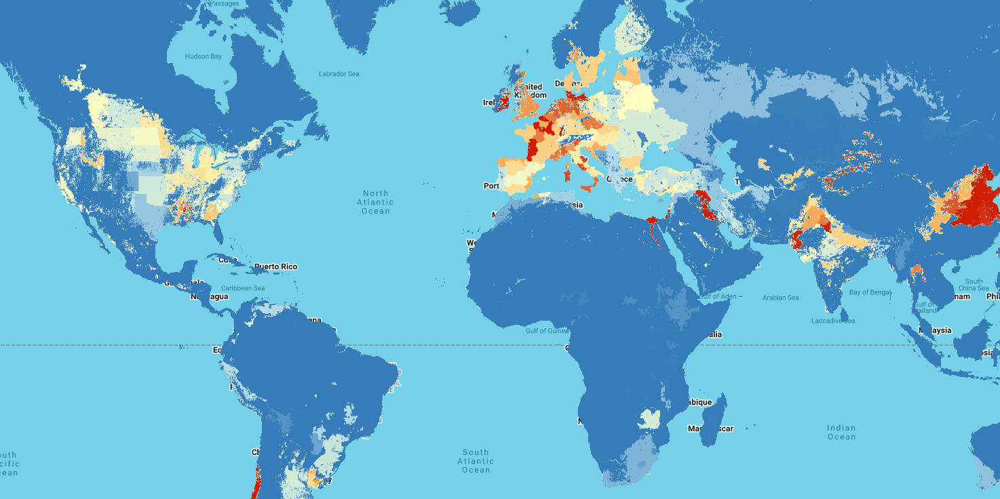

# NPKGRIDS Global Fertilizer Application Rates Dataset

NPKGRIDS is a global georeferenced dataset providing application rates for nitrogen (N), phosphorus (P₂O₅), and potassium (K₂O) fertilizers across 173 crops as of 2020. This dataset offers unprecedented spatial resolution at 0.05° (approximately 5.6 km at the equator) and represents a major advancement in understanding global agricultural fertilizer use patterns.

The use of chemical and mineral fertilizers has grown nearly 10-fold over the last sixty years, contributing decisively to increased crop and livestock production. However, over- and non-optimal use of fertilizers has created serious environmental problems affecting ecosystems and human health at all scales—from local soil and water pollution to regional eutrophication hotspots and marine dead zones. NPKGRIDS addresses the need for detailed, subnational-scale information to assess the interactions of fertilizer use with critical co-variants such as climatic conditions, soil properties, water flows, ecosystems, crops distribution, and farm management practices. You can read the [full paper here](https://www.nature.com/articles/s41597-024-04030-4) and find the [dataset here](https://doi.org/10.6084/m9.figshare.24616050)

#### Dataset Description

NPKGRIDS was developed through a data fusion approach integrating crop mask information from CROPGRIDS with eight published datasets of fertilizer application rates, compiled from either georeferenced data or national and subnational statistics. The dataset includes:

- **173 crops**: Coverage of all major global crop species using FAO crop nomenclature
- **3 nutrients**: Nitrogen (N), Phosphorus (P₂O₅), and Potassium (K₂O)
- **Reference period**: Circa 2020 (2015-2020 average)
- **Spatial resolution**: 0.05° (~5.6 km at equator)
- **Coordinate system**: WGS84
- **No-data value**: -1 (for ocean/water areas)

#### Data Structure

The dataset is organized as 519 three-band images in Google Earth Engine:

- **One image per crop per nutrient**: Each crop has 3 images (N, P₂O₅, K₂O)
- **Three bands per image**:
  - Band 1: Application rate (continuous values, pyramiding: MEAN)
  - Band 2: Data quality (0-1 scale, pyramiding: MODE)
  - Band 3: Dataset source (categorical, pyramiding: MODE)

Example asset naming: `npkgridsv1_08_{crop}_{nutrient}`
- `npkgridsv1_08_wheat_n` - Nitrogen data for wheat
- `npkgridsv1_08_maize_p2o5` - Phosphorus data for maize
- `npkgridsv1_08_rice_k2o` - Potassium data for rice

#### Band Information

**For Nitrogen (N) images:**
- `Nrate`: N application rate (kg-N ha⁻¹)
- `Nqual`: N data quality indicator (dimensionless, 0-1)
- `Nset`: Best-fit dataset used for N (categorical)

**For Phosphorus (P₂O₅) images:**
- `P2O5rate`: P₂O₅ application rate (kg-P₂O₅ ha⁻¹)
- `P2O5qual`: P₂O₅ data quality indicator (dimensionless, 0-1)
- `P2O5set`: Best-fit dataset used for P₂O₅ (categorical)

**For Potassium (K₂O) images:**
- `K2Orate`: K₂O application rate (kg-K₂O ha⁻¹)
- `K2Oqual`: K₂O data quality indicator (dimensionless, 0-1)
- `K2Oset`: Best-fit dataset used for K₂O (categorical)

**Note on conversions:**
- 1 kg of P₂O₅ is equivalent to 0.436 kg of elemental P
- 1 kg of K₂O is equivalent to 0.83 kg of elemental K

#### Limitations

Users should be aware of the following limitations:

- **Temporal uncertainty**: For regions where only historical data (circa 2000) was available, the dataset assumes spatial patterns remained consistent through 2020
- **Input data uncertainties**: Inherited errors from source datasets and CROPGRIDS crop masks
- **Geographic gaps**: Some small countries and territories excluded due to spatial resolution constraints
- **Pasture limitations**: Uncertainty in fertilizer use on meadows and pastures in certain regions
- **Regional variations**: Data quality varies by region, with better coverage in developed countries


#### Citation

```
Nguyen, T.H., Tang, F.H.M., Conchedda, G. et al. NPKGRIDS: a global georeferenced dataset of N, P2O5, and K2O fertilizer
application rates for 173 crops. Sci Data 11, 1179 (2024). https://doi.org/10.1038/s41597-024-04030-4
```

#### Dataset Citation

```
maggi, federico; Tang, Fiona H.M.; Nguyen, Thu Ha; Conchedda, Giulia; Casse, Leon; Tubiello, Francesco N.; et al. (2023).
NPKGRIDS. figshare. Dataset. https://doi.org/10.6084/m9.figshare.24616050.v4
```



#### Earth Engine Snippet

```js
var collection = ee.ImageCollection("projects/sat-io/open-datasets/NPKGRIDS");
var collection_wheat = collection.filter(ee.Filter.eq('crop','wheat'))

// Load NPKGRIDS collections by nutrient type
var wheat_nitrogen = collection_wheat.filter(ee.Filter.eq('nutrient','N'));
var wheat_phosphorus = collection_wheat.filter(ee.Filter.eq('nutrient','P2O5'));
var wheat_potassium = collection_wheat.filter(ee.Filter.eq('nutrient','K2O'));

// Access individual bands
var n_rate = wheat_nitrogen.select('Nrate');
var n_quality = wheat_nitrogen.select('Nqual');
var n_source = wheat_nitrogen.select('Nset');

// Visualize nitrogen application rate
Map.addLayer(n_rate, {min: 0, max: 200, palette: ['#2c7bb6', '#abd9e9', '#ffffbf', '#fdae61', '#d7191c']}, 'N Application Rate');
```

Sample Code: https://code.earthengine.google.com/?scriptPath=users/sat-io/awesome-gee-catalog-examples:agriculture-vegetation-forestry/NPKGRIDS


#### License

This work is licensed under a Creative Commons Attribution 4.0 International License (CC BY 4.0). You are free to copy and redistribute the material in any medium or format, and to transform and build upon the material for any purpose, even commercially. You must give appropriate credit, provide a link to the license, and indicate if changes were made.

Provided by: Nguyen et al 2025

Curated in GEE by: Samapriya Roy

Keywords: agriculture, fertilizers, nitrogen, phosphorus, potassium, nutrient management, crop production, environmental sustainability, precision agriculture, global food security

Last Updated in GEE: 2025-10-18
