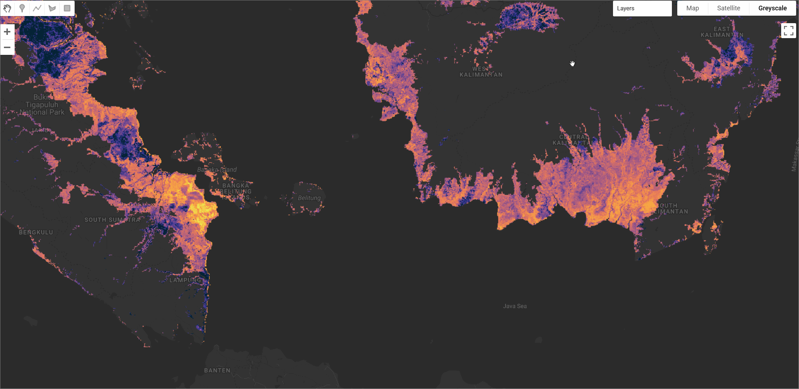

# PEATGRIDS Global Peat Thickness and Carbon Stock

PEATGRIDS is a globally consistent, high-resolution (1 km) dataset that maps the carbon stock of peatlands. This dataset is the first of its kind to provide global estimates of peat carbon stocks using a digital soil mapping (DSM) approach. It integrates over 27,000 peat core observations of thickness, bulk density, and carbon content from various biogeographic regions. The carbon stock was modelled using Quantile Random Forest (QRF) algorithms, leveraging a suite of environmental covariates derived from climate, topography, vegetation, and soil datasets.

#### Dataset Description

The dataset provides comprehensive mapping of global peatland properties including peat thickness, bulk density, carbon content, and total carbon stock. Using the Global Peatland Map (GPM 2.0) as the spatial extent, the study employed digital soil mapping techniques to predict these properties at 1 km resolution. The models were trained on approximately 27,000 data points for peat thickness, 19,000 for bulk density, and 9,000 for carbon content, collected from multiple sources worldwide.

The global peatlands are estimated to store 942 ± 312 Pg C over an area of 6.75 million km², with the Northern region holding more than 83% of the total. Peat thickness models demonstrated good predictive performance with validation R² ranging from 0.21 to 0.61 across different regions. The dataset includes both predicted values and uncertainty estimates for all parameters. The complete dataset including all layers and uncertainty estimates is available for [download here](https://zenodo.org/records/15070037)

#### Dataset Characteristics

<center>

| Parameter | Value |
|-----------|-------|
| Spatial Resolution | 1 km × 1 km |
| Coverage | Global peatlands (6.75 million km²) |
| Total Carbon Stock | 942 ± 312 Pg C |
| Peat Thickness Range | 0.02 - 12.06 m |
| Mean Peat Thickness | 2.07 m (Northern region) |
| Bulk Density Range | 0.03 - 1.0 Mg m⁻³ |
| Carbon Content Range | 0.1 - 0.58 g g⁻¹ |
| Model Performance | R² = 0.21-0.61 (thickness), 0.30-0.52 (BD), 0.06-0.33 (CC) |

</center>

#### Available Layers

The **PEATGRIDS** collection includes several datasets, each providing **mean and standard deviation (STDEV)** estimates. All layers must be masked to exclude no-data pixels (`values >= 0`).

| Asset Name           | Description                                         | Bands (Mean & STDEV)                                  | Units          |
| -------------------- | --------------------------------------------------- | ----------------------------------------------------- | -------------- |
| `THICKNESS_CM`       | Estimated peat thickness from the land surface      | `THICKNESS_CM_MEAN`, `THICKNESS_CM_STDEV`             | cm             |
| `BD_MEAN / BD_STDEV` | Estimated bulk density (standardized soil layers)   | `BD_000_015_MEAN/STDEV` ... `BD_100_200_MEAN/STDEV`   | tons/m³        |
| `CC_MEAN / CC_STDEV` | Estimated carbon content (standardized soil layers) | `CC_000_015_MEAN/STDEV` ... `CC_100_200_MEAN/STDEV`   | g C/g dry soil |
| `C_STOCK_MGC_PER_M2` | Carbon stock per unit area for full peat depth      | `C_STOCK_MgC_per_m2_MEAN`, `C_STOCK_MgC_per_m2_STDEV` | Mg C / m²      |
| `C_STOCK_MGC`        | Total carbon stock per pixel for full peat depth    | `C_STOCK_MgC_MEAN`, `C_STOCK_MgC_STDEV`               | Mg C           |


#### Citation

```
Widyastuti, M. T., Minasny, B., Padarian, J., Maggi, F., Aitkenhead, M., Beucher, A.,  Connolly, J., Fiantis, D., Kidd, D., Ma, Y., Macfarlane, F., Robb, C., Rudiyanto,
Setiawan, B. I., & Taufik, M. (2025). Digital mapping of peat thickness and carbon stock of global peatlands. CATENA, 258, 109243.
https://doi.org/10.1016/j.catena.2025.109243
```

#### Dataset Citation

```
Widyastuti, M. T., Minasny, B., Padarian, J., & Maggi, F. (2024). PEATGRIDS: Mapping global peat thickness and carbon stock via digital soil mapping
approach, dataset (2.0.1) [Data set]. Zenodo. https://doi.org/10.5281/zenodo.15070037
```



#### Earth Engine Snippet

```javascript
var bd_mean = ee.Image("projects/sat-io/open-datasets/PEATGRIDS/BD_MEAN");
var cc_mean = ee.Image("projects/sat-io/open-datasets/PEATGRIDS/CC_MEAN");
var cstock_mgc = ee.Image("projects/sat-io/open-datasets/PEATGRIDS/C_STOCK_MGC");
var cstock_mgc_per_m2 = ee.Image("projects/sat-io/open-datasets/PEATGRIDS/C_STOCK_MGC_PER_M2");
var thickness = ee.Image("projects/sat-io/open-datasets/PEATGRIDS/THICKNESS_CM");

var thickness_mean = thickness.select('THICKNESS_CM_MEAN').mask(thickness.select('THICKNESS_CM_MEAN').gte(0));
var bd_mean_0_15 = bd_mean.select('BD_000_015_MEAN').mask(bd_mean.select('BD_000_015_MEAN').gte(0));
var cc_mean_0_15 = cc_mean.select('CC_000_015_MEAN').mask(cc_mean.select('CC_000_015_MEAN').gte(0));
var cstock_total = cstock_mgc.select('C_STOCK_MgC_MEAN').mask(cstock_mgc.select('C_STOCK_MgC_MEAN').gte(0));
var cstock_area = cstock_mgc_per_m2.select('C_STOCK_MgC_per_m2_MEAN').mask(cstock_mgc_per_m2.select('C_STOCK_MgC_per_m2_MEAN').gte(0));

var palettes = require('users/gena/packages:palettes');

var carbonVisTotal = { min: 0, max: 500000, palette: palettes.cmocean.Thermal[7].reverse() };
var carbonVisArea = { min: 0, max: 1500, palette: palettes.cmocean.Matter[7] };
var thicknessVis = { min: 0, max: 1000, palette: palettes.colorbrewer.YlGnBu[9] };
var bdVis = { min: 0, max: 0.5, palette: palettes.colorbrewer.OrRd[9] };
var ccVis = { min: 0.2, max: 0.7, palette: palettes.colorbrewer.Greens[7] };

Map.setCenter(110, 0, 4);
Map.addLayer(cstock_total, carbonVisTotal, "Peat Carbon Stock (Mg C)", true);
Map.addLayer(cstock_area, carbonVisArea, "Peat Carbon Stock (Mg C/m²)", false);
Map.addLayer(thickness_mean, thicknessVis, "Peat Thickness Mean (cm)", false);
Map.addLayer(bd_mean_0_15, bdVis, "Bulk Density Mean (0-15cm)", false);
Map.addLayer(cc_mean_0_15, ccVis, "Carbon Content Mean (0-15cm)", false);

var snazzy = require("users/aazuspan/snazzy:styles");
snazzy.addStyle("https://snazzymaps.com/style/38/shades-of-grey", "Greyscale");
```

Sample Code: Sample Code: https://code.earthengine.google.com/?scriptPath=users/sat-io/awesome-gee-catalog-examples:geophysical-biological-biogeochemical/PEATGRIDS-ALL-LAYERS

#### License

This work is licensed under a Creative Commons Attribution 4.0 International License (CC BY 4.0).

Provided by: Widyastuti et al., 2024

Keywords: Carbon stock, Bogs, Fens, Peatlands, Climate change, Digital soil mapping, Quantile Random Forest, Global mapping, Soil organic carbon, Wetlands

Curated in GEE by: Samapriya Roy

Last updated: 2025-08-06
