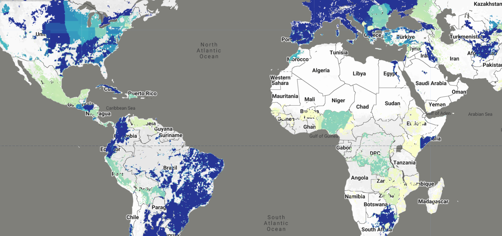

# PEST-CHEMGRIDS Global Pesticide Application Rates

Global Pesticide Grids (PEST-CHEMGRIDS) v1.01 provides globally gridded estimates of the 20 most-used pesticide active ingredients applied to 6 dominant crops and 4 aggregated crop classes at 5 arc-minute resolution (~10 km at the equator). The dataset includes estimates for 2015 with projections to 2020 and 2025, addressing the critical need for geographically explicit pesticide data to assess human and ecosystem exposure to agricultural chemicals.

The FAO reports that 4.1 million tonnes of pesticide substances were applied globally in 2015, representing a 35% increase since 2000. With projected population growth to 9.77 billion people by 2050 and continued land conversion into arable production, global pesticide applications are likely to increase. PEST-CHEMGRIDS provides crucial data to understand the global-scale distribution and trends of pesticide use, enabling environmental modeling, contamination assessment, and risk analysis from local to continental scales.

You can read the [full paper here](https://doi.org/10.1038/s41597-019-0169-4) and access the [original dataset here](https://doi.org/10.7927/weq9-pv30).

#### Dataset Description

PEST-CHEMGRIDS was developed through spatial statistical methods that re-analyze the USGS Pesticide National Synthesis Project (USGS/PNSP) and FAO Corporate Statistical Database (FAOSTAT) pesticide databases. The methodology integrates these pesticide inventories with globally gridded data on soil physical properties, hydroclimatic variables, agricultural quantities, and socioeconomic indices to estimate pesticide application rates at global scales.

The dataset encompasses:

- **95 active ingredients**: The 20 most-used pesticide active ingredients for each crop class, totaling 95 unique substances
- **10 crop types**: 6 dominant crops (corn, soybean, wheat, cotton, rice, alfalfa) and 4 aggregated crop classes (vegetables and fruits, orchards and grapes, pasture and hay, other crops)
- **3 time periods**: Base year 2015, with projections to 2020 and 2025
- **Spatial resolution**: 5 arc-minute (~10 km at equator)
- **Coordinate system**: WGS84
- **Pesticide classes**: 60 herbicides, 22 fungicides, 20 insecticides, 8 acaricides, 6 nematicides, 5 plant growth regulators, and 1 repellent

#### Data Structure

The dataset is organized into **three separate Earth Engine ImageCollections**:

1. **`projects/sat-io/open-datasets/PEST-CHEMGRIDS/application_rates`**:
   - Contains both HIGH and LOW estimate application rates
   - Annual application rates in kg per hectare per year (kg/ha-year)
   - Available years: 2015, 2020, 2025
   - Properties: `crop`, `active_ingredient`, `year`, `estimate_type` (HIGH/LOW), `pesticide_classes`

2. **`projects/sat-io/open-datasets/PEST-CHEMGRIDS/quality_index`**:
   - Data quality indicators (0-1 scale) for each crop-ingredient combination
   - Accounts for: crop surface area aggregation quality, historical trend regression quality, and FAOSTAT validation quality
   - Properties: `crop`, `active_ingredient`, `pesticide_classes`

3. **`projects/sat-io/open-datasets/PEST-CHEMGRIDS/crops`**:
   - Crop harvested area distributions (hectares)
   - 10 crop types: 6 dominant crops + 4 aggregated crop classes
   - Properties: `crop`, `crop_type` (dominant/aggregated)

#### Key Features

**Coverage by Crop Class:**

??? example "The dataset covers 10 crop types with the top 20 most-used active ingredients for each"

     | Crop Class | Type | Top 5 Active Ingredients | Total Count |
     |------------|------|-------------------------|-------------|
     | Corn | Dominant | glyphosate, atrazine, acetochlor, metolachlor, 2,4-D | 20 ingredients |
     | Soybean | Dominant | glyphosate, metolachlor, 2,4-D, fomesafen, acetochlor | 20 ingredients |
     | Wheat | Dominant | glyphosate, 2,4-D, MCPA, bromoxynil, propiconazole | 20 ingredients |
     | Cotton | Dominant | glyphosate, dichloropropene, trifluralin, acetochlor, glufosinate | 20 ingredients |
     | Rice | Dominant | propanil, thiobencarb, glyphosate, copper sulfate, clomazone | 20 ingredients |
     | Alfalfa | Dominant | glyphosate, pendimethalin, trifluralin, chlorpyrifos, diuron | 20 ingredients |
     | Vegetables and Fruits | Aggregated | metam, dichloropropene, metam potassium, chloropicrin, chlorothalonil | 20 ingredients |
     | Orchards and Grapes | Aggregated | petroleum oil, glyphosate, dichloropropene, copper hydroxide, calcium polysulfide | 20 ingredients |
     | Pasture and Hay | Aggregated | glyphosate, 2,4-D, dicamba, atrazine, triclopyr | 20 ingredients |
     | Other Crops | Aggregated | glyphosate, atrazine, dichloropropene, metolachlor, chlorothalonil | 20 ingredients |

??? example "Most Used Active Ingredients Globally"

     | Pesticide Class | Active Ingredient | Estimated Global Application (tonnes/year) |
     |----------------|-------------------|-------------------------------------------|
     | **Herbicides** | Glyphosate | ~700,000 |
     | | Metam potassium | ~700,000 |
     | | Metam | ~450,000 |
     | | Dichloropropene | ~450,000 |
     | | 2,4-D | ~150,000 |
     | **Insecticides** | Metam potassium | ~50,000 |
     | | Metam | ~50,000 |
     | | Calcium polysulfide | ~50,000 |
     | | Chlorpyrifos | ~20,000 |
     | **Fungicides** | Metam potassium | ~150,000 |
     | | Petroleum oil | ~150,000 |
     | | Chlorothalonil | ~120,000 |

*Note: Some active ingredients (e.g., metam potassium, metam) belong to multiple pesticide classes and are counted in each relevant category.*

#### Pesticide Classification

??? example "Active ingredients are classified into seven pesticide classes. The table below shows the classification codes used in the dataset"

     | Code | Full Name | Description |
     |------|-----------|-------------|
     | HBC | Herbicide | Controls unwanted plants and weeds |
     | INS | Insecticide | Controls insect pests |
     | FUN | Fungicide | Controls fungal diseases |
     | ACA | Acaricide | Controls mites and ticks |
     | PGR | Plant Growth Regulator | Modifies plant growth and development |
     | NEM | Nematicide | Controls nematodes |
     | REP | Repellent | Repels pests without killing them |

**Note**: Many active ingredients belong to multiple pesticide classes. For example:
- **glyphosate**: Herbicide (HBC)
- **chlorpyrifos**: Acaricide + Insecticide (ACA, INS)
- **metam**: Fungicide + Herbicide + Insecticide + Nematicide (FUN, HBC, INS, NEM)
- **2,4-D**: Herbicide + Plant Growth Regulator (HBC, PGR)

The complete classification for all 95 active ingredients is stored in the `pesticide_classes` property of each image.

#### Citation

```
Maggi, F., F. H. M. Tang, D. la Cecilia and A. McBratney. 2019. PEST-CHEMGRIDS, Global Gridded Maps of the Top 20 Crop-specific Pesticide Application Rates from 2015 to 2025.
Scientific Data 6 (170): 1-20. https://doi.org/10.1038/s41597-019-0169-4
```

#### Dataset Citation

```
Maggi, F., F. H. M. Tang, D. la Cecilia and A. McBratney. 2020. Global Pesticide Grids (PEST-CHEMGRIDS), Version 1.01. Palisades, NY: NASA Socioeconomic Data and Applications
Center (SEDAC). https://doi.org/10.7927/weq9-pv30
```



#### Earth Engine Snippet

```js
// Load the three PEST-CHEMGRIDS collections
var application_rates = ee.ImageCollection("projects/sat-io/open-datasets/PEST-CHEMGRIDS/application_rates");
var quality_index = ee.ImageCollection("projects/sat-io/open-datasets/PEST-CHEMGRIDS/quality_index");
var crops = ee.ImageCollection("projects/sat-io/open-datasets/PEST-CHEMGRIDS/crops");

var snazzy = require("users/aazuspan/snazzy:styles");
snazzy.addStyle("https://snazzymaps.com/style/15/subtle-grayscale", "Greyscale");


// Configuration
var selectedCrop = 'Corn';
var selectedIngredient = 'Glyphosate';
var timePoints = [2015, 2020, 2025];

// Limit dataset for charts to avoid heavy aggregation
var limited = application_rates.limit(5000);

// Load application rate layers for each year
var layers = {};
timePoints.forEach(function(year) {
    layers[year] = application_rates
        .filter(ee.Filter.eq('crop', selectedCrop))
        .filter(ee.Filter.eq('ingredient', selectedIngredient))
        .filter(ee.Filter.eq('year', year))
        .filter(ee.Filter.eq('estimate', 'HIGH'))
        .first()
        .select(['application_rate']);
});

var aprVis = {
    min: 0,
    max: 2,
    palette: ['#ffffcc', '#c7e9b4', '#7fcdbb', '#41b6c4', '#2c7fb8', '#253494']
};

Map.addLayer(
    layers[2015].updateMask(layers[2015].gte(0.01)),
    aprVis,
    selectedIngredient + ' on ' + selectedCrop + ' (2015)',
    false
);

Map.addLayer(
    layers[2020].updateMask(layers[2020].gte(0.01)),
    aprVis,
    selectedIngredient + ' on ' + selectedCrop + ' (2020)',
    true
);

Map.addLayer(
    layers[2025].updateMask(layers[2025].gte(0.01)),
    aprVis,
    selectedIngredient + ' on ' + selectedCrop + ' (2025)',
    false
);

// Chart 1: Distribution by crop type
var cropTypeChart = ui.Chart.array.values({
        array: ee.Dictionary(limited.aggregate_histogram('crop_type')).values(),
        axis: 0,
        xLabels: ee.Dictionary(limited.aggregate_histogram('crop_type')).keys()
    }).setChartType('PieChart')
    .setOptions({
        title: 'Images by Crop Type',
        width: 400,
        height: 300,
        pieHole: 0.3
    });
print(cropTypeChart);

// Chart 2: Distribution by pesticide class
var classChart = ui.Chart.array.values({
        array: ee.Dictionary(limited.aggregate_histogram('pesticide_class')).values(),
        axis: 0,
        xLabels: ee.Dictionary(limited.aggregate_histogram('pesticide_class')).keys()
    }).setChartType('PieChart')
    .setOptions({
        title: 'Distribution by Pesticide Class',
        pieHole: 0.3,
        width: 400,
        height: 300
    });
print(classChart);

Map.setCenter(-26.49, 22.02, 3);
```

Sample Code: https://code.earthengine.google.com/?scriptPath=users/sat-io/awesome-gee-catalog-examples:agriculture-vegetation-forestry/PEST-CHEMGRIDS

#### License

This work is licensed under a Creative Commons Attribution 4.0 International License (CC BY 4.0). You are free to copy and redistribute the material in any medium or format, and to transform and build upon the material for any purpose, even commercially. You must give appropriate credit, provide a link to the license, and indicate if changes were made.

Provided by: Maggi et al 2020

Curated in GEE by: Samapriya Roy

Keywords: agriculture, pesticides, herbicides, insecticides, fungicides, crop protection, environmental assessment, contamination, risk analysis, global agriculture, food security, water quality

Last Updated in GEE: 2025-10-25
