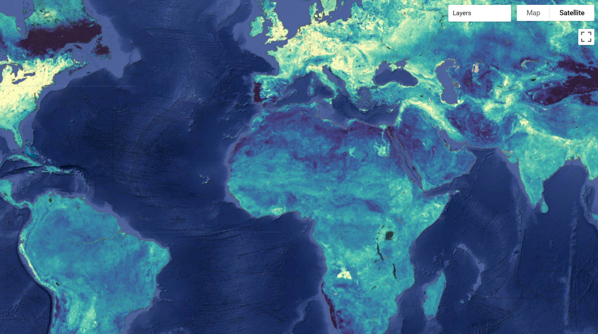

# Global Plant Functional Traits

Plant functional traits are fundamental to ecosystem dynamics and Earth system processes, but their global characterization is limited by the availability of field surveys and trait measurements. This dataset provides wall-to-wall global maps of 31 plant functional traits as defined in the TRY Plant Trait Database at 1 km resolution. Plant functional traits are predicted as community-weighted means based on a synthesis of crowdsourced biodiversity data (GBIF species observations, sPlot vegetation surveys, and in situ trait measurements from the TRY trait database) modeled as a function of Earth observation data, including surface reflectance, climatic variables, soil properties, canopy height, and vegetation optical depth.

Each trait raster contains three bands: Trait values (scaled), Coefficient of variation (model uncertainty indicator), and Area of applicability mask (indicates extrapolation beyond training data). This version of the maps includes traits sourced from all available plant functional types (PFT). For additional information [access the paper here](https://doi.org/10.1038/s41467-026-68996-y).

**Trait Table**

??? example "The Trait details can be found here by expanding this table"
    | Trait | TRY trait name | TRY ID | Unit | Pearson's r |
    | :--- | :--- | :--- | :--- | :--- |
    | Conduit element length* | Wood vessel element length; stem conduit element length | 282 | µm | 0.45 |
    | Dispersal unit length* | Dispersal unit length | 237 | mm | 0.36 |
    | LDMC* | Leaf dry mass per leaf fresh mass (LDMC) | 47 | g g-1 | 0.47 |
    | Leaf area | Leaf area | 3113 | mm2 | 0.59 |
    | Leaf C | Leaf carbon (C) content per leaf dry mass | 13 | mg g-1 | 0.55 |
    | Leaf C/N ratio | Leaf carbon/nitrogen (C/N) ratio | 146 | g g-1 | 0.57 |
    | Leaf delta 15N | Leaf nitrogen (N) isotope signature (delta 15N) | 78 | ppm | 0.56 |
    | Leaf dry mass | Leaf dry mass (single leaf) | 55 | g | 0.50 |
    | Leaf fresh mass* | Leaf fresh mass | 163 | g | 0.49 |
    | Leaf length* | Leaf length | 144 | mm | 0.49 |
    | Leaf N (area) | Leaf nitrogen (N) content per leaf area | 50 | g m-2 | 0.63 |
    | Leaf N (mass) | Leaf nitrogen (N) content per leaf dry mass | 14 | mg g-1 | 0.56 |
    | Leaf P | Leaf phosphorus (P) content per leaf dry mass | 15 | mg g-1 | 0.54 |
    | Leaf thickness | Leaf thickness | 46 | mm | 0.52 |
    | Leaf water content* | Leaf water content per leaf dry mass (not saturated) | 3120 | g g-1 | 0.48 |
    | Leaf width | Leaf width | 145 | mm | 0.51 |
    | Plant height* | Plant height (vegetative) | 3106 | m | 0.45 |
    | Rooting depth | Root rooting depth | 6 | m | 0.60 |
    | Seed germination rate* | Seed germination rate (germination efficiency) | 95 | days | 0.47 |
    | Seed length* | Seed length | 27 | mm | 0.39 |
    | Seed mass* | Seed dry mass | 26 | mg | 0.47 |
    | Seed number* | Seed number per reproduction unit | 138 | - | 0.43 |
    | SLA | Leaf area per leaf dry mass (specific leaf area, SLA) | 3117 | m2 kg-1 | 0.63 |
    | SRL | Root length per root dry mass (specific root length, SRL) | 1080 | cm g-1 | 0.46 |
    | SRL (fine)* | Fine root length per fine root dry mass | 614 | cm g-1 | 0.43 |
    | SSD | Stem specific density (SSD) or wood density | 4 | g cm-3 | 0.59 |
    | Stem conduit density | Stem conduit density (vessels and tracheids) | 169 | mm-2 | 0.56 |
    | Stem conduit diameter | Stem conduit diameter (vessels, tracheids) | 281 | µm | 0.60 |
    | Stem diameter* | Stem diameter | 21 | m | 0.48 |
    | Wood fiber lengths* | Wood fiber lengths | 289 | µm | 0.39 |
    | Wood ray density* | Wood rays per millimetre (wood ray density) | 297 | mm-1 | 0.22 |

**Experimental traits—model performance below the heuristic threshold of r=0.5. Please consider your use case before incorporating these trait maps into your analysis.**

#### Key Features and Details
* **Spatial Resolution:** 1 km
* **Temporal Coverage:** Representative of recent decades (based on synthesis of historical and recent field/EO data)
* **Coverage:** Global
* **Additional Relevant Metrics:** Includes Coefficient of Variation (uncertainty) and Area of Applicability (AOA) mask to indicate regions of extrapolation.

#### Data Sources
* Global Biodiversity Information Facility (GBIF) (~40 million citizen science species observations)
* sPlot vegetation surveys
* TRY Plant Trait Database measurements
* Global Earth observation datasets (surface reflectance, climatic variables, soil properties, canopy height, and vegetation optical depth)

#### Citation

```
Lusk, D., Wolf, S., Svidzinska, D., Kattenborn, T. "Crowdsourced biodiversity monitoring fills gaps in global plant trait mapping."
Nature Communications 17, 1203 (2026). https://doi.org/10.1038/s41467-026-68996-y
```

#### Dataset Citation

```
Lusk, D., Wolf, S., Svidzinska, D., & Kattenborn, T. (2026). Global plant trait maps based on crowdsourced biodiversity monitoring and Earth observation - 1
km - All PFTs [Data set]. In Nature Communications (1.0.0, Vol. 17, Number 1203). Zenodo. https://doi.org/10.5281/zenodo.14646322
```

#### Dataset Preprocessing for Earth Engine
The dataset is ingested into Earth Engine with three bands per trait image: `b1` (Trait values), `b2` (Coefficient of variation), and `b3` (Area of applicability mask). The trait values and coefficient of variation bands must be rescaled using the `trait_scale`, `trait_offset`, `cov_scale`, and `cov_offset` properties available in the image metadata. The Area of Applicability mask (`b3`) can be used to mask out regions where the model is extrapolating beyond its training data. For the community catalog the images were moved out of a folder and into image collections for each of use while maintaing the metadata.



#### Earth Engine Snippet

```js
var TRAIT_STG = "projects/sat-io/open-datasets/global-traits/Shrub_Tree_Grass";
var TRAIT_ST  = "projects/sat-io/open-datasets/global-traits/Shrub_Tree";
```
Sample Code: https://code.earthengine.google.com/?scriptPath=users/sat-io/awesome-gee-catalog-examples:agriculture-vegetation-forestry/GLOBAL-PLANT-TRAITS

#### Additional Links
* **Interactive App:** https://global-traits.projects.earthengine.app/view/global-traits
* **Project Website:** https://planttraits.earth
* **Zenodo Repository:** https://zenodo.org/records/14646322

#### License
This dataset is licensed under a Creative Commons Attribution 4.0 International (CC-BY-4.0) license.

Keywords: plant traits, functional traits, SLA, TRY database, citizen science, GBIF, sPlot, global, leaf traits, wood traits, seed traits, plant height, leaf area, trait mapping

Curated in GEE by: Daniel Lusk & Samapriya Roy

Last updated in GEE: 2026-03-06
