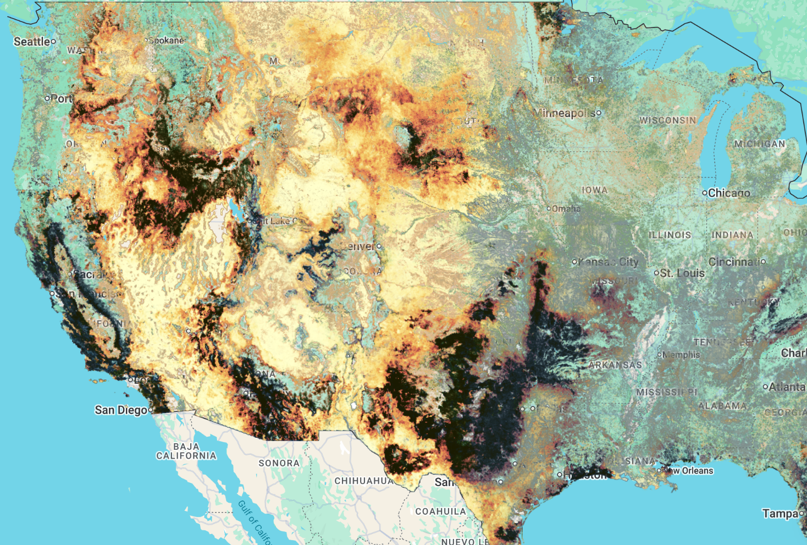

# Wildfire Risk to Rangeland Carbon

Wildfire Risk to Rangeland Carbon provides estimates of total standing biomass and carbon in rangelands of the conterminous United States (CONUS) circa 2014 and 2020, along with calculations of carbon emissions from wildfire and carbon remaining following wildfire. Rangelands are non-forested ecosystems including shrublands and grasslands, covering approximately 821 million acres of CONUS as of 2014 and 833 million acres as of 2020.

Standing rangeland biomass was modeled through multiple steps:

1. Shrub biomass was modeled from [LANDFIRE](https://landfire.gov) data layers representing shrub cover, shrub height, and shrub type
2. Herbaceous biomass, including grasses and forbs, was calculated from [Rangeland Analysis Platform](https://rangelands.app/) data
3. Litter and duff were modeled using data from the Fuel Characteristic Classification System Fuelbeds dataset

Total rangeland biomass was then used in the First Order Fire Effects Model (FOFEM) to calculate standing carbon and biomass, carbon and biomass remaining following wildfire, and carbon emissions conditional upon wildfire occurring. Carbon emissions conditional upon wildfire were converted to annual expected carbon emissions given burn probability (wildfire likelihood) using burn probability outputs from the Large Fire Simulator (FSim).

RCMAP and Wildfire Risk to Rangeland Carbon data are useful to natural resource decision making, including budget allocation for wildfire risk mitigation and risk tolerance assessment for rangeland carbon market projects.

#### Available Datasets

The Wildfire Risk to Rangeland Carbon product suite includes five circa-2014 layers, each delivered as a single-band Earth Engine image (tons/acre). The following table shows the current availability status:

| Dataset Type | Description | Status | Earth Engine Asset |
| --- | --- | --- | --- |
| **Initial Carbon** | Rangeland carbon, circa 2014 (tons/acre) | Complete | `projects/sat-io/open-datasets/USFS/RANGELAND_CARBON/RANGELAND_TOTAL_INITIAL_CARBON` |
| **Carbon Remaining** | Rangeland carbon remaining after simulated burning, circa 2014 (tons/acre) | Complete | `projects/sat-io/open-datasets/USFS/RANGELAND_CARBON/RANGELAND_TOTAL_CONDITIONAL_CARBON_REMAINING` |
| **Carbon Emissions** | Rangeland carbon emissions from simulated burning, circa 2014 (tons/acre) | Complete | `projects/sat-io/open-datasets/USFS/RANGELAND_CARBON/RANGELAND_TOTAL_CARBON_EMISSIONS` |
| **Expected Annual Carbon Emissions** | Expected rangeland carbon emissions given annual burn probability, circa 2014 (tons/acre) | Complete | `projects/sat-io/open-datasets/USFS/RANGELAND_CARBON/RANGELAND_ANNUAL_EXPECTED_CARBON_EMISSIONS` |
| **Expected Annual Carbon Remaining** | Expected rangeland carbon remaining given annual burn probability, circa 2014 (tons/acre) | Complete | `projects/sat-io/open-datasets/USFS/RANGELAND_CARBON/RANGELAND_ANNUAL_EXPECTED_CARBON` |

#### Dataset Details

??? example "The Wildfire Risk to Rangeland Carbon dataset details can be found here"

      | Characteristic | Description |
      | --- | --- |
      | Name | Wildfire Risk to Rangeland Carbon |
      | Provider | USDA Forest Service, Rocky Mountain Research Station |
      | Resolution | 30 meters |
      | Coverage | Conterminous United States (CONUS) |
      | Temporal Range | Circa 2014 (source data publication also includes circa 2020 landscapes) |
      | Units | Tons per acre |
      | Data Structure | Single-band (`b1`) image per metric |
      | Study Area | Rangelands (shrublands and grasslands); ~821 million acres (2014) and ~833 million acres (2020) of CONUS |

#### Data Layers

??? example "The Wildfire Risk to Rangeland Carbon dataset includes the following layers"

      | Layer | Band Name | Description |
      | --- | --- | --- |
      | Initial Carbon | b1 | Total standing herbaceous carbon, litter, and duff in all pixels, plus total standing shrub carbon in shrub-dominated pixels. Calculated from allometric equations applied to LANDFIRE vegetation layers (shrub fuels), Rangeland Analysis Platform herbaceous production (herbaceous fuels), and the Fuel Characteristic Classification System (litter and duff), then converted to carbon in SpatialFOFEM |
      | Carbon Remaining | b1 | Total remaining rangeland carbon after simulating burning of initial rangeland fuels in SpatialFOFEM |
      | Carbon Emissions | b1 | Total rangeland carbon emissions from simulating burning of initial rangeland fuels in SpatialFOFEM |
      | Expected Annual Carbon Emissions | b1 | Total carbon lost from burning (as simulated in SpatialFOFEM) multiplied by the annual burn probability of each pixel from the circa-2014 FSim simulations |
      | Expected Annual Carbon Remaining | b1 | Total initial rangeland carbon minus total annual expected rangeland carbon loss; represents expected rangeland carbon after accounting for the amount annually lost to fire |

#### Citation

```
Zimmer, Scott N.; Riley, Karin L.; Reeves, Matthew C; Urbanski, Shawn P. 2026. Spatial datasets of wildfire risk to rangeland carbon for the conterminous United States (30m) circa 2014 and 2020 landscapes. Fort Collins, CO: Forest Service Research Data Archive. https://doi.org/10.2737/RDS-2026-0015
```

Please also cite the underlying risk assessment framework:

```
Calkin, David E.; Riley, Karin L.; Thompson, Matthew P., eds. 2011. A comparative risk assessment framework for wildland fire management: the 2010 cohesive strategy science report. Gen. Tech. Rep. RMRS-GTR-262. Fort Collins, CO: U.S. Department of Agriculture, Forest Service, Rocky Mountain Research Station. 63 p.
```

**Related dataset:** [Wildfire Risk to Forest Carbon](https://doi.org/10.2737/RDS-2026-0014) — Houtman, Rachel M.; Riley, Karin L.; Finney, Mark A.; Ager, Alan A. 2026. Spatial datasets of wildfire risk to forest carbon for the conterminous United States (30m) circa 2014 landscapes. Fort Collins, CO: Forest Service Research Data Archive.



#### Earth Engine Snippet

```javascript
var rangeland_total_initial_carbon = ee.Image("projects/sat-io/open-datasets/USFS/RANGELAND_CARBON/RANGELAND_TOTAL_INITIAL_CARBON");
Map.addLayer(rangeland_total_initial_carbon, {bands: ["b1"], min: 0, max: 2.34, palette: ["3e1f0d","5a2e15","783f1f","97542b","b66c3b","d1864e","e6a062","f2ba7a","f9d395","e1e9a5","b4da90","84c87c","53b069","2b8c52","0a643a","166e5c","105a80","0a449e"]}, "Total Initial Rangeland Carbon 2014");

var rangeland_total_conditional_carbon_remaining = ee.Image("projects/sat-io/open-datasets/USFS/RANGELAND_CARBON/RANGELAND_TOTAL_CONDITIONAL_CARBON_REMAINING");
Map.addLayer(rangeland_total_conditional_carbon_remaining, {bands: ["b1"], min: 0, max: 0.95, palette: ["4D2610","5A2E15","783F1F","F9D395","2B8C52","0A449E"]}, "Total Conditional Rangeland Carbon Remaining 2014");

var rangeland_total_conditional_carbon_emissions = ee.Image("projects/sat-io/open-datasets/USFS/RANGELAND_CARBON/RANGELAND_TOTAL_CARBON_EMISSIONS");
Map.addLayer(rangeland_total_conditional_carbon_emissions, {bands: ["b1"], min: 0, max: 1.61, palette: ["ffffcc","fbec9a","f4cc68","eca855","e48751","d2624d","a54742","73382f","422818","1a1a01"]}, "Total Conditional Rangeland Carbon Emission 2014");

var rangeland_annual_expected_carbon = ee.Image("projects/sat-io/open-datasets/USFS/RANGELAND_CARBON/RANGELAND_ANNUAL_EXPECTED_CARBON");
Map.addLayer(rangeland_annual_expected_carbon, {bands: ["b1"], min: 0, max: 2.35, palette: ["3e1f0d","5a2e15","783f1f","97542b","b66c3b","d1864e","e6a062","f2ba7a","f9d395","e1e9a5","b4da90","84c87c","53b069","2b8c52","0a643a","166e5c","105a80","0a449e"]}, "Total Annual Expected Rangeland Carbon 2014");

var rangeland_annual_expected_carbon_emissions = ee.Image("projects/sat-io/open-datasets/USFS/RANGELAND_CARBON/RANGELAND_ANNUAL_EXPECTED_CARBON_EMISSIONS");
Map.addLayer(rangeland_annual_expected_carbon_emissions, {bands: ["b1"], min: 0, max: 0.011, palette: ["ffffcc","fbec9a","f4cc68","eca855","e48751","d2624d","a54742","73382f","422818","1a1a01"]}, "Total Annual Expected Rangeland Carbon Emissions 2014");
```

Sample Code: https://code.earthengine.google.com/?scriptPath=users/sat-io/awesome-gee-catalog-examples:fire-monitoring-analysis/RANGELAND_CARBON

#### License

These data were collected using funding from the U.S. Government and can be used without additional permissions or fees. If you use these data in a publication, presentation, or other research product please cite the data appropriately.

This work is marked with CC0 1.0 Universal (CC0 1.0) Public Domain Dedication.

Users are strongly encouraged to read and fully comprehend the metadata prior to data use. Users should acknowledge the Originator when using this dataset as a source. No warranty is made by the Originator as to the accuracy, reliability, or completeness of these data for individual use or aggregate use with other data, or for purposes not intended by the Originator. This dataset is intended to estimate probabilistic wildfire risk components that can support national strategic planning; the applicability of the data to support fire and land management planning on smaller areas will vary by location and specific intended use. Spatial information may not meet National Map Accuracy Standards. This information may be updated without notification.

Created by: Scott N. Zimmer, Karin L. Riley, Matthew C. Reeves, Shawn P. Urbanski, and collaborators at USDA Forest Service, Rocky Mountain Research Station

Keywords: Carbon, Rangeland Carbon, Emissions, Remaining, Carbon pre-burn, Carbon post-burn, Climate change, Ecology, Ecosystems, & Environment, Fire, Natural Resource Management & Use, Wildfire Risk, Rangelands, Conterminous United States

Last updated: 2026-06-30
