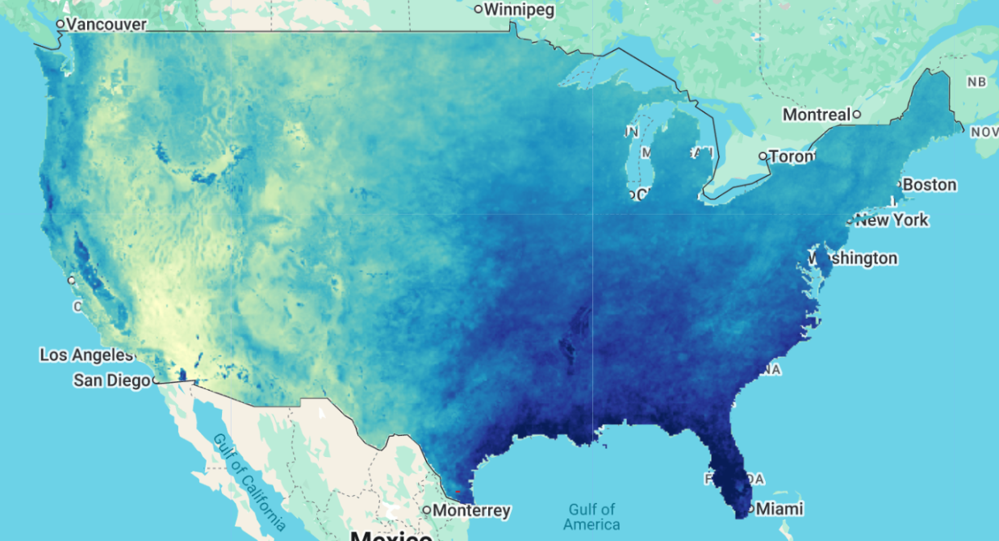

# Historical Evapotranspiration for the Conterminous U.S. (Reitz Ensemble ET)

Evapotranspiration (ET) is the largest component of the water budget, accounting for roughly 70% of the water supplied by precipitation across the conterminous United States (CONUS). It is also one of the hardest components to quantify, because observations are sparse and uncertain and because the many simplified ET equations in use can give significantly different answers for the same location. This dataset addresses that gap by combining the information contained in available ET data and equations into a single, long-record, high-resolution product.

A suite of published equations for actual ET was evaluated against three national-scale observational sources: annual water balance ET from 1,858 gaged watersheds (80,147 water-years), monthly SSEBop remotely sensed ET aggregated to HUC-10 boundaries, and monthly ET from 154 AmeriFlux flux towers. Error distributions at the observation locations were used to derive relative weights for each equation through a modified Bayesian model averaging (BMA) approach, and a random forest regression was then used to generalize those weights as a function of explanatory variables (vapor pressure deficit, precipitation, temperature, elevation, latitude, land cover, soils, ecoregion, and others). Applying the random forest to wall-to-wall CONUS explanatory variable maps produced annual relative weight maps for each ensemble member, which were multiplied by the land cover calibrated equation predictions and summed to produce ensemble ET.

The final annual ensemble uses five equations - Schreiber (Hamon), Budyko (Hamon), Reitz, Brutsaert-Stricker, and Fu-Zhang (Hamon) - while monthly variability is discretized using the Fu-Zhang (Hamon) equation and scaled to sum to the annual ensemble values. The result is monthly ET at 800 m resolution from October 1895 through September 2018 (WY 1896-2018), a finer spatial resolution and longer timespan than other currently available products, with demonstrated accuracy improvements relative to six widely used gridded ET products (NLDAS-2 Mosaic, Noah, and VIC; Livneh; MERRA-2 CLSM; and TerraClimate).

??? example "Data release contents"


    | Group        | Item                                   | Description                                                                                       | Units       |
    |--------------|----------------------------------------|---------------------------------------------------------------------------------------------------|-------------|
    | ET maps      | AET_YYYY_YYYY                          | Zip files containing annual ET maps for a given year range, named AET_YYYY.tif                     | m/yr        |
    |              | AET_YYYY_YYYY_monthly                  | Zip files containing monthly ET maps for a given year range, named AET_YYYY_MM.tif                 | mm/day      |
    |              | AET_longterm                           | Long-term annual average ET, 1896-2018                                                             | m/yr        |
    |              | Uncertainty_Variance                   | Estimate of uncertainty (variance) in the long-term annual average ET, from the BMA variance equation | m/yr     |
    | Ensemble     | Weight_maps                            | Maps of relative weights of the different equation predictions used to create the ensemble ET values |           |
    | Irrigation   | Irrigation_all_1980-2018               | Annual and monthly total irrigation estimates, 1980-2018                                            | m/yr, mm/day |
    |              | Irrigation_groundwater_1980-2018       | Annual and monthly groundwater-sourced irrigation estimates, 1980-2018                              | m/yr, mm/day |
    |              | Irrigation_surfacewater_1980-2018      | Annual and monthly surface water-sourced irrigation estimates, 1980-2018                            | m/yr, mm/day |
    |              | Irrigation_monthly_fractions           | Maps of the fraction of annual irrigation apportioned to each month                                 | fraction    |
    | Supporting   | GRACE_annualchange_May2003_May2014     | Average magnitude of total water storage change from GRACE data, May 2003 to May 2014               | mm/yr       |
    |              | Gaged_watersheds                       | Shapefile of the gaged watershed locations used in the analysis                                     |             |
    |              | Flux_towers                            | Shapefile of the flux tower locations used in the analysis                                          |             |
    |              | HistoricalET_FigureData.xlsx           | Data underlying the figures and tables in the associated journal article                            |             |


**Summary:** This dataset provides monthly rasters (mm/day) of actual evapotranspiration (ET) at the Conterminous U.S. (CONUS) scale from October 1895 to September 2018. Data are provided at the annual and monthly time scales at 800 meter spatial resolution. The dataset was produced using ensemble estimation methods described in the associated journal article.

#### Dataset postprocessing

The monthly ET rasters were merged into a single image collection with time properties attached to each image for ease of filtering by date. Values are provided in mm/day at the native 800 m spatial resolution.

#### Citation

```
Reitz, M., Sanford, W. E., & Saxe, S. (2023). Ensemble Estimation of Historical Evapotranspiration for the Conterminous U.S.
Water Resources Research, 59(6), e2022WR034012. https://doi.org/10.1029/2022WR034012
```

#### Dataset Citation

```
Reitz, M., Sanford, W. E., & Saxe, S. (2023). Historical evapotranspiration for the conterminous U.S.
U.S. Geological Survey Data Release. https://doi.org/10.5066/P9EZ3VAS
```



#### Earth Engine Snippet

```js
var aet = ee.ImageCollection("projects/sat-io/open-datasets/USGS/REITZ-ENSEMBLE-ET");
```

Sample Script: https://code.earthengine.google.com/?scriptPath=users/sat-io/awesome-gee-catalog-examples:agriculture-vegetation-forestry/REITZ_ENSEMBLE_ET

GEE App: https://nwi-usgs.projects.earthengine.app/view/aet-explorer

#### License

Licensed under [CC0 1.0 Universal](https://creativecommons.org/publicdomain/zero/1.0/legalcode)

Distribution Liability: Unless otherwise stated, all data, metadata and related materials are considered to satisfy the quality standards relative to the purpose for which the data were collected. Although these data and associated metadata have been reviewed for accuracy and completeness and approved for release by the U.S. Geological Survey (USGS), no warranty expressed or implied is made regarding the display or utility of the data for other purposes, nor on all computer systems, nor shall the act of distribution constitute any such warranty.

Created by: USGS, Reitz et al. 2023

Curated in GEE by: Sayantan Majumdar and Samapriya Roy

Keywords: evapotranspiration, irrigation, groundwater, hydrology, conus, water balance, ensemble

Last updated in GEE: 2026-08-20
