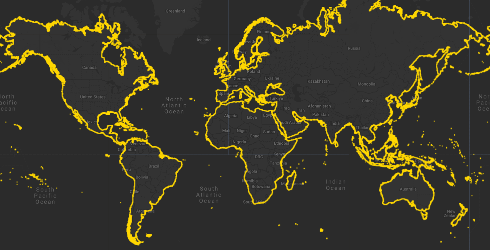

# S2Coast-2023 Global 10-meter Resolution Coastline Dataset

S2Coast-2023 is the first global coastline dataset produced at 10-meter resolution from Sentinel-2 imagery, offering a unified, consistent representation of the land–sea boundary for global coastal research and monitoring. Coastlines are inherently dynamic interfaces shaped by tides, waves, sea-level rise, and human activity. Despite major advances in satellite remote sensing, no comprehensive global coastline product derived directly from Sentinel-2's high-resolution, frequently revisited observations had previously been available.

To address this gap, the S2Coast framework was developed as a knowledge-based, fully automated extraction framework built on the Google Earth Engine (GEE) platform. The method detects a standardized coastline indicator, the High Water Line , from annual cloud-free Sentinel-2 composites. The approach integrates multi-temporal information, spectral signatures, and spatial features to delineate the stable extent of seawater submergence over a year, generating a land–water binary image whose boundary defines the HWL for Sentinel-2.

Following raster-to-vector conversion and optimization, the workflow—executed through 12,275 coordinated processing tasks—produced the S2Coast-2023 dataset, encompassing approximately 2.17 million kilometers of coastline across all continents and most islands larger than 100 m², excluding Antarctica and remote polar islands. Global validation using 1,146 coastline samples demonstrates strong temporal consistency, with 88% of repeatedly generated coastline segments (2021–2023) falling within a 10-m buffer, confirming the robustness and universality of the S2Coast approach. Positional accuracy assessment using 532 reference coastline samples from very high-resolution, image-supported OpenStreetMap data shows an average positional deviation of −1.10 m (95% CI: −2.06 to −0.15 m) and an average RMSE of 17.40 m (95% CI: 16.23 to 18.65 m).

The S2Coast-2023 dataset includes approximately 2.17 million kilometers of coastline distributed across six continents: Asia (208,554 km), Africa (80,078 km), North America (241,933 km), South America (94,824 km), Australia (63,739 km), and Europe (114,060 km). Additionally, the dataset contains boundary lines for 743,526 isolated patches (islands, intertidal vegetated areas, sandbars, and permanent man-made structures at sea), collectively accounting for more than 1.36 million kilometers of coastline.

Disclaimer: Whole or parts of the dataset description were provided by the author(s) or their works.

#### Data Access

The S2Coast-2023 dataset and reproduction materials are available at: https://doi.org/10.5281/zenodo.17092775

The repository contains:
- Global coastline dataset in Polygon/Polyline ESRI Shapefile format
- GEE sub-processing units
- Complete code for Sentinel-2 image processing and classification
- Validation coastline data

#### Citation

```
Duan, Y., Sanchez-Azofeifa, A., Chen, C., Tian, B., Li, X., Sengupta, D., Zhou, Y., 2026. S2Coast-2023: The first global 10-meter resolution coastline dataset derived from enhanced 
Sentinel-2 composite imagery using Google Earth Engine. Remote Sensing of Environment 334, 115186. https://doi.org/10.1016/j.rse.2025.115186
```

#### Dataset Specifications

| Attribute | Description |
|-----------|-------------|
| **Spatial Resolution** | 10 meters (based on Sentinel-2 MSI imagery) |
| **Temporal Coverage** | 2023 (annual composite) |
| **Geographic Extent** | Global (all continents and islands >100 m², excluding Antarctica) |
| **Total Coastline Length** | Approximately 2.17 million kilometers |
| **Format** | ESRI Shapefile (Polygon and Polyline) |
| **Coordinate System** | WGS 1984 |
| **Processing Framework** | Google Earth Engine (GEE) |




#### Earth Engine Snippet

```js
var s2Coast = ee.FeatureCollection("projects/sat-io/open-datasets/S2COAST-2023");

Map.addLayer(s2Coast.style({
  color: 'gold',
  width: 2
}), {}, 'S2Coast-2023 Global Coastline');
var snazzy = require("users/aazuspan/snazzy:styles");
snazzy.addStyle("https://snazzymaps.com/style/38/shades-of-grey", "Greyscale");

// Center the map on a specific region (optional)
Map.setCenter(79.5395, 8.6931, 8); // You can adjust the coordinates and zoom level as needed
```

Sample code: https://code.earthengine.google.com/?scriptPath=users/sat-io/awesome-gee-catalog-examples:oceans-shorelines/S2COAST-2023

#### License

These datasets are made available under the CC BY 4.0 Attribution 4.0 International license. This license allows users to distribute, remix, adapt, and build upon the material in any medium or format, so long as attribution is given to the creator.

Created by: Yuanqiang Duan, Arturo Sanchez-Azofeifa, Chunpeng Chen, Bo Tian, Xing Li, Dhritiraj Sengupta, Yunxuan Zhou

Curated in GEE by: Dhritiraj Sengupta and Samapriya Roy

Keywords: Coastline, Sentinel-2, Google Earth Engine, coastal monitoring, coastal erosion, shoreline mapping, high water line, global dataset, coastal change

Last updated: 2026-01-27
