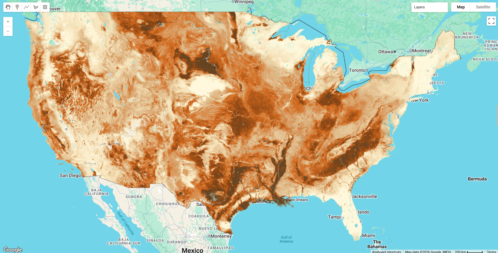

# Soil Landscapes of the United States (SOLUS)

Soil Landscapes of the United States (SOLUS) is a national map product developed by the National Cooperative Soil Survey that provides a consistent set of spatially continuous soil property maps to support large-scope soil investigations and land use decisions. SOLUS maps use a digital soil mapping framework that combines multiple sources of soil survey data with environmental covariate data and machine learning. Digital soil mapping is the production of georeferenced soil databases based on the quantitative relationships between soil measurements made in the field or laboratory and environmental data. Numerical models use the quantitative relationships to predict the spatial distribution of either discrete soil classes, such as map units, or continuous soil properties, such as clay content.

The first version of SOLUS, called SOLUS100, has a 100 m spatial resolution. Each 100 m raster cell represents a 100 m by 100 m square on the ground with soil property values estimated at seven depths: 0, 5, 15, 30, 60, 100, and 150 cm. SOLUS100 predicts 20 soil properties at seven depths for the continental United States for a total of 512 maps. The properties include textural fractions (clay, sand, silt, coarse sand, medium sand, fine sand, very fine sand, very coarse sand), chemical parameters (pH, cation exchange capacity, effective cation exchange capacity, calcium carbonate, gypsum, electrical conductivity, sodium adsorption ratio), physical parameters (bulk density, rock fragment content), carbon (soil organic carbon), and depth to restrictions (depth to bedrock, depth to restriction).

SOLUS maps use continuous property mapping, which predicts soil physical or chemical properties in horizontal and vertical dimensions. The soil properties are represented across a continuous range of values. Raster datasets of select soil properties can be predicted at specified depths or depth intervals. Continuous soil property maps such as SOLUS provide critical natural resource information to support environmental researchers and modelers, conservationists, and others making land management decisions. SOLUS will be updated annually with improved data and methodology. Details on background, methodology, accuracy, uncertainty, and other results and discussion of SOLUS100 maps are available at [SOLUS100 Ag Data Commons Repository](https://agdatacommons.nal.usda.gov/articles/dataset/Data_from_Soil_Landscapes_of_the_United_States_100-meter_SOLUS100_soil_property_maps_project_repository/25033856) and in the [publication](https://doi.org/10.1002/saj2.20769).

#### Key Features and Details

* **Spatial Resolution:** 100 m
* **Temporal Coverage:** 2024 (initial release)
* **Coverage:** Continental United States
* **Additional Relevant Metrics:** 20 soil properties at 7 depths (0, 5, 15, 30, 60, 100, and 150 cm)

#### Data Sources

SOLUS100 maps are available for download or use within scripting or GIS software environments: [SOLUS100 Cloud Storage Bucket](https://storage.googleapis.com/solus100pub/index.html). Details on background, methodology, accuracy, uncertainty, and other results and discussion of SOLUS100 maps are available at [SOLUS100 Ag Data Commons Repository](https://agdatacommons.nal.usda.gov/articles/dataset/Data_from_Soil_Landscapes_of_the_United_States_100-meter_SOLUS100_soil_property_maps_project_repository/25033856).

#### Citation

```
Soil Survey Staff. Soil Landscapes of the United States. United States Department of Agriculture, Natural Resources Conservation Service. Available online at storage.googleapis.com/solus100pub/index.html. Month, day, year accessed (year of official release).

Nauman, T. W., Kienast-Brown, S., Roecker, S. M., Brungard, C., White, D., Philippe, J., & Thompson, J. A. (2024). Soil landscapes of the United States (SOLUS): developing predictive soil property maps of the conterminous United States using hybrid training sets. Soil Science Society of America Journal, 1–20. https://doi.org/10.1002/saj2.20769
```

#### Dataset Preprocessing for Earth Engine

Each SOLUS soil property is provided as a separate Earth Engine Image with four bands. **CRITICAL: Each band has its own scaling factor stored as a separate metadata property.**

**Bands:**
- **prediction**: Predicted value using Random Forest models
- **high_95_pi**: Upper 95% prediction interval
- **low_95_pi**: Lower 95% prediction interval
- **relative_pi**: Relative prediction interval (normalized uncertainty metric)

**Band-Specific Metadata Properties:**
Each image contains separate scalar values for each band:
- **scalar_prediction**: Scaling factor for the prediction band
- **scalar_high_95_pi**: Scaling factor for the upper PI band
- **scalar_low_95_pi**: Scaling factor for the lower PI band
- **scalar_relative_pi**: Scaling factor for the relative PI band

**Common scaling patterns:**
- Prediction and PI bands (prediction, high_95_pi, low_95_pi) typically share the same scalar
- Relative PI band often has a different scalar (commonly 100)

**Value Scaling**
**CRITICAL**: Each band within an image may have a different scaling factor. You must divide each band by its specific scalar to get actual values.

**Example: Calcium Carbonate at 0 cm**
- `prediction` band: scalar = 1 (divide by 1)
- `high_95_pi` band: scalar = 1 (divide by 1)
- `low_95_pi` band: scalar = 1 (divide by 1)
- `relative_pi` band: scalar = 100 (divide by 100)

**Typical Scaling Patterns by Property Type:**

**Textural Fractions** (clay, sand, silt, sand fractions):
- Prediction/PI bands: scalar = 100
- Relative PI: scalar = 100
- Example: prediction value of 1570 = 15.70% (1570 ÷ 100)

**Chemical Properties** (pH, CEC, calcium carbonate, gypsum, EC, SAR):
- Variable scalars - **always check metadata**
- Common patterns:
  - Prediction/PI bands: scalar = 1 or 10
  - Relative PI: scalar = 100

**Physical Properties**:
- Bulk density: prediction/PI scalar = 100, relative PI scalar = 100
- Rock fragments: prediction/PI scalar = 1, relative PI scalar = 100

**Soil Organic Carbon**:
- Prediction/PI bands: scalar = 10
- Relative PI: scalar = 100

**Depth to Restrictions**:
- Prediction/PI bands: scalar = 1
- Relative PI: scalar = 100

**Always use the band-specific scalar metadata properties to ensure correct scaling.**



#### Earth Engine Snippet

```js
// Load the SOLUS ImageCollection
var solus = ee.ImageCollection("projects/sat-io/open-datasets/solus_collection");

// ============================================
// PROPER SCALING FUNCTION
// ============================================
// Each band has its own scalar - must scale each band separately!

function scaleSolusProperty(image) {
  // Get band-specific scalars from image properties
  var scalar_prediction = ee.Number(image.get('scalar_prediction'));
  var scalar_high_95_pi = ee.Number(image.get('scalar_high_95_pi'));
  var scalar_low_95_pi = ee.Number(image.get('scalar_low_95_pi'));
  var scalar_relative_pi = ee.Number(image.get('scalar_relative_pi'));

  // Apply band-specific scaling
  var prediction = image.select('prediction').divide(scalar_prediction);
  var high_pi = image.select('high_95_pi').divide(scalar_high_95_pi);
  var low_pi = image.select('low_95_pi').divide(scalar_low_95_pi);
  var rpi = image.select('relative_pi').divide(scalar_relative_pi);

  // Combine bands and preserve metadata
  return prediction.addBands(high_pi).addBands(low_pi).addBands(rpi)
    .copyProperties(image, image.propertyNames());
}

// Apply scaling to entire collection
var collection = solus.map(scaleSolusProperty);

// ============================================
// FILTERING AND SELECTION EXAMPLES
// ============================================

// Clay content at 30 cm depth
var clay30 = collection
  .filter(ee.Filter.eq('property', 'claytotal'))
  .filter(ee.Filter.eq('depth_cm', 30))
  .first();

// Soil organic carbon at surface (0 cm)
var soc0 = collection
  .filter(ee.Filter.eq('property', 'soc'))
  .filter(ee.Filter.eq('depth_cm', 0))
  .first();

// Clay Content
var clayPalette = ['#FFF8DC', '#F5DEB3', '#DEB887', '#D2691E', '#8B4513', '#654321'];
Map.addLayer(clay30.select('prediction'),
  {min: 5, max: 50, palette: clayPalette},
  'Clay Content (%) - 30cm');

// Soil Organic Carbon
var socPalette = ['#FFFACD', '#F0E68C', '#DAA520', '#B8860B', '#654321', '#2F1F10'];
Map.addLayer(soc0.select('prediction'),
  {min: 0, max: 8, palette: socPalette},
  'Soil Organic Carbon (%) - 0cm');
```
Sample Code: https://code.earthengine.google.com/?scriptPath=users/sat-io/awesome-gee-catalog-examples:soil-properties/SOLUS-SOIL-PROPERTIES

#### Additional Links
- [SOLUS100 Cloud Storage Bucket](https://storage.googleapis.com/solus100pub/index.html)
- [SOLUS100 Ag Data Commons Repository](https://agdatacommons.nal.usda.gov/articles/dataset/Data_from_Soil_Landscapes_of_the_United_States_100-meter_SOLUS100_soil_property_maps_project_repository/25033856)

#### License

CC BY 4.0. This work is in the public domain in the USA as it has been contributed to by U.S. Government employees.

Keywords : soil properties, digital soil mapping, SOLUS, USDA-NRCS, soil survey, prediction intervals, uncertainty, CONUS

Curated in GEE by: Samapriya Roy

Last updated in GEE: 2026-03-16
