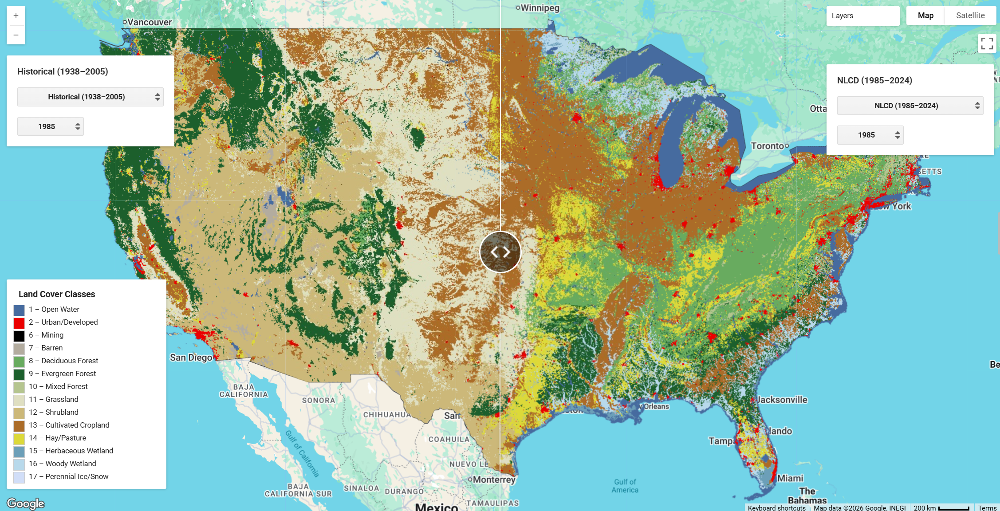

# Modeled Historical and Projected (1938–2100) Annual LULC and Forest Stand Age CONUS

The landscape of the conterminous United States has changed dramatically over the last century, with agricultural land use, urban expansion, forestry, wetland drainage, and reservoir construction altering land cover across vast swaths of the country. Researchers at the U.S. Geological Survey used a wide range of historical data sources and the spatially explicit FORE-SCE (Forecasting Scenarios of Land-use Change) modeling framework to produce a seamless, annual, wall-to-wall LULC dataset for the conterminous United States spanning 1938 through 2100 — combining a historical backcast with scenario-based future projections at a consistent 250-m spatial resolution.

The **historical dataset** (1938–1992) reconstructs annual LULC maps by modeling backwards from a modified 1992 National Land Cover Database (NLCD) using 14 LULC classes. Anthropogenic classes — cropland, hay/pasture, urban, wetland, and reservoirs — were actively modeled using historical data sources including the Census of Agriculture, USGS Land Cover Trends data, housing density records, drained lands census data, and the U.S. Army Corps of Engineers National Inventory of Dams. Natural land cover classes (forest, grassland, shrubland) were passively modeled, with their proportions determined by the ebb and flow of anthropogenic land use across 84 EPA Level III and 15 Level II ecoregions. Assessment showed good agreement with historical data sources, with only modest degradation as the model iterated further back in time.

The **projected dataset** (1992–2100) uses the same FORE-SCE framework to produce annual LULC maps with 17 classes, extending the 1992 NLCD baseline forward through 2100 under four scenarios consistent with the IPCC Special Report on Emissions Scenarios (SRES): A1B, A2, B1, and B2. Scenario demand was constructed by downscaling IPCC SRES assumptions through expert-driven workshops to each of the 84 Level III ecoregions, using IMAGE integrated model outputs alongside historical USGS and NLCD data. In addition to thematic LULC, the projected dataset includes an annual **forest stand age layer** tracking years since last disturbance or land-use change for all forested pixels, with starting 1992 stand ages derived from Landsat-based VCT disturbance data and interpolated U.S. Forest Service FIA ground data.

Together, these datasets provide a consistent, annual LULC record from 1938 through 2100, enabling researchers to assess historical impacts of LULC change on ecological and societal processes, and to examine potential future consequences for hydrology, carbon and greenhouse gas fluxes, biodiversity, climate, and biogeochemical cycling.

#### Key Features and Details

|  | Historical | Projected |
|--|--|--|
| **Period** | 1938–1992 (annual) | 1992–2100 (annual; baseline 1992–2005, projections 2006–2100) |
| **LULC Classes** | 14 | 17 (adds 3 clearcut ownership classes) |
| **Scenarios** | N/A | A1B, A2, B1, B2 (IPCC SRES) |
| **Forest Stand Age** | Not modeled | Included (1992–2100) |
| **Spatial Resolution** | 250 m | 250 m |
| **Coverage** | Conterminous US | Conterminous US |
| **Spatial Framework** | 84 Level III + 15 Level II EPA ecoregions | 84 Level III EPA ecoregions |

**LULC Classes (Historical, 14):** Water, Urban, Mining, Barren, Deciduous Forest, Evergreen Forest, Mixed Forest, Grassland, Shrubland, Cropland, Hay/Pasture, Herbaceous Wetland, Woody Wetland, Ice/Snow

**LULC Classes (Projected, 17):** All historical classes plus Clearcut (National Forest), Clearcut (Other Public), Clearcut (Private); Urban class is an aggregation of multiple NLCD developed classes

**Forest Stand Age:** Pixel values represent the number of years since that pixel last experienced a land-use or land-cover change or disturbance (clear-cutting or afforestation). Stand age is reset to zero on clear-cutting or afforestation events. Natural mortality, fire, storm damage, and insect damage are not modeled; absolute stand-age values are best interpreted as relative changes over time rather than direct field-comparable ages.

#### Data Sources

* **Historical Data Release:** [https://doi.org/10.5066/F7KK99RR](https://doi.org/10.5066/F7KK99RR)
* **Historical Journal Article:** [https://doi.org/10.1080/1747423X.2016.1147619](https://doi.org/10.1080/1747423X.2016.1147619)
* **Projected Data Release:** [https://doi.org/10.5066/P95AK9HP](https://doi.org/10.5066/P95AK9HP)
* **Projected Journal Article:** [https://doi.org/10.1890/13-1245.1](https://doi.org/10.1890/13-1245.1)

#### Citations

**Historical Land Use and Land Cover**

```
Data Release: Sohl, T.L., Reker, Ryan, Bouchard, Michelle, Sayler, Kristi, Dornbierer, Jordan, Wika, Steve, Quenzer, Rob, and Friesz, Aaron, 2018, Modeled historical land use and land cover for the conterminous United States: 1938–1992: U.S. Geological Survey data release, https://doi.org/10.5066/F7KK99RR.

Journal Article: Sohl, T., Reker, R., Bouchard, M., Sayler, K., Dornbierer, J., Wika, S., Quenzer, R., & Friesz, A. (2016). Modeled historical land use and land cover for the conterminous United States. *Journal of Land Use Science*, 11(4), 476–499. https://doi.org/10.1080/1747423X.2016.1147619
```

**Land Use and Land Cover Projections and Forest Stand Age**

```
Data Release: Sohl, T.L., Sayler, K.L., Bouchard, M.A., Reker, R.R., Freisz, A.M., Bennett, S.L., Sleeter, B.M., Sleeter, R.R., Wilson, T., Soulard, C., Knuppe, M., and Van Hofwegen, T., 2018, Conterminous United States Land Cover Projections — 1992 to 2100: U.S. Geological Survey data release, https://doi.org/10.5066/P95AK9HP.

Journal Article: Sohl, T.L., Sayler, K.L., Bouchard, M.A., Reker, R.R., Freisz, A.M., Bennett, S.L., Sleeter, B.M., Sleeter, R.R., Wilson, T., Soulard, C., Knuppe, M., and Van Hofwegen, T. (2014). Spatially explicit modeling of 1992 to 2100 land cover and forest stand age for the conterminous United States. *Ecological Applications*, 24(5), 1015–1036. https://doi.org/10.1890/13-1245.1
```



#### Earth Engine Snippet

```js
var lulc_conus = ee.ImageCollection("projects/sat-io/open-datasets/USGS/LULC-CONUS");
var forest_history = ee.ImageCollection("projects/sat-io/open-datasets/USGS/CONUS-FOREST-HISTORY");
```

Sample Code:
- USGS LULC Comparisons:  https://code.earthengine.google.com/?scriptPath=users/sat-io/awesome-gee-catalog-examples:regional-landuse-landcover/USGS-LULC-HISTORICAL-PROJECTED
- Forest Comparisons: https://code.earthengine.google.com/?scriptPath=users/sat-io/awesome-gee-catalog-examples:regional-landuse-landcover/USGS-FOREST-COMPARISONS

#### Additional Links

* [USGS LULC Comparisons GEE Script](https://code.earthengine.google.com/69cae81461395d4f0b45fba6ddd5ede1)
* [Forest Comparisons GEE Script](https://code.earthengine.google.com/3a59d6aba59e0caba80d7951036f6cce)

#### License

CC0 1.0 Universal. Unless otherwise stated, all data, metadata, and related materials are considered to satisfy the quality standards relative to the purpose for which the data were collected. Although these data and associated metadata have been reviewed for accuracy and completeness and approved for release by the U.S. Geological Survey (USGS), no warranty expressed or implied is made regarding the display or utility of the data on any other system or for general or scientific purposes, nor shall the act of distribution constitute any such warranty.

Keywords: land cover, land use, CONUS, IPCC, scenario, future, projected, historical, FORE-SCE, forest stand age, forest disturbance, Census of Agriculture, ecoregion

Curated in GEE by: Sayantan Majumdar & Samapriya Roy

Last updated in GEE: 2026-03-24
