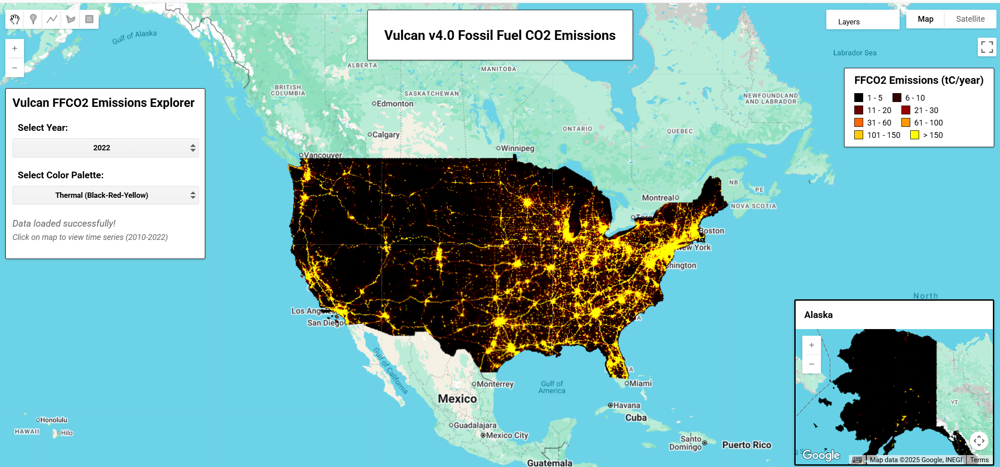

# Vulcan Fossil Fuel CO2 Emissions Dataset

This dataset provides high-resolution (1-kilometer) annual fossil fuel carbon dioxide (FFCO2) emissions estimates for the United States, covering a thirteen-year period from
2010 to 2022. Developed by researchers at Northern Arizona University's Vulcan Project, these maps were created using a comprehensive bottom-up approach that integrates multiple
data sources including EPA emissions reporting, traffic monitoring, power plant databases, and building energy surveys. The dataset provides sector-specific emissions data with
unprecedented spatial and temporal detail, making it an essential resource for climate research, policy development, and atmospheric carbon cycle studies.

#### Dataset Details

| Characteristic  | Description                                                        |
|-----------------|-------------------------------------------------------------------|
| Name            | Vulcan v4.0 Fossil Fuel CO2 Emissions                             |
| Provider        | Northern Arizona University                                        |
| Resolution      | 1 kilometer                                                        |
| Coverage        | United States (Continental US and Alaska)                         |
| Temporal Range  | 2010-2022 (annual)                                                |
| Sectors         | 11 emission sectors (see below)                                   |
| Projection      | Lambert Conformal Conic                                           |
| Units           | Metric tons of carbon per year (tC/year)                          |
| Uncertainty     | 95% confidence interval: ±8% (one-sigma ~±4%)                     |

#### Emission Sectors

The dataset includes emissions from the following sectors:

| Sector Code | Sector Name | Description |
|-------------|-------------|-------------|
| **air** | Aircraft | Emissions from aircraft taxi and takeoff/landing sequences |
| **cmt** | Cement Production | Process-derived CO2 from limestone conversion during clinker production |
| **cmv** | Commercial Marine Vessel | Emissions from commercial vessels within 12 nautical miles of US shoreline |
| **com** | Commercial | Emissions from commercial buildings and dispersed stationary sources |
| **elc** | Electricity Production | Emissions from power plants monitored under CAMD and EIA reporting systems |
| **ind** | Industrial | Emissions from industrial point sources with identifiable emission stacks |
| **nrd** | Nonroad | Emissions from off-road mobile sources (construction, agricultural equipment) |
| **onr** | Onroad | Emissions from road vehicles distributed to segments using traffic data |
| **res** | Residential | Emissions from residential buildings representing dispersed area sources |
| **rrd** | Railroad | Emissions from both rail yard point sources and along rail line segments |
| **tot** | Total | Sum of all fossil fuel CO2 emissions sectors combined |

#### Image Properties

Each image in the collection contains the following properties:

- `vulcan_version`: Dataset version (4.0)
- `sector`: Emission sector code (air, cmt, cmv, com, elc, ind, nrd, onr, res, rrd, tot)
- `sector_name`: Full sector name (e.g., "Electricity Production")
- `sector_description`: Detailed description of sector emissions
- `domain`: Geographic domain (usa for Continental US, ak for Alaska)
- `year`: Calendar year (2010-2022)
- `resolution`: Spatial resolution (1km)
- `projection`: Map projection (lcc for Lambert Conformal Conic)
- `estimate_type`: Uncertainty estimate type (mn for mean)
- `units`: Emission units (tC_per_year)
- `dataset`: Dataset identifier (VULCAN_FFCO2)
- `source`: Data provider (NAU)

#### Notes

!!! info

    - The dataset uses a bottom-up methodology combining EPA National Emissions Inventory data, power plant monitoring, traffic counts, and building energy surveys
    - Emissions are quantified at native resolution (points, lines, polygons) then gridded to 1km × 1km for analysis
    - Data represents "Scope 1" or in-boundary emissions reflecting physical CO2 release from stated geography
    - Includes emissions extending 12 nautical miles from US coastal boundary and up to 3,000 ft for aircraft operations
    - No-data values are represented as 0 in the dataset
    - Each image contains annual emission totals with temporal distribution based on sector-specific patterns

#### Methodology

The Vulcan approach employs multiple data sources:

- **EPA National Emissions Inventory (NEI)**: CO emissions reporting converted to CO2 using emission factors
- **Clean Air Markets Division (CAMD)**: Hourly power plant monitoring data
- **Energy Information Administration (EIA)**: Monthly power plant fuel consumption
- **Federal Highway Administration**: Traffic count data for road emission distribution
- **Building surveys**: DOE energy consumption surveys for residential/commercial sectors
- **Facility databases**: Portland Cement Association and USGS data for cement production

#### Citation

```
Gurney, K.R., P. Dass, A. Kato, L. Gawuc, B. Aslam, H. Sun (2025) Vulcan version 4.0 high-resolution
annual estimates of fossil fuel and cement production carbon dioxide emissions in the United States
for the 2010-2022 time period, under review at Scientific Data.

Gurney, K.R., J. Liang, R. Patarasuk, Y. Song, J. Huang, G. Roest (2020) The Vulcan Version 3.0 High-
Resolution Fossil Fuel CO2 Emissions for the United States. Journal of Geophysical Research:
Atmospheres, 125, 19, e2020JD032974. https://doi.org/10.1029/2020JD032974.
```



#### Earth Engine Snippet

```javascript
var vulcan = ee.ImageCollection("projects/sat-io/open-datasets/NAU/VULCAN_FFCO2");
```

Sample Code: https://code.earthengine.google.com/?scriptPath=users/sat-io/awesome-gee-catalog-examples:global-utilities-assets-amenities/VULCAN-FFCO2

Sample App: https://sat-io.earthengine.app/view/vulcan


#### Keywords

Fossil Fuel Emissions, Carbon Dioxide, Climate Change, Atmospheric Carbon, Power Plants, Transportation, Buildings, Industrial Emissions, Bottom-up Inventory, Greenhouse Gas, Energy, Urban Emissions, Carbon Cycle

#### License

The Vulcan v4.0 data product is made possible through support from the National Oceanic and Atmospheric Administration, grants NA19OAR4310167 and NA20OAR4310297. The dataset is distributed under Creative Commons Attribution 4.0 International (CC-BY 4.0).

#### Acknowledgement

When using this dataset, please include the following acknowledgement: "The Vulcan v4.0 data product was made possible through support from the National Oceanic and Atmospheric Administration, grants NA19OAR4310167 and NA20OAR4310297."

Produced by: Vulcan Project, Northern Arizona University

Curated in GEE by: Samapriya Roy

Last updated on GEE: 2025-06-25
