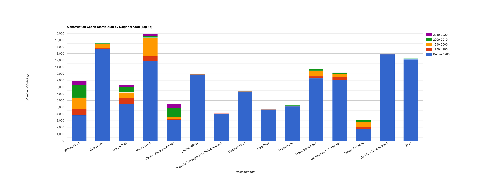

# Performing Zonal Statistics on GHS-OBAT Building Data: A Case Study in Amsterdam

<p style="text-align: right;">
by <a href="#">Samapriya Roy</a>
</p>

This tutorial demonstrates a scalable workflow for performing zonal statistics on the **Global Human Settlement - Open Buildings Attribute Table (GHS-OBAT)** dataset using custom administrative boundaries. By leveraging the GHS-OBAT's rich building-level attributes, we can derive meaningful insights at a local scale.

The analysis uses two primary datasets:

1.  **GHS-OBAT:** A feature collection providing building footprints for the Netherlands, enriched with attributes like construction epoch and height from the Global Human Settlement Layer (GHSL).
2.  **Amsterdam Neighborhoods:** A feature collection of polygons defining the zones for our statistical analysis.

The methodology involves loading and filtering the data, creating a function to calculate statistics per zone, applying this function across all zones using `.map()`, and visualizing the results with both choropleth maps and `ui.Chart`.

-----

### **1. Data Preparation and Filtering**

The first step in any analysis is to prepare the input data. This involves loading the relevant collections, spatially filtering the GHS-OBAT data to our area of interest (AOI) for efficiency, and cleaning the data to ensure analytical integrity.

  * **Loading Datasets:** We load the GHS-OBAT collection for the Netherlands (`NLD`) and the Amsterdam neighborhood boundaries.
  * **Spatial Filtering:** We apply `.filterBounds()` to the GHS-OBAT collection. This is a critical performance optimization that reduces the dataset to only those features that intersect with the neighborhood boundaries before any further processing.
  * **Attribute Cleaning:** We filter the resulting collection to exclude buildings with null or invalid values for `height` and `epoch`, which are the primary attributes for this analysis.

```javascript
// Load the datasets
var amsterdam_neighbourhoods = ee.FeatureCollection("projects/sat-io/open-datasets/INSIDE-AIRBNB/amsterdam_neighbourhoods");
var GHS_OBAT_NLD = ee.FeatureCollection("projects/sat-io/open-datasets/JRC/GHS-OBAT/GHS_OBAT_GPKG_NLD_E2020_R2024A_V1_0");

// Spatially filter buildings to the Amsterdam area
var amsterdam_buildings = GHS_OBAT_NLD.filterBounds(amsterdam_neighbourhoods);

// Clean the data to ensure valid attributes for analysis
var valid_buildings = amsterdam_buildings.filter(ee.Filter.and(
  ee.Filter.neq('height', null),
  ee.Filter.neq('epoch', null),
  ee.Filter.gt('height', 0),
  ee.Filter.gte('epoch', 0)
));

print('Total valid buildings in Amsterdam area:', valid_buildings.size());
```

-----

### **2. Implementing Zonal Statistics with a Mapped Function**

The core of this analysis is to calculate statistics for each neighborhood polygon. The most efficient way to accomplish this in Earth Engine is to define a function that processes a single feature and then apply it to the entire collection using `.map()`.

Our `calculateNeighborhoodStats` function executes the following steps for each neighborhood:

1.  Filters the `valid_buildings` collection to the geometry of the input neighborhood.
2.  Calculates aggregate statistics (e.g., `mean`, `min`, `max`) for numeric properties like `height` and `epoch` using `aggregate_stats`.
3.  Performs categorical counts for distributions, such as the number of buildings within each construction epoch and within custom-defined height ranges. This requires a series of `.filter().size()` calls.
4.  Attaches the results as new properties to the input neighborhood feature using `.set()`. Note the practice of adding both raw property names (e.g., `epoch_1`) and descriptive, chart-friendly names (e.g., `'Before 1980'`) for downstream flexibility.

This function is then mapped over the `amsterdam_neighbourhoods` collection, executing the entire statistical analysis as a single server-side operation.

```javascript
// Function to calculate zonal statistics for each neighborhood
function calculateNeighborhoodStats(neighborhood) {
  var neighborhood_buildings = valid_buildings.filterBounds(neighborhood.geometry());

  // Calculate aggregate and categorical statistics
  var building_count = neighborhood_buildings.size();
  var height_stats = neighborhood_buildings.aggregate_stats('height');
  var epoch_1_count = neighborhood_buildings.filter(ee.Filter.eq('epoch', 1)).size();
  // ... (additional counts for other epochs and height ranges)

  // Add all statistics as properties to the neighborhood feature
  return neighborhood
    .set('building_count', building_count)
    .set('height_mean', height_stats.get('mean'))
    // ... (other aggregate stats)
    // Set chart-friendly property names
    .set('Before 1980', epoch_1_count)
    .set('1980-1990', neighborhood_buildings.filter(ee.Filter.eq('epoch', 2)).size());
    // ... (other descriptive properties)
}

// Apply the function to every neighborhood feature
var neighborhoods_with_stats = amsterdam_neighbourhoods.map(calculateNeighborhoodStats);
print('Sample neighborhood with enriched statistics:', neighborhoods_with_stats.first());
```

-----

### **3. Visualization and Interpretation**

With the `neighborhoods_with_stats` collection now enriched with our calculated data, we can visualize the results to identify spatial patterns and trends.

#### **Choropleth Maps**

Choropleth maps are effective for visualizing the spatial distribution of a variable. We can style the neighborhood polygons based on a calculated property, such as `'building_count'` or `'height_mean'`. The `fillColor` parameter is dynamically assigned from the feature property, and a `palette` defines the color ramp.

```javascript
// Create a choropleth map for mean building height
Map.addLayer(
  neighborhoods_with_stats,
  {
    color: 'black',
    width: 1,
    fillColor: 'height_mean', // Use the calculated property
    palette: ['#fee5d9', '#fcbba1', '#fc9272', '#fb6a4a', '#de2d26', '#a50f15'],
    min: 3,
    max: 15
  },
  'Mean Building Height by Neighborhood',
  false // Layer initially hidden
);
```

#### **Interactive Charts**

For comparing distributions across multiple categories and neighborhoods, `ui.Chart` is the ideal tool. By using `ui.Chart.feature.byFeature`, we can create stacked column charts to explore the building stock's composition.

Crucially, we provide the array of chart-friendly property names we created earlier (e.g., `'Before 1980'`) as the `yProperties`. Earth Engine uses these strings directly as labels in the chart's legend, producing a clear and interpretable visualization without requiring manual label overrides in the chart options.

```javascript
// Height distribution chart
var heightChart = ui.Chart.feature.byFeature({
  features: neighborhoods_with_stats.limit(15),
  xProperty: 'neighbourh',
  // Use the descriptive property names for the y-axis
  yProperties: ['0-5m', '5-10m', '10-20m', '20m+']
})
.setChartType('ColumnChart')
.setOptions({
  title: 'Building Height Distribution by Neighborhood (Top 15)',
  hAxis: {title: 'Neighborhood'},
  vAxis: {title: 'Number of Buildings'},
  isStacked: true,
  legend: {position: 'right'}
});
print(heightChart);

// Epoch distribution chart
var epochChart = ui.Chart.feature.byFeature({
  features: neighborhoods_with_stats.limit(15),
  xProperty: 'neighbourh',
  // Use the descriptive property names for the y-axis
  yProperties: ['Before 1980', '1980-1990', '1990-2000', '2000-2010', '2010-2020']
})
.setChartType('ColumnChart')
.setOptions({
  title: 'Construction Epoch Distribution by Neighborhood (Top 15)',
  hAxis: {title: 'Neighborhood'},
  vAxis: {title: 'Number of Buildings'},
  isStacked: true,
  legend: {position: 'right'}
});
print(epochChart);
```

-----

### **4. Key Findings from the Amsterdam Analysis**

The generated charts and data reveal distinct patterns in Amsterdam's urban morphology, demonstrating the analytical power of the GHS-OBAT dataset.

  * **Building Density and Dominant Epochs:** The analysis highlights neighborhoods with the highest building density, such as **Noord-West**, **Bijlmer-Oost**, and **De Pijp - Rivierenbuurt**. The charts clearly show that **Noord-West** and **Bijlmer-Oost** are dominated by **pre-1980 construction** (`epoch_1`), indicating large-scale development in that period. In contrast, newer areas like **IJburg - Zeeburgereiland** show a significant concentration of buildings from 2000 onwards (`epoch_4` and `epoch_5`).


  * **Building Height Distribution:** There is a clear spatial variation in building heights. Neighborhoods like **Bijlmer-Centrum** and **Bijlmer-Oost** have a substantial stock of taller buildings, with a large number of structures in the **10-20m** and **20m+** categories. This aligns with the known post-war development of high-rise residential blocks in these areas. Conversely, many other neighborhoods are predominantly low-rise, with the majority of buildings falling into the **0-5m** and **5-10m** height categories.



  * **Mixed-Age Neighborhoods:** Some neighborhoods, such as **Watergraafsmeer**, exhibit a more balanced mix of construction epochs. This suggests a history of continuous development and infill over several decades rather than a single, dominant period of construction.

These data-driven insights, derived entirely from Earth Engine, align with the known urban development history of Amsterdam and showcase how GHS-OBAT can be used for detailed urban studies.

-----

### **5. Conclusion**

This workflow provides a robust template for leveraging the GHS-OBAT dataset for sub-national analysis. It can be readily adapted to other cities, administrative boundaries, or to analyze other building attributes like functional `use` or `shapefactor`. The enriched feature collection can also be exported using `Export.table.toDrive` for use in other data analysis softwares. You can find the [overall code here](https://code.earthengine.google.com/?scriptPath=users/sat-io/awesome-gee-catalog-examples:global-utilities-assets-amenities/GHS-OBAT-TUTORIAL)
